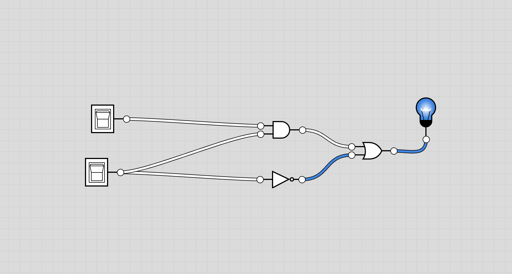
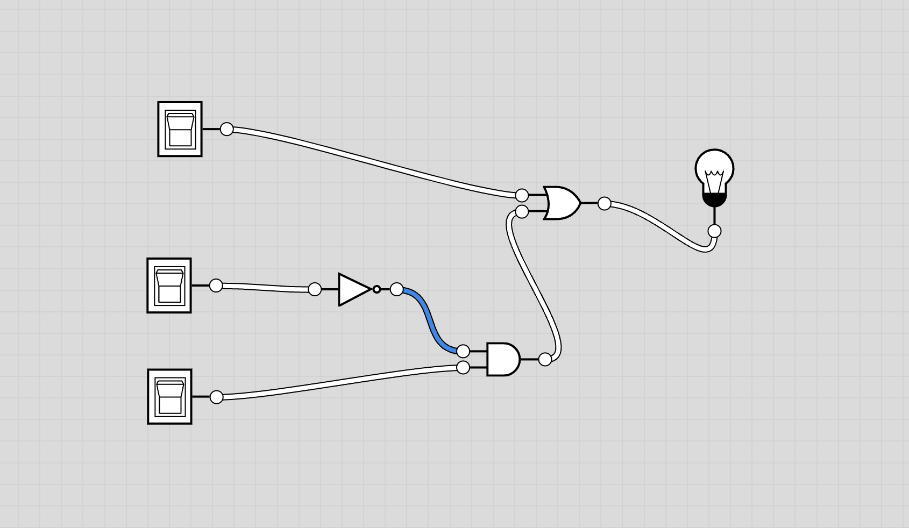
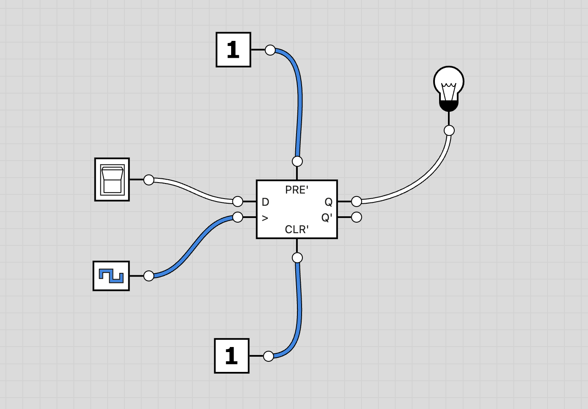
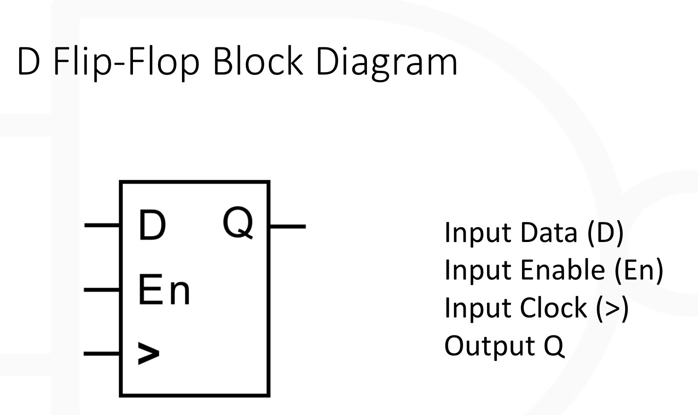
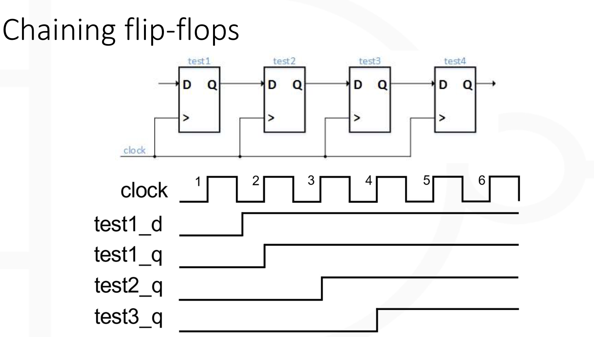
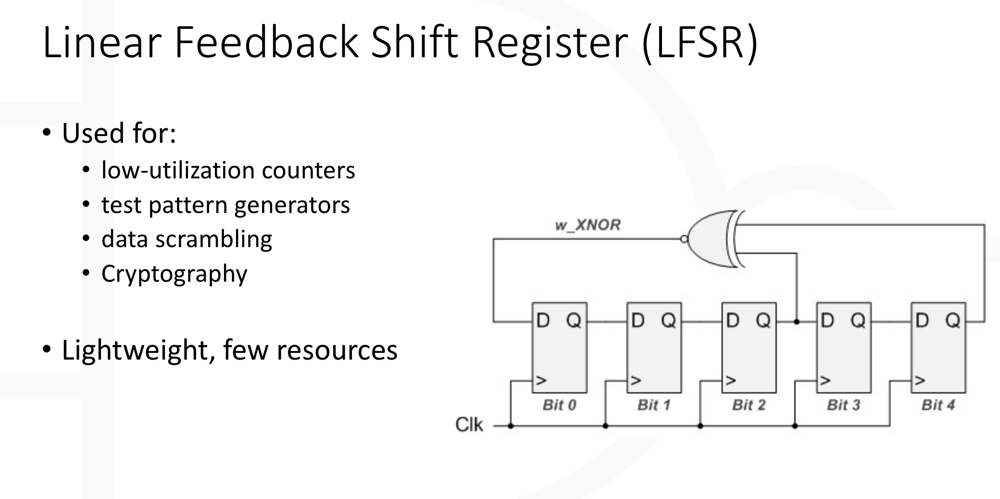
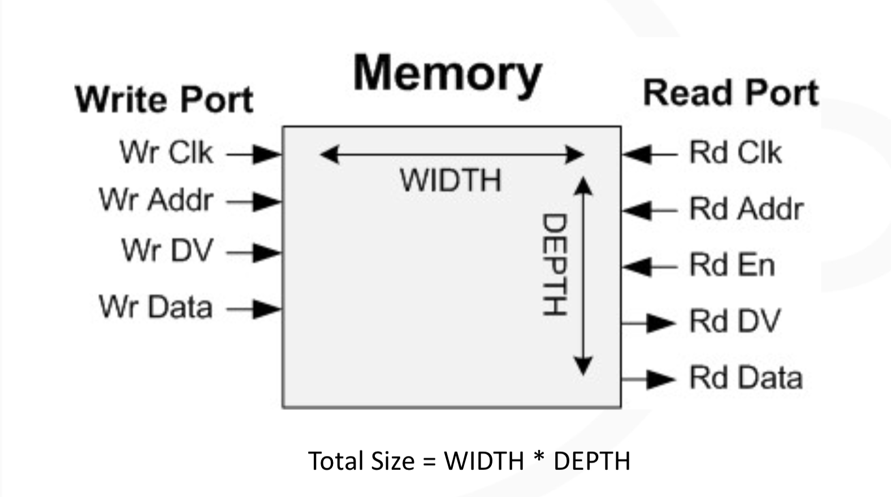

# Getting Started With FPGAS

- [Getting Started With FPGAS](#getting-started-with-fpgas)
- [Day 1](#day-1)
    - [Who's Russell Merrick?](#whos-russell-merrick)
  - [What's FPGA](#whats-fpga)
    - [Use Cases](#use-cases)
    - [Usage](#usage)
  - [Transitors](#transitors)
  - [How many bits do we need?](#how-many-bits-do-we-need)
  - [Look up table (LUP)](#look-up-table-lup)
  - [Truth Tables](#truth-tables)
  - [AND Truth Table (`A ∧ B`)](#and-truth-table-a--b)
  - [OR Truth Table (`A ∨ B`)](#or-truth-table-a--b)
  - [XOR Truth Table (`A ⊕ B`)](#xor-truth-table-a--b)
  - [NOT Truth Table (`¬A`)](#not-truth-table-a)
  - [NAND Truth Table (`A ↑ B`)](#nand-truth-table-a--b)
  - [The Flip-Flop](#the-flip-flop)
  - [Example of a flip-flop](#example-of-a-flip-flop)
    - [Frogger project](#frogger-project)
- [Workshop 24/09/2024](#workshop-24092024)
    - [Combninational logic](#combninational-logic)
    - [Sequential logic](#sequential-logic)
    - [Simulation](#simulation)
      - [Testbench](#testbench)
- [Workshop 25/09/2024](#workshop-25092024)
  - [Bit indexing](#bit-indexing)
  - [Constants in Verilog](#constants-in-verilog)
  - [Ripple carry adder](#ripple-carry-adder)
  - [LED Blinker](#led-blinker)
  - [Shift register](#shift-register)
  - [LFSR](#lfsr)
  - [RAM](#ram)
  - [Latch Problem](#latch-problem)
  - [Build process](#build-process)
    - [Synthesis](#synthesis)
  - [Place \& Route](#place--route)
    - [Timing Errors](#timing-errors)
    - [How they occur](#how-they-occur)
  - [Setup and hold time](#setup-and-hold-time)
    - [Propagation delay](#propagation-delay)
- [Workshop 26/09/2024](#workshop-26092024)
  - [Timing errors and GOBoard](#timing-errors-and-goboard)
  - [Metastability](#metastability)
  - [Debounce filter](#debounce-filter)

# Day 1

### Who's Russell Merrick?

All he does is explain things.

Worked on Laser-guided missiles, IR goggles, satellites

## What's FPGA

An FPGA (Field-Programmable Gate Array) is an integrated circuit that can be reprogrammed after manufacturing, allowing for flexibility in its functionality. Despite the name, FPGAs are no longer strictly "gate arrays" as technology has evolved significantly, but the term is still widely used.

### Use Cases

FPGAs are utilized in a variety of fields, including telecommunications (e.g., phone towers), satellites, radar systems, and robotics.

### Usage

PGAs are known for:

High-speed processing
Handling large volumes of data
Performing complex mathematical computations

## Transitors

Transistors were invented in 1947 at Bell Labs. They act as electronic switches and are foundational in enabling complex systems like computers. Transistors played a crucial role in ushering in the digital age and are the fundamental building blocks of all integrated circuits.

## How many bits do we need?

In general, the number of values that can be represented by N bits is
2^N - 1
where N is the number of bits.

## Look up table (LUP)

One of the two most critical components in an FPGA is the logic element, which enables the implementation of Boolean algebra and complex logic operations.

## Truth Tables

## AND Truth Table (`A ∧ B`)

| A   | B   | A ∧ B |
| --- | --- | ----- |
| 0   | 0   | 0     |
| 0   | 1   | 0     |
| 1   | 0   | 0     |
| 1   | 1   | 1     |

## OR Truth Table (`A ∨ B`)

| A   | B   | A ∨ B |
| --- | --- | ----- |
| 0   | 0   | 0     |
| 0   | 1   | 1     |
| 1   | 0   | 1     |
| 1   | 1   | 1     |

## XOR Truth Table (`A ⊕ B`)

| A   | B   | A ⊕ B |
| --- | --- | ----- |
| 0   | 0   | 0     |
| 0   | 1   | 1     |
| 1   | 0   | 1     |
| 1   | 1   | 0     |

## NOT Truth Table (`¬A`)

| A   | ¬A  |
| --- | --- |
| 0   | 1   |
| 1   | 0   |

## NAND Truth Table (`A ↑ B`)

| A   | B   | A ↑ B |
| --- | --- | ----- |
| 0   | 0   | 1     |
| 0   | 1   | 1     |
| 1   | 0   | 1     |
| 1   | 1   | 0     |

**A*B+A'**



| A   | B   | A'  | A * B | A * B + A' |
| --- | --- | --- | ----- | ---------- |
| 0   | 0   | 1   | 0     | 1          |
| 0   | 1   | 1   | 0     | 1          |
| 1   | 0   | 0   | 0     | 0          |
| 1   | 1   | 0   | 1     | 1          |

**A+(C*B')**



| A   | B   | B'  | C   | C * B' | A + (C * B') |
| --- | --- | --- | --- | ------ | ------------ |
| 0   | 0   | 1   | 0   | 0      | 0            |
| 0   | 0   | 1   | 1   | 1      | 1            |
| 0   | 1   | 0   | 0   | 0      | 0            |
| 0   | 1   | 0   | 1   | 0      | 0            |
| 1   | 0   | 1   | 0   | 0      | 1            |
| 1   | 0   | 1   | 1   | 1      | 1            |
| 1   | 1   | 0   | 0   | 0      | 1            |
| 1   | 1   | 0   | 1   | 0      | 1            |

Multiple LUTs can be cascaded to make much more complicated operations.

## The Flip-Flop

**Not this...**


The second critical component in an FPGA is the flip-flop, which is used to store state information. Flip-flops provide memory, making it possible to track the passage of time and maintain the system’s current state. Without flip-flops, time-dependent operations would not be feasible.

## Example of a flip-flop



Flip-flops provide memory by delaying the input slightly, as they are synchronized with the clock cycle. This delay enables tracking the passage of time and maintaining the system's current state. Without flip-flops, time-dependent operations would not be feasible.

 <br>


### Frogger project  

- The user control the frog's movement
- Buttons on the go board are used to direct the frog
- cars move horizontally

We will use Verilog, which is similar to C. It is a Hardware Description Language, created especially for FGPA development.

# Workshop 24/09/2024

| SW1 | SW3 | SW2 | SW4 | O2  | O1  | O3  |
| --- | --- | --- | --- | --- | --- | --- |
| 0   | 0   | 0   | 0   | 0   | 1   | 1   |
| 0   | 0   | 0   | 1   | 0   | 1   | 1   |
| 0   | 0   | 1   | 0   | 0   | 0   | 0   |
| 0   | 0   | 1   | 1   | 1   | 1   | 1   |
| 0   | 1   | 0   | 0   | 0   | 0   | 0   |
| 0   | 1   | 0   | 1   | 0   | 0   | 0   |
| 0   | 1   | 1   | 0   | 0   | 0   | 0   |
| 0   | 1   | 1   | 1   | 1   | 0   | 1   |
| 1   | 0   | 0   | 0   | 0   | 1   | 1   |
| 1   | 0   | 0   | 1   | 0   | 1   | 1   |
| 1   | 0   | 1   | 0   | 0   | 0   | 0   |
| 1   | 0   | 1   | 1   | 1   | 1   | 1   |
| 1   | 1   | 0   | 0   | 1   | 1   | 1   |
| 1   | 1   | 0   | 1   | 1   | 1   | 1   |
| 1   | 1   | 1   | 0   | 1   | 0   | 1   |
| 1   | 1   | 1   | 1   | 1   | 1   | 1   |

``` Verilog
module Boolean(
    input CLK,                 // Clock signal
    input SW1, SW2, SW3, SW4,  // Unused switches
    output LED1, LED2, LED3, LED4 // LEDs
);

assign LED1 = ((SW1 && SW3) | (SW2 && SW4)) | ((SW1 | !SW3) && (!SW2 | SW4));
assign LED2 = (SW1 && SW3) | (SW2 && SW4);
assign LED3 = (SW1 | !SW3) && (!SW2 | SW4);

   
endmodule
```

``` Verilog Multiplexer
assign out = !sel1 & !sel2 ? in1 : 
             !sel1 & sel@ ? in2 : 
             sel1 & !sel2 ? in3 :
             in4  
```

FPGAs are like LEGO blocks: from simple building blocks, you can create highly sophisticated designs. Modules allow us to build reusable components, enabling the replication of functionality throughout a design. They act as a way to encapsulate code into a single, reusable unit, streamlining development and increasing efficiency.

``` Verilog
wire Input; 
wire Output; 

module name INSTANCE_NAME 
(.i_1(Input)),
 .o_1(Output);
```

Wiring an and_module

``` Verilog
module project_and_gates(
    input SW1, SW2, SW3, SW4,  // Inputs for switches
    output LED1, LED2          // Outputs for LEDs
);

    wire and_out1, and_out2;   // Intermediate wires for the outputs of AND gates

    // Instantiate first and_gate module
    and_gate and1 (
        .a(SW1),
        .b(SW2),
        .c(and_out1)
    );

    // Instantiate second and_gate module
    and_gate and2 (
        .a(SW3),
        .b(SW4),
        .c(and_out2)
    );

    // Connect the outputs of the AND gates to the LEDs
    assign LED1 = and_out1;
    assign LED2 = and_out2;

endmodule


module and_gate(
    input a, 
    input b, 
    output c,
);
    assign c = a & b;
endmodule

```

Always blocks in Verilog provide the ability to create flip-flops, allowing you to define logic that updates with each clock cycle. The keyword posedge (positive edge) is reserved in Verilog and is used to trigger operations at the rising edge of the clock signal, which is essential for flip-flop behavior.

```Verilog
always @(posedge i_Clock)
begin 
    // do smthg
end
```

```Verilog
always @(posedge i_Clock)
begin 
    if (Value > Check)
        begin 
            // do smth
        end
    else
        begin
            // do smth else
        end
end
```

```Verilog
module flip_flops(
    input CLK,
    input SW1, 
    output LED1
);

    reg r_LED1;
    reg r_Switch1;

    always @(posedge CLK) 
    begin
        r_Switch1 <= SW1;
        if (r_Switch1 == 1 && SW1 == 0)
            begin 
                r_LED1 <= ~r_LED1;
            end 
    end 
    
    assign LED1 = r_LED1;

endmodule

```

### Combninational logic

Combinational logic is a type of logic where the outputs are determined solely by the current inputs, with no memory of previous states.

### Sequential logic

Sequential logic, also known as synchronous logic, produces outputs based on both the current inputs and the previous states (or outputs), often synchronized to a clock.

In Verilog, it’s generally best to avoid using combinational logic within an always block, as this can lead to unintended behavior or design inefficiencies.

```Verilog
always @(input_1 or input_2)
    begin 
    and_gate <= input_1 & input_2
    end
```

We want to use **Sequential always blocks** (with a clock).

### Simulation

The most effective way to identify bugs in an FPGA design is through simulation. Simulating the design allows you to observe the internal behavior of the FPGA, helping to pinpoint issues before deploying to hardware.

#### Testbench

A testbench is used to exercise the Unit Under Test (UUT) by simulating its inputs and monitoring its outputs. It serves as a wrapper around the UUT, allowing for comprehensive testing and verification of its functionality.

# Workshop 25/09/2024

4'd6: Represents a 4-bit wide decimal number set to 6.
3'b010: Represents a 3-bit wide binary number set to 010, which is 2 in decimal.
8'hAB: Represents an 8-bit wide hexadecimal number set to 0xAB, which is 171 in decimal.

## Bit indexing

Given an N-bit wide signal, you can select any individual bit using indexing.

```Verilog
reg [3:0] r_test = 4'b0011;

r_test[0] is 4'b1
```

We can also select a range of bits.

```Verilog
reg [3:0] r_test = 4'b0011;

r_test[1:0] is 4'b11;
```

## Constants in Verilog

```Verilog
localparam 


localparam COUNT_LIMIT = 250;

reg [15:0] r_counter; 

always @(posedge i_Clk)
begin 
    if (r_counter == COUNT_LIMIT)
        // do smthg
    else if (r_counter < COUNT_LIMIT / 2)
        // do smthg
end
```

## Ripple carry adder

A ripple carry adder is a circuit that uses multiple full adders to add larger binary numbers together. The carry output from each full adder is propagated to the next, creating a "ripple" effect through the chain of adders. This allows for the addition of multi-bit binary numbers.

## LED Blinker

```Verilog
module led_blinker(
    input CLK,
    output LED1, LED2, LED3, LED4
);

  reg [23:0] r_counter1;
  reg [23:0] r_counter2; 
  reg [23:0] r_counter3;
  reg [23:0] r_counter4;

    always @(posedge CLK) begin 
        r_counter1 <= r_counter1 + 1;
        r_counter2 <= r_counter2 + 1;
        r_counter3 <= r_counter3 + 1;
        r_counter4 <= r_counter4 + 1;

        if (r_counter1 == 24'd12500000) begin
            r_counter1 <= 0;
            LED1 <= ~LED1;
        end
        if (r_counter2 == 24'd9375000) begin
            r_counter2 <= 0;
            LED2 <= ~LED2;
        end

        if (r_counter3 == 24'd6250000) begin
            r_counter3 <= 0; // Reset the counter
            LED3 <= ~LED3;
        end 
        if (r_counter4 == 24'd3125000) begin
            r_counter4 <= 0; // Reset the counter
            LED4 <= ~LED4;
        end 
    end

endmodule
```

## Shift register

```Verilog
reg [3:0] r_shift; // 4-bit shift register

always @(posedge Clk) begin
    // Shift data left and insert new data on the rightmost bit
    r_shift[3] <= r_shift[2];
    r_shift[2] <= r_shift[1];
    r_shift[1] <= r_shift[0];
    r_shift[0] <= data_to_delay; // New data is inserted into the least significant bit
end
```

## LFSR

An LFSR is a shift register that utilizes linear feedback to produce a sequence of bits. It consists of a series of flip-flops connected in a chain, with feedback taken from specific points in the register, determined by a polynomial. The feedback is combined using XOR gates, and the output can be used for various applications, including:

Random number generation: LFSRs can generate pseudo-random sequences, making them useful in applications like cryptography and simulation.
Error detection and correction: They can be used in algorithms to detect errors in data transmission.
Digital signal processing: LFSRs can help create pseudo-random sequences for testing and analysis.



## RAM

RAM is very common in FPGA design and allows for temporary data storage, enabling you to read the data back after a specified duration.

Total Size = WIDTH × DEPTH

Dual port RAM are composed of two ports:

- Write Port:
  - Wr clk: Write clock signal
  - Wr address: Address for the write operation
  - Wr data valid: Indicates that the data being written is valid
  - Wr data: Data to be written

- Read Port:
  - Rd clk: Read clock signal
  - Rd address: Address for the read operation
  - Rd en: Read enable signal
  - Rd dv: Indicates that the data being read is valid
  - Rd data: Data that is read



## Latch Problem

Problem

```Verilog
module project_latch
 (input i_Clk,
  input i_Switch_1,
  input i_Switch_2,
  output o_LED_1,
  output o_LED_2,
  output o_LED_3,
  output o_LED_4);

  wire [1:0] w_Select;
  reg [3:0] r_Latch;

always @ (w_Select)
  begin
    if (w_Select == 2'b00)
      r_Latch <= 4'b0001;
    else if (w_Select == 2'b01)
      r_Latch <= 4'b0011;
    else if (w_Select == 2'b10)
      r_Latch <= 4'b0111;
    // Incomplete assignment, missing one last else if!
  end

  assign w_Select = {i_Switch_2, i_Switch_1}; // concatenation

  assign o_LED_1 = r_Latch[0];
  assign o_LED_2 = r_Latch[1];
  assign o_LED_3 = r_Latch[2];
  assign o_LED_4 = r_Latch[3];

endmodule

```

Solution

```Verilog
module project_latch
 (input i_Clk,
  input i_Switch_1,
  input i_Switch_2,
  output o_LED_1,
  output o_LED_2,
  output o_LED_3,
  output o_LED_4);

  wire [1:0] w_Select;
  reg [3:0] r_Latch;

always @ (posedge i_Clk)
  begin
    case (w_Select) // Missing 2'b11 case
      2'b00: r_Latch <= 4'b0001;
      2'b01: r_Latch <= 4'b0011;
      2'b10: r_Latch <= 4'b0111;
      2'b11: r_Latch <= 4'b1111;
      default : r_Latch <= 4'b0000;
    endcase
  end

  assign w_Select = {i_Switch_2, i_Switch_1}; // concatenation

  assign o_LED_1 = r_Latch[0];
  assign o_LED_2 = r_Latch[1];
  assign o_LED_3 = r_Latch[2];
  assign o_LED_4 = r_Latch[3];

endmodule

```

Added a clock, the missing condition and the switch case to handle the problem that was causing undefined behaiours on the previous code.

## Build process

Verilog -> Synthesis -> Place & Route -> Program FPGA

### Synthesis

Is like a compiler in C, turns the verilog to primitive fpga components.
the output is a netlist.

Common problems:

- syntax errors
  - Fix the first error first
  - Might be cascading series of errors
- High utilization
  - Switch to larger fpga
  - find largest contributor and rewrite it
  - Remove/Move functionality
- Synthesis warnings
  - Do not ignore inferred latch problems

## Place & Route

- Takes synthesized desdgin as input
- Places physically design to your FPGA
- Routes all wires
- Analyzes timing, generates report
- Output can be progranned to FPGA

### Timing Errors

Means the design might not work as intended.
Might work fine on you desk, but not in real environment.

### How they occur

When requested Clock freq > actual clock freq

will produce routes with neggative slack = timing error

Clock period calculated by steuo time + propagation delay

tclk(min) = tsu + tp

tsu = setup time
tp = propagation delay

## Setup and hold time

Flip-flops do not respond instantaneously; they require time to achieve a stable state.

- Setup Time: This is the minimum amount of time that the input of a flip-flop must be stable before the arrival of a clock edge. If the input changes too close to the clock edge, it may not be reliably captured.

- Hold Time: This is the minimum amount of time that the input of a flip-flop must remain stable after the clock edge. If the input changes too soon after the clock edge, it can lead to incorrect data being latched.

Violating setup or hold times can result in unreliable operation, leading to data corruption and functional failures in the design.

### Propagation delay

Propagation delay is the amount of time it takes for a signal to travel from its source to its destination. Voltage does not travel instantaneously; electricity typically travels at approximately one meter per nanosecond (m/ns).

In the context of timing errors:

- Setup Time: This is a fixed parameter for flip-flops and remains constant.
- Clock Frequency: The clock frequency is usually predetermined and does not change during operation.
- Propagation Delay: This is the only variable we can adjust to prevent timing errors. By optimizing propagation delay, we can ensure that signals meet the required setup and hold times, thus avoiding potential issues in the design.

# Workshop 26/09/2024

## Timing errors and GOBoard

- GO board uses a 25MHz clock
- 1/25 MHz = 40ns period

## Metastability

If setup or hold times are violated, the output of a flip-flop can enter a metastable state. In this condition, the output may be:

- 0
- 1
- Somewhere in between

Metastable states are unpredictable and can lead to inconsistent behavior. The presence of metastability is considered a timing error, as it affects the reliability of the circuit's operation.

## Debounce filter

```Verilog
module Debounce_Filter #(parameter DEBOUNCE_LIMIT = 20) (
  input  CLK,
  input  i_Bouncy,
  output o_Debounced);
 
  // Will set the width of this counter based on the input parameter
  reg [$clog2(DEBOUNCE_LIMIT)-1:0] r_Count = 0; 
  reg r_State = 1'b0;
  
  always @(posedge CLK)
  begin
    // Bouncy input is different than internal state value, so an input is
    // changing.  Increase the counter until it is stable for enough time.  
    if (i_Bouncy !== r_State && r_Count < DEBOUNCE_LIMIT-1)
    begin
      if (r_Count < DEBOUNCE_LIMIT-1)
      begin
        r_Count <= r_Count + 1;
      end
    end
    
    else if (r_Count == DEBOUNCE_LIMIT-1)
    begin
      r_State <= i_Bouncy ;
      r_Count <= 0;

    end 

    // Switches are the same state, reset the counter
    else
    begin
      r_Count <= 0;
    end
  end
  
  // Assign internal register to output (debounced!)
  assign o_Debounced = r_State;
  
endmodule
```

Implemented into a project

```Verilog
module LED_Toggle_Project
 (input  CLK,
  input  SW1,
  output LED1
  );

  wire w_Debounced;               
  reg r_LED_1    = 1'b0;
  reg r_Switch_1 = 1'b0;

  // Instantiate the Debounce_Filter module
  Debounce_Filter #(20) Debounce_1 (
    .CLK      (CLK),
    .i_Bouncy (SW1),
    .o_Debounced (w_Debounced)
  );

  // Purpose: Toggle LED output when i_Switch_1 is released.
  always @(posedge CLK)
  begin
    r_Switch_1 <= w_Debounced;  // Creates a Register
 
    // This conditional expression looks for a falling edge on i_Switch_1.
    // Here, the current value (i_Switch_1) is low, but the previous value
    // (r_Switch_1) is high.  This means that we found a falling edge.
    if (w_Debounced == 1'b0 && r_Switch_1 == 1'b1)
    begin
      r_LED_1 <= ~r_LED_1;   // Toggle LED output
    end
  end
 
  assign LED1 = r_LED_1;
 
endmodule

```
