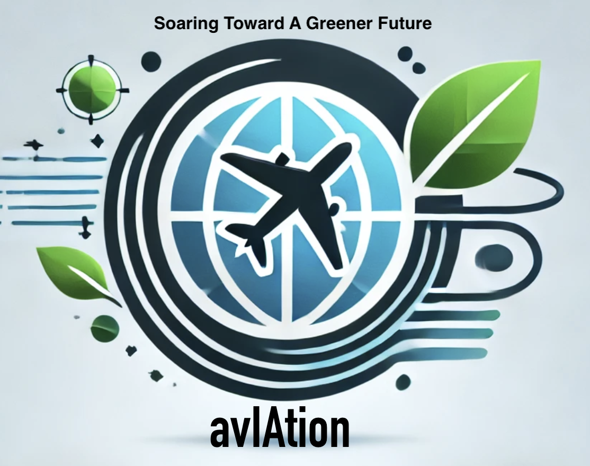

# Course

- [Course](#course)
  - [DOXX](#doxx)
    - [Shopping List](#shopping-list)
  - [Vocabulary list related to study](#vocabulary-list-related-to-study)
  - [27/11](#2711)
    - [Sports during Thanksgiving](#sports-during-thanksgiving)
    - [Thanksgiving in Germany](#thanksgiving-in-germany)
  - [Note](#note)
    - [1st passage](#1st-passage)
      - [Aurelien](#aurelien)
      - [Maxime](#maxime)
      - [Clementine](#clementine)
    - [2nd passage](#2nd-passage)
    - [Paul](#paul)
    - [Aurelien](#aurelien-1)
      - [Clementine](#clementine-1)
    - [Video](#video)
    - [Shark Dent](#shark-dent)
    - [Introducing the topic](#introducing-the-topic)
    - [Present yourself](#present-yourself)
    - [Help you prepare](#help-you-prepare)
    - [Audience](#audience)
    - [Introducing your visual aids](#introducing-your-visual-aids)
    - [Sharing examples](#sharing-examples)
    - [Emphasizing a point](#emphasizing-a-point)
    - [referencing information](#referencing-information)
    - [Key takeaways](#key-takeaways)
    - [Ending the presentation](#ending-the-presentation)

## DOXX

she goes to lidl and super u, she has a girl neighbor

### Shopping List

- red wine 2.69 / liter
- hot cider
- flamed octopus' tentacles with armaniac/maple syrup
- spice.

## Vocabulary list related to study

before an exam, some students cram for it.

even if genuis do some revision

revise by looking at past papers

exam happens ever year

memorized

learn off by heart

use mnemonics

root learning is not sufficient or most subject

bury urself in your books and study intensively until u know the subject inside out

1. know inside out
2. mnemonics
3. cram for
4. intensively
5. bury yourself
6. genius
7. rote learning
8. past papers

How does the author description of the yellow headed blackbird create a vivid image to the reader.

The usage of two vivid colors—bold yellow head and bright blue sky—contrasts with the black body of the bird. This emphasizes the magnificent and vivid colors of the birds that stand out from the landscape.  The colors stand out despite the dark-feathered color of the bird. Moreover, the colors are well-described and precise, making it simple for the user to synthesize the image.

What is the significance of the author, distinguishing between his early bird memory and his earliest birding memory?

How does the author characterized Steve Jobs based on their first meeting? in 1984

What literary device does the author gives when describing Jobs' charm.

---

merry Christmas

your nephew just pulled in the manger - creche de noel = manger

have something to pitch
the beam of his charm
be focused on
tempting
be restored to the throne
thereafter
think different
the endeavor of assessing historic influence fascinating
extol
petulant
revealing
i found myself rather captivated
engaging intensity

lined up along
prompt something to
tally
transform someone's interest in bla into a quest with a sense of purpose
laid down enough pencil miles
take hold
brain exercise
make lines on paper

promote the chair
chat bot

Dinesh is being prompted by his coworker to send a file, once again. Dinesh is petulant, as he has already sent the file 5 times. It is not a brain exercise to dig into the conversation.

His coworker stood there, as if he had something to pitch, in fact, he sat down, into thin air, revealing a mechanic tripod chair. He was extolled by the creation and restored the throne to his coworker, by sending him the file.

Thereafter, Dinesh took hold and focused on dissing his coworker with Gilfoyle, his friend. I found myself rather captivated upon discovering that it was a chatbot all along, making lines on the paper. It laid down enough pencil miles to trick Dinesh into thinking it was Gilfoyle.

## 27/11

### Sports during Thanksgiving

- If I had to choose
- If you ask me
- Out of all the gngngngn
- the first gnggn that comes to mind is
- I guess I'm trying to say that
- To put it another away

When I think about thanksgiving, the first thing that comes to my mind is football.
Since the creation of the National Football League in 1920, many teams played during Thanksgiving.

It's a delightful day for the Detroit Lions fans, as out of all the teams that played in the NFL, they have been playing on Thanksgiving day since 1937.
To put it another way, its been nearly 90 years they play on Thanksgiving.

If you ask me, I'd rather watch a football match, rather than staying stuck at a never-ending dinner.
It is a tradition to watch football during thanksgiving.

### Thanksgiving in Germany

Thanksgiving as celebrated in the United States is not a traditional holiday in Germany. However, Germany does have a similar occasion called "Erntedankfest" (Harvest Thanksgiving Festival), which typically takes place in late September or early October. Here's what Germans generally do for Erntedankfest:

1. Church Services and Processions
In rural areas, Erntedankfest often begins with a church service to give thanks for the harvest. Churches are decorated with fruits, vegetables, grains, and flowers.
Some communities organize processions with decorated harvest wagons and displays of regional agricultural products.
2. Traditional Food
The celebration includes feasts with seasonal dishes. Common foods include roasted meats (like goose or pork), root vegetables, potatoes, and breads.
While there's no turkey tradition as in the U.S., some families or communities might roast chickens or serve hearty stews.
3. Community Events
Villages or towns may hold markets, fairs, or festivals, with activities such as music, dance, and even games.
In larger cities, it might be less common, but some church groups or local organizations still host events.
4. Modern Adaptations
With globalization, some Germans have adopted American-style Thanksgiving celebrations, especially in cities or among expatriate communities. This could include turkey dinners and gatherings with family or friends.
While Thanksgiving isn't a public holiday in Germany, the concept of gratitude and celebrating the harvest resonates with many, particularly in traditional or rural areas.

## Note

### 1st passage

#### Aurelien

- **Improvements Needed:**  
  - Avoid saying "no" too often.  
  - Work on being more consistent in delivery.  
  - Improve accent clarity and articulation (e.g., "complexiti" should be "complexity").  
  - Speak louder and with more confidence.  
  - Watch for issues like "moRRRE" and "199 too."  
  - "la voix baisse"
  - 200 won - you tried to say 200 and one
  - You look bored and annoyed, evne if you are try to pretend

#### Maxime  

- **Improvements Needed:**  
  - Avoid overusing filler words like "So."  
  - "rice," "race," "raise", you tried correcting yourself, it was a nice try tho. <3
  - Be careful with "zis" instead of "this" and "Z" for "th."  
  - Be more confident in delivering facts (e.g., "1938" and "approximately").  
  - Work on intonation and overall clarity.  
  - "financial difficulties," "motor vehicles"  work on pronunciation, you said feenancial
  - Pronunciation of "nationalize all the rails" should be smoother.  

#### Clementine  

- **Improvements Needed:**  
  - Ensure correct pronunciation of terms (e.g., "privatisation," "passenger").  
  - Avoid unclear or filler phrases like  "Ouais => Bah euh."  
  - "goid point of those?"
  - Work on clearer articulation of points (e.g., "The UK rails were privatized went really up fast" is unclear).  
  - Pay attention to accent and accentuation.  
  - Avoid using expletives like "feuck" in professional settings. or pronounce it properly lol
  - If you wanna talk about a specific decade say "in the 1990s"

### 2nd passage

### Paul

- **Improvements Needed:**  
  - Words to improve: "alright," "istory," "wouagon," "euuh," "amalgamated," "mahny" (should be "many"), "railings" (should be "railways").  
  - Watch for pronunciation issues like "shit" sounded very french and "The histeury" (should be "the history").  
  - Replace "wagons" with "carriages."  
  - Clarify phrases like "stayed?" and "took ove others."  
  - Intonation problems throughout.  

### Aurelien

- **Improvements Needed:**
  - Words to improve: "ralways" (railways), "zey decided" , "the kality" (), a
  - Issues with pronunciation of "r" and "w" (e.g., "dizzeuh," "euhhhhhh").  
  - Avoid overdoing "tooooooo" and filler sounds like "euh."  
  - Improve articulation of numbers (e.g., "in 199 too," "1982").  
  - Work on intonation and accentuation, especially in longer sentences.  
  - Ensure clarity with terms like "privatisation," "highly cost," "tracks and wagons," and "increase of customers."  
  - Content is good, but pronunciation and delivery need improvement.  

#### Clementine

- **Improvements Needed:**  
  - Words to improve: "three" (ensure the "th" sound), "zirdly" (should be "thirdly"), "ticken" (should be "ticket").  
  - Ensure proper pronunciation of "high" (emphasize the "h") and avoid replacing "ways" for "railways."  
  - Be clearer with phrases like "euh in a passenger," "50 billion what," and "put into competition."  
  - Focus on advantages like "cheaper," but also ensure a strong conclusion.  
  - Intonation and filler words like "euh" need addressing.  

### Video

The resume is rly important it represents you, skills, past

Ive seen they include everything idc what u did 20-30 y ago, you might have been a star 20 years ago, but the world has changed, you changed, only go back at around 15 years

grammatical mistakes, dead punctuations, more than 1 error its done, resume are expected to be perfect, spell check

all hire manager and staff check on the internet, can stop you from getting or actually get you an interview. be careful post you do, your conversation, do a google search on ur own name

job advertisement, posted online, or a job description hr
what are the skills and abilities that are required to do the job
list the key skills that are required
were theses skills in the past
stories that demonstrate how they use their skills

how do they dress, how do they come in

if you dont handle it the right way, how you approach them
treat everyone as part of the interview process

the employers is giving us money, i can offer enough value to the company. If I give more value = more money.

id let the employer raise the money topic first
that's the right time after

body language + eye contant + tone is impotant, we want to feel confident, communicate your confidence

its strong personality, id like to be an apple tree, beautiful, blooming and fruity, cactus dont need a lot of support they can survive on their own.

black friday discount of prices, unofficial start of holiday

isnt only about shopping

it has been in the new, bad event that happened on fridays

in 1869, couple investors james fisk, gold market financial panic, black friday

after the us thanksgiving

bonnie tayler blake searcher, a journal factory management 1951, day afyer thanksgiving, it has to do with worker absentesm, had trouble to have their worker to show up

Police in philadelphia, because biggest shopping day, football game, panics, dealing with traffic, foot and car traffic, deal with all that

chatoci shop scene
didnt like the connotation, wanted to rebrand it as big friday.
very common myth, since 1980's black friday = retail store companies become profitable, they go in the black

its been so scucesful try to spin off black friday to other days, cyber monday

black friday is a popular day for retailers

---

### Shark Dent

Bot-It
a website mobile app ai online task - 150K dollar 10% stake

I am Thibaud, CEO and founder of avIAtion. avIAtion is an AI weather forecast system designed specifically for AVIATION.
This AI model serves as a tool for flight and maintenance planning as well as reducing the environmental impact of aviation.
How so? By mitigating re-route during flight to avoid meteorological hazards, helping in mitigating flight delays and deletion if conditions are not met for takeoff, thus avoiding a huge amount of people to take their car to the airport for nothing.
I demand $10K, an 8% stake and a mentor to keep on developing my project and having a professional and external feedback on my project.

at avIAtion we are soaring Towards a Greener Future

morning
mourning

1. Thank you for joining us today.
2. I'm thrilled to be here discussing...
3. Today's insights will be valuable for...
4. Let's embark on a journey through...
5. I appreciate the opportunity to share
6. Imagine a world where
7. Did you know that [startling statistic]
8. Have you ever faced a challenge like [relevant situation]
9. I'd like to begin by sharing a personal story that relates to our topic
10. In today's fast-paced world, it's crucial to
11. Let's take a moment to reflect on the impact of [current industry trend]
12. I stand before you today to address a critical issue [presentation topic]
13. Before we dive into the details, let me ask you a question [thought-provoking question]
14. As [name] continues to evolve, we must embrace change and seize opportunities

Did you know that 30% of the population, in 25 years, will need to move because of climate change. Let's take a moment to reflect on the impact of ocean's rise. In today's fast-paced world, it is crucial to embrace change to correct our bad habits.

### Introducing the topic

15. As you all know, I will talk to you about CPC advertising best practices today.
16. In this presentation, I am going to walk you through some of the best practices in CPC advertising
17. For the next forty-five minutes, I am going to be speaking to you about the best practices in CPC advertising
18. By the end of this session, you will all know a little more about the best practices in CPC advertising.
19. My presentation is particularly relevant to those of you who are new to CPC advertising
20. Today, we're going to look at some of the recent developments in CPC advertising
21. This talk is designed to act as the starting point for discussion

### Present yourself

22. my name is Kenny Jones and I am the Head of Marketing.
23. For those who haven't met me yet, I'm Kenny jones, the Head of Marketing. Let me start with a few words about my background.
24. First of all, a little bit about my background. I am the head of marketing at Lego and have been with the company for seven years. Before that, I used to work for Booking.com where I...
25. I'd like to introduce myself: I am Kenny Jones, the Head of Marketing at Lego
26. by the way of an introduction, my name is Kenny Jones, and I heap up the marketing department at Lego
27. My role involves creating and executing marketing strategies across all channels
28. Does everyone have a copy of the report we'll discuss today?
29. Don't worry about the taking notes, I've put all the relevant statistics in a handout for you, which I'll pass out now / share a link to in the meeting chat
30. You can refer to the handout I shared earlier throughout the presentation
31. Please go to page 5 of the report

### Help you prepare

32. Can everyone hear me?
33. Can you see the presentation I'm sharing on my screen?
34. Apologies for the technical problems. Please bear with me for a moment
35. Thank you for your patience. We'll resume the presentation shortly.
36. While we sort out this issue, let's discuss your thoughts so far.
37. Let's take a brief pause while this gets resolved. In the meantime. Feel free to write down any questions

### Audience

38. My presentation will take about 45 minutes and is divided into four sections. Section 1 is going to discuss..
39. Since we only have 45 minutes to discuss this huge topic, Im going to keep things brief. This talk is going to be divided into four sections. To start off
40. I thought sharing a road map of what i plan to cover would be helpful. This talk will be divided into four sections
41. I'm going to look at four different aspects of CPC advertising in today's presentation. Number one
42. Today's presentation will cover three main areas... We'll start with..., move on to...., and conclude with...
43. Here's a bird's eye view of our agenda today.

44. If you have questions, please kindly wait until the end of the presentation to ask them, we'll have 10 minutes for an open discussion  at the end
45. Please save any questions for the end of the presentation when we have time for a Q&A session.
46. I'll be happy to answer any questions at the end of my talk
47. I encourage you to hold any questions until the end
48. We've allocated plenty of time for a Q&A session after the presentation
49. Feel free to share any questions in the chat as we go along
50. Feel free to interrupt if you have any questions
51. if anything isn't clear, put your hand up, and I'll do my best to answer your question
52. Unfortunately, photography isn't allowed during this presentation
53. I would appreciate it if you could put your phones on silent or turn the, off for this talk.
54. I'd like to ask you all to please mute your microphones so we can make sure everyone can hear the presentation.

55. So, what is CPC advertising
56. Lets start at the very beginning. Many people ask..
57. let's get started
58. I'd like to start talking about
59. Shall we kick off?
60. let's dive into the first part of the presentation
61. To set the stage
62. First and foremost

63. Okay, so that's Facebook ads. But what about Google ads? Well..
64. Now. let's turn to Google ads.
65. there's a lot more to learn about that, but since we have a limited amount of time, let's move on to Google ads.
66. Next up: Google ads
67. part two: Google ads
68. Building on that, now let's explore Google ads.
69. Now, shifting our attention to Google ads.
70. Let's move on to Google ads

71. Now, I'd like to turn over to Christina Richards, who will walk us through KPIs
72. At this point, I'll hand things over to Christina to continue with KPIs
73. To provide more details on KPIs here's Christina
74. That's all for me. Christina would you like to take it from here?
75. I'll stop here and let Christina continue with the next part of the presentation
76. With that I'll pas it over to Christina to take us through the next section
77. Before i hand over to Cristina, does anyone have any questions about what we've just covered?
78. Now that we've gone over CPC advertising, Christina will dive deeper into KPIs
79. Thanks for your attention so far. Let's hear for Christina next

### Introducing your visual aids

80. If you look at this graph, you'll see
81. This graph paints a clear picture of
82. From this chart, we can understand how
83. This chart shows the findings of a recent experiment we undertook. Part a represents... while Part B stands for...
84. AS you can see from this infographic, our research indicates that
85. Now, direct your attention to this infographic
86. To visualize this concept, take a look at this diagram
87. Here's a visual representation to simplify this idea

88. There are five main advantages to this approach... firstly,... secondly,... thirdly
89. There are three main reasons why people choose Google ads/ It's primarily because... but another key factor is... some people choose them because...
90. There are five stages of the process. You start by... then, you should...after that...
91. We'll start the presentation with a broader perspective on CPC advertising, then move on to specifics about...
92. First of all, I'd like to give an overview of...
93. My first point concerns
94. Next, I'll focus on
95. Then we'll consider
96. From there, I'll highlight the main points of
97. Finally, I'd like to address the topic of
98. Finally, I'd like to briefly discuss the issue of

### Sharing examples

99. For example, consider the case of
100. For instance
101. As an illustration of my point, let's discuss
102. Drawing from real life, remember when
103. To put this into context
104. A practical example would be
105. Let's imagine a scenario where

### Emphasizing a point

106. It's crucial to understand that
107. I cannot stress this enough
108. Let's not overlook the fact that
109. This is the crux of our discussion: an omni-channel marketing strategy.(the term "crux")
110. It's of paramount importance that...(the term "paramount" means of more importance than anything else.)
111. I'd like to draw your attention to
112. You'll want to remember this
113. This is a pivotal moment in our discussion
114. The main thing to focus on here is
115. Let me underscore the importance of

116. On a related note
117. This ties in with our earlier discussion about
118. in conjunction with this topic
119. similarly, we can also consider
120. This draws parallel between
121. This brings us to our next point, which is closely related to
122. In the same vein
123. This naturally leads us to
124. To expand on this further
125. Now, let's take a closer look at how this connects to
126. This provides a good segue into
127. To rephrase that
128. In other words
129. to put it differently
130. What i mean to say is
131. Essentially, the idea is
132. Now. let's further discuss the implications of
133. I'd like to dive into this issue in further detail
134. Let's consider the significance of this data/result/problem

### referencing information

135. According to a study by
136. As per the latest findings
137. Referencing data from
138. Our latest customer surveys shows that
139. Recent research suggests
140. To quote the report
141. Let's take a look at these statistics
142. Based on the results of this survey conducted by our marketing department

### Key takeaways

143. That's it on CPC advertising for today. In brief, we've covered.
144. To wrap up, let's quickly review the main points we've covered today.
145. Here are the key takeaways from today's presentation about CPC advertising
146. Before we finish, I'd like to highlight the most important points.
147. What I'd like you to take away from this is
148. The key action items moving forward are
149. Here's what we need to focus on after today's meeting
150. Are there any points you'd like me to elaborate on?
151. If there's one thing to remember from today's presentation about CPC advertising, it's
152. The most important point to take away is
153. I want to make sure this key messages sticks
154. Don't forget the main points from today: A, B, and C
155. Let's recap for a moment

### Ending the presentation

156. That brings me to the end of the presentation. I hope you're clearer on CPC advertising and when to use it.
157. To sum up our journey today
158. As we conclude, remember
159. To bring our discussion full circle
160. That concludes our presentation for today. Thank you all for your attention and participation
