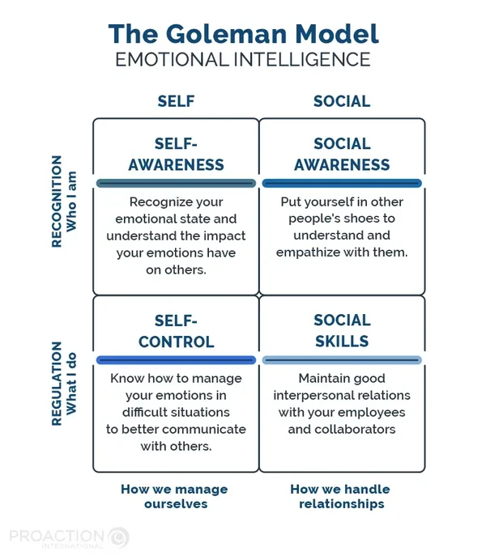
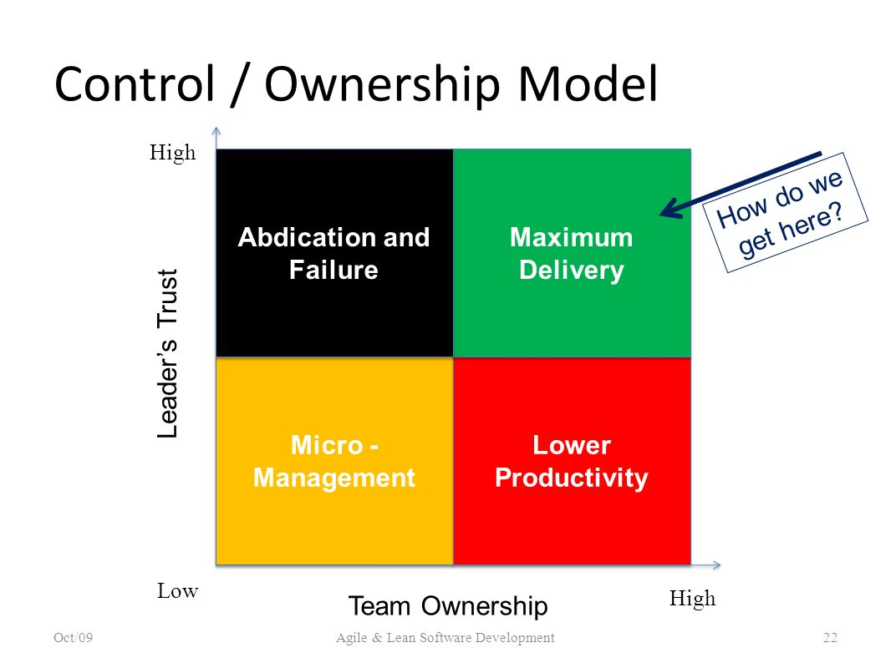
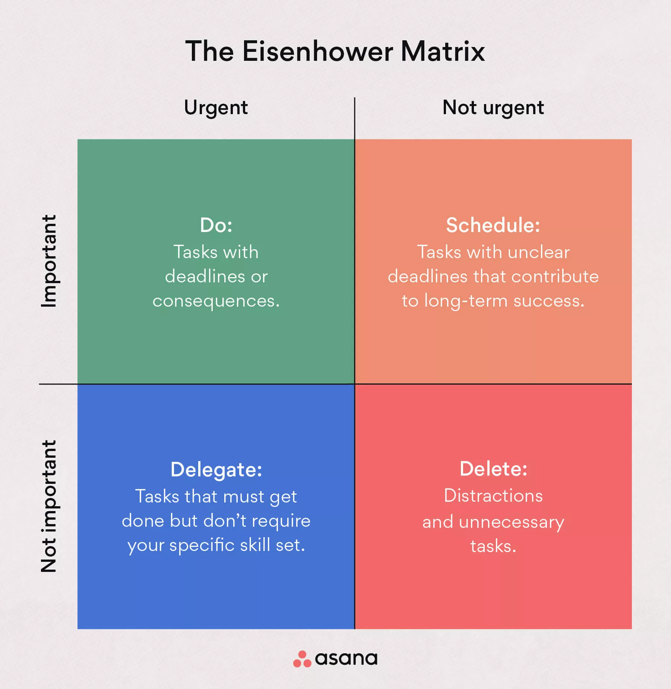
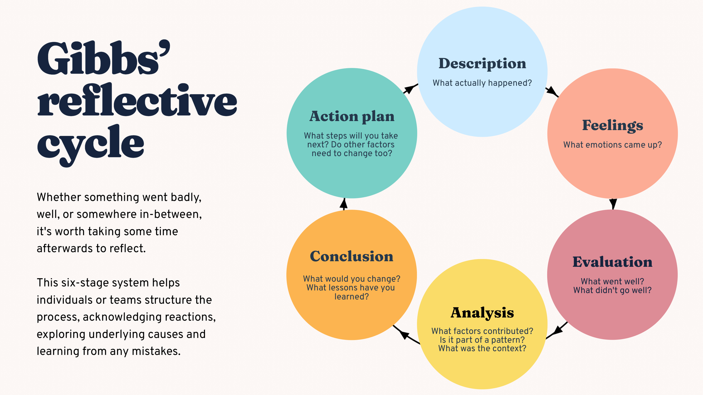
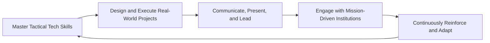
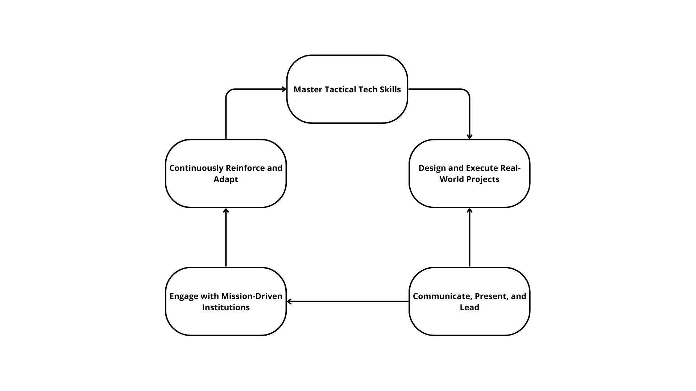

# Identifying Opportunities

## Core values and personal vision

What is important to me now?

- Get better at programming
- Work on my moonshot project for the bachelor then the master
- Get better at the guitar
- Start working at the gendarmerie

What do you think will be important to you when you finish your studies at ALGOSUP?

- Build experience over the years
- Have knowledge

What do you need to be, to do or to have in order for you to be happy?

- To be loved
- To be myself, be kind
- To do something I like, that matters to me, that can help others

### Alexis L.

Important now:

- Moonshot + Graduation (next month)
- French sign language exam (next week)
- plan holidays (vercors)

Important after ALGOSUP:

- directly find a job, don't want to spend too much time on the job market
- create a family

To be happy:

- To be proud of himself
- To do something that really help others
- Human relations (small talks, enjoying time)

## The values I value the most

- Love
- Openness
- Humor

### Positive and Negative Behaviors Driven by These Values

#### Positive

- **Love:** Caring for others, fostering healthy and non-toxic relationships, I want love to be primary (family first).
- **Openness:** Being receptive to others' opinions, beliefs, and perspectives, which helps in understanding different viewpoints.
- **Humor:** Creating a light-hearted atmosphere that brings joy, making work environments and social interactions more enjoyable and likable.

#### Negative

- **Love:** Can cause pain if feelings are one-sided or lead to being blinded by love, overlooking important issues.
- **Openness:** May result in feeling vulnerable or left out when your own feelings are not equally acknowledged.
- **Humor:** Risks not being taken seriously if humor dominates, and sometimes it can be misinterpreted or offend others.

They have to be balanced, not too much, but enough. These points are important to me, but I keep in mind that if they are unbalanced, this can lead to issue.

## Personal Vision

- A personal vision is a clear picture of your desired future.
- It should be **meaningful**, **realistic**, and **easy to understand**.
- It must also be **inspirational**—appealing to your imagination and aligning with your core motives and aspirations.

### How I want potential employers, colleagues, and partners to see me

I want to be seen as a relaxed, easygoing person—gentle, trustworthy, and someone who brings humor and a light-hearted atmosphere to the workplace.

### How I intend to make money

I plan to earn a living through multiple paths:

- Working as a full-time employee
- Serving as a reservist in the Gendarmerie
- Investing in the stock market
- Invest in my bank account (interests)

### What will make me special

I would love to be known as a skilled guitar player, but above all, I want to be recognized for my kindness and gentleness. These qualities matter to me more than any specific talent.

### What I want my family and friends to think of me

I hope my family and friends see me as someone caring, loving husband, gentle, and docile—always willing to help and there for them when they need support.

### What reputation I wish to have among people I may not know personally

I want to be known as a hardworking, trustworthy, and gentle person, even by those who may not know me well.

### Personal Vision Statement

In the future, I want to be known as a kind, gentle, trustworthy, and hardworking person—someone who brings a light-hearted, supportive presence to both personal and professional relationships. I aim to build a fulfilling life through meaningful work, service in the Gendarmerie, wise investments, and by nurturing my passion for guitar and human connection. I aspire to be a loving husband, a reliable colleague, and a person who values purpose over profit.

"Everybody thinks of changing humanity - hardly anyone thinks of changing himself." - Bayazid al-Bastami

This resonates in me, it is way easier to see others' issues rather than ourselves. Sometime changing ourselves will resolve issues.

## What attitudes and behaviors do I need to change in order to realize my personal vision?

- "I'll do it tomorrow"
- "I'll play video games for now"
- "I'm tired"
- "I've time to do it"
- I won't succeed anyway
- I'm not good enough
- I'll never know what/how to do
- I'll never reach such a level
- If I fail, I'll lose everything
- others will do it

- I'll do it now
- I can't do it, yet
- I need to persevere, ill do it one day
- I'll try my best
- I'll learn from my mistakes
- I will manage my time
- let's plan my day
- let's plan deadlines
- Let's break the tasks down
- I don't need to be perfect

### Four-Room Apartment

- Contentment:
  - Comfort zone
  - Feel confident
  - Feel Competent
- Denial:
  - I'm not the problem
  - Won't learn a thing
  - doesn't admit any weakness or fault
  - Refuse to change
  - "I'm doing all possible"
- Confusion
  - questioning
  -
- Renewal
  - growth

## Discovering Opportunities

Effectuation - [Link explanation](https://blog.hubspot.fr/sales/effectuation#:~:text=L%27effectuation%20est%20une%20logique,avec%20exactitude%20dès%20ses%20débuts.)

- Start with what's available now
- Invest want you can afford to lose

Process of exploration

- Who I am / What I know
- WHat I can do → goals
- Who I know
- stakeholders / commitment
  - no commitment → dead end (dump bad idea)
  - new means → how will I do this
  - new goals
-

A change in environment changes what you know (e.g. lessons) and loops back to the beginning

This whole loop leads to new firms, products or markets

5 principles:

1. bird in hand

- start with what you have
- asked yourself what should I know
- who I know
- use the available resources
- zero

2. Affordable loss

- make a commitment
- find what you can lose
- focus on downside
- limit risks

3. Crazy quilt

- patchwork quilt
- partnership and networks
- seek funding
- co-create new markets with interested others
- build hive with bees

4. Lemonade

- sense and seize opportunities
- don't use what if
- transform problems into chances for growth
- more lemon, more lemonade

5. Pilot in the plane

- control vs predict
- focus on activities within control
- action result in desired outcomes
- don't predict the future: make your own

- designed for older people experiencing reduced mobility
- enable coordination and mobility
- increase autonomy
- amount of obstacles they might face avoided
- reaction time
- stability regarding long distance → balance

## Today's Conclusion

- When you are given the task to task somebody, don't do it yourself.
- Sometimes they do even better than what you've imagined
- trust your colleague, you will get sometimes surprised
- even if they don't deliver as you expected them to, it opens new possibilities
- sometime the best solution is the combination of ideas
- sometimes you have to build up and not build down

## Building Relationships

"The best way to find out if you can trust somebody is to trust them" - Hemingway

Trust holds relationship together. No matter the source of the relationship (love, friendship, colleague)

Do you directly trust someone, or do you not ?

1. People are open directly, until they get hit on the head
2. People won't trust you and will test you all along

If you always search for mistakes, it communicates no trust.
Rather, search for good things and mistakes. And feedback will be more appreciated.

TRUST = (Credibility + Reliability + Intimacy) / Perceived Self Orientation

Credibility = perceived competence \
Reliability = Perceived consistency and dependability: delivering promises \
Intimacy = Perceived closeness and understanding

Perceived Self Orientation = Perceived personal gain motive

Sometimes people say the same thing as you with other words, you have to understand that they have the same pov as you. \
Things don't have to be said the way you think or say them.

### The 5 trust skills

- Listen

  - Do not argue or apply a fixed mindset
  - Empathetic, earning the right to be heard

- Partner

  - do not compete over ideas, maybe other people can add value to your idea, sometimes they are trying to improve it (keep in kind that sometimes they try to shoot you down, in that case, refuse it, but conquer your mind)
  - Give and take
  - Being in 'tune', know their needs, understand them

- Know yourself

  - You need to know yourself for others to trust you, it's at the center.

- Risk

  - Risks of trusting, the more you defend, the more people throw stones, they will stop eventually if you don't defend. WHen someone argues with you, they give you weapon to fight back with, so don't give them weapons in return.
  - Willingness to take risks because there's a solid relationship to fall back on
  - When the relationship is strong, you forgive more, so you are willing to take more risks and when it comes to conflicts, you know it can be fixed, because the relationship is strong
  - Negotiation doesn't have to take a lot of time when you trust each other

- Improvise
  - Flexibility (according to the needs of the people we are working with)
  - Thinking and responding quickly when the situation is not familiar
  - Some things you cannot control or predict will happen
  - Practice improvisation, your instinct will get better

You have to be like water, be flexible and hard to be trapped, be like bamboo, be strong and flexible at the same time. In Asia, they say that
bamboo (fiber) can be stronger than steel.

Lots of talking doesn't matter, the doing does, and the doing improves your credibility

### 4 elements of empathy

1. See their world
   1. put yourself in their shoes
2. Appreciate them as human beings
   1. don't judge them they are human after all
3. Communicate understanding
   1. verbal/non-verbal communication
   2. a smile can be enough (beware of cultural differences)
4. Understand feelings

### Trust creation process - ELFEC

1. Engage
   1. Offer something of value in an open discussion about issues important to the other: "Let's talk about..."
2. Listen
   1. Take note of what's important to the other and earn the right to offer solutions: "Tell me more..."
3. Frame
   1. State the root issue in terms of what is acceptable to both
   2. state problems and hypotheses
   3. Take personal risks to explore sensitive issue in depth "So the issue is..."
4. Envision
   1. Define an alternate reality including win-win descriptions of outcomes and results "Let's imagine..."
5. Commit
   1. Jointly articulate actionable next steps to signify commitment and movement on the part of each party "I suggest we do..."

### Emotional Intelligence

The ability, capacity, or skill to perceive, assess, and manage your emotions and those of others.

It is the core of the art of handling relationships of any kind.

1. Recognition
   1. SELF
      1. Self awareness
         1. Self-Confidence
            1. Emotional self-awareness
            2. Accurate self assessment
   2. SOCIAL
   3. Social Awareness
      1. Empathy
         1. Organizational Awareness
         2. Service Orientation
2. Regulation
   1. SELF
      1. Self management
         1. Self control
         2. Trustworthiness
         3. Conscientiousness
         4. Adaptability
         5. Achievement
         6. Drive to succeed
         7. Initiative
   2. SOCIAL
      1. Relationship Management
         1. Influence
         2. Inspirational Leadership
         3. Developing others
         4. Building Bonds
         5. Teamwork & Collaboration

### Trust-Ownership Model

## Structuring Problem-Solving

### Rational Problem-Solving

- Identify the problem
  - Define the situation
  - Analyze the situation
  - Diagnose the cause of the problem
  - Specify decision objectives
- Problem-Solving
  - Searching for alternatives
- Decision-Making
  - Evaluating alternatives
  - Selecting the best alternatives
- Implementing the decision
  - Testing
  - Monitoring
  - Reviewing

### Eisenhower Urgent-Important Matrix

Purpose: prioritize actions, tasks or projects.

### Role Plays

Lucas:

- Fluid
- fast at the beginning
- clean
- not all questions were asked

Camille:

- had a great feeling about the interview

Thibaud:

- had a great feeling as well

Would hire Camille for the junior web developer job, on a common decision, Camille wasn't expecting for the senior job, and from what he said, the interviewer was aiming for the same.

## Continuous Learning

Everything around us is interconnected and that every decision or action we take has consequences for ourselves and others.

### Critical thinking DSRP

Distinctions: We make distinctions between ideas, objects, things...

Systems: We organize things into part-whole groupings...

Relationships: We make connections between and among things...

Perspectives: We take different perspectives on and from things...

Learning and resilience begin with mindset, with a growth mindset, you'll find a solution faster, you'll get out of the situation in an easier way.

### Ignorance Management

If there's something you don't know try not to cover it up, thrive to know it as soon as possible. Get things done basically.

When you're angry, count up to 20 before opening your mouth, keep control of yourself and understand that your answer will have consequences.

You need to bring it out and up, systemic response. Don't throw stones back.

Steve Jobs, despite having a fairly rude and disrespectful question, kept composure by taking his time, cooling down and applying a systemic response.

We have to learn on our feet, and not being blinded by angriness is a must-do but being agile in the way we learn is as important.

### Learning Agility

- Individual attributes related to Learning Agility:
  - Goal orientation
  - Cognitive ability - the ability of making connections, apply the programming approach when it comes to relationships, what goes with what
  - Openness to experience - not be defensive, you shouldn't be to be told twice

When people offer to help us, we have to be grateful. And not feel as if it is competition

- Learning Agility

  - Speed
  - Flexibility

- Outcomes
  - Fast learning across situations
  - Positive performances changes over time

## Exercise: Marvella District Council

Clem ; edu department

3 objectives:

1. A Primary school downtown horrible state, no bathroom, dining hall, no staff room, old school, 250 students, a lot of staff.
   1. Build a new school
      1. 720,000
      2. 18 month
2. Illiterate students
   1. Employ new teachers that will work with these students
   2. 72000/year
3. School circuit
   1. 320,000 + 60,000
   2.

Lucas; Finance and Admin department

25% of the budget, but went decreasing
Asks for more than 25%

1. Local authorities to be aware of the housing stock
   1. The last planning was made 8 years ago
   2. 1,000,000 euro
   3. Make new housing survey
2. Chief Executive worried
   1. Employ a management consultant to suggest improvement
   2. 300,000 euros
   3. upgrade housing in the city

Robin; Public services

1. Lights have been smashed by vandals
   1. replace with costless lights + fix lights
   2. 600,000 euros
   3. save 60,000 euros / year, but we need to wait for 2 years
   4. Mugging in dark streets are going on
2. Cleaning the city
   1. 3 workers currently → not enough
   2. buy 10 machines / 20,000 / machines
   3. 60,000 to pay driving licenses
   4. Increase salary of employees → 84,000 / year

Emilien; housing department

1. Families need to move from house to house

   1. research a project for flexible houses to change the size of the house dynamically (modular houses)
   2. 1,800,000 but save 600,000 euros a year **if** this works
   3. needs to be done now

2. Elderly people that don't have mobility and offices to pay rent are far away they need to move to get there
   1. Vans that bring elderly there
   2. Collect complaints of people
   3. 180,000 euros
   4. Solution to make an app that allows people to make their rent

Report:

Total: 1,692M€ → 108K€ spare

2 mains pb: Housing + Education (all the others are related or due to them)

1st of all: Focus education, but the propositions weren't good enough, except the new teachers, we also considered reducing crimes by changing lights (but due to the fact it won't be done this year, we decided to postponed it, then, if extra budget it will be spared for them next year)

2nd: Housing, we realized that some actions might be better if paired (the manager and the housing survey)
So we decided to take those 2 (1M€ + 300K€)

To help elder people and reduce everyone's need to move from A to B, we added the vans moving across the city to pay rent (+180K€)

And finally, to help women victim of domestic violence, we're adding the center helping the victims (+140K)

The consultant wasn't a good idea as the consultant wouldn't bring a thing, those that know things are those that been working on the project for 10 years.

The decision you take reflects your values.

We realized that all the problems in the city stem from education and homelessness, so our decisions focused mostly on fixing this issue
We tried focusing on education, but most of the solutions didn't work. Building a new primary school was not a good idea in a town with already 64 primary schools, even if one of them is bad. We also thought that it was stupid to invest in a television channel, as most young people are on social media and don't watch tv, and it's useless to teach stuff to the elderly, who are the main TV watchers. But we did think that it was worth it to hire the new teachers to help with illiteracy, as it is not very expensive and helps treat the problem at the source for only €72,000.
After that, we focused on housing. We couldn't afford to take the risk of spending the €1,800,000 on a research and development project since we need to fix this town's issues soon, and housing is not the only one.
Also, the solution of one center in the center of the district is not viable, as we know that it's already difficult for people to move around, and there are 232,000 homeless people; if we add the battered women, it is not enough to only have one building. However, this town has a lot of elderly people, and a lack of education usually leads to mothers with a lot of children so doing the truck to help them pay rent was a good idea, it also helps with risking going out in a town with lots of vandals and lack of lights to see them coming since old people and children don't run fast enough to escape them.
At first, we thought the survey for housing stock was not a good idea, however, we realized that if we combined it with the manager, it would help a lot with the housing problem, as we would be able to allocate existing housing a lot more efficiently and figure out more solutions to make new housing since the solutions we had weren't viable. Digitizing all the rent was a good idea, but it is far too expensive, and once again, it takes the whole budget and there is more than one issue to solve.
All the proposition of the public services department were ignored as, the streets will be dirty as long as there are homeless people and drug addicts, the lights were a good idea, but it takes too long and if we do nothing people will leave and the garbage disposal plant is too expensive and would be a lot more useful if we had more housing.
Creating two buildings for €1,700,000 was not a good idea since it is too expensive and is only a bandage on the homelessness problem. And the drug rehabilitation center is not that useful unless kids are educated or have a job, so until this is a lot better, the drug rehab is not worthwhile. However, helping battered women was a good idea since they need help quickly, and it also makes good publicity.
In the end, all of our ideas combined are:
€1,000,000 for the survey,
€300,000 for the consultant,
€140,000 for the battered women,
€180,000 for the van helping to pay rent,
€72,000 for extra teachers,
€1,692,000 in total.
The rest will be allocated for new lighting for the next year.

## Gibbs reflective Learning Cycle

## SELF-REFLECTION

1. When during the week have I listened, changed my mind and acted upon the ideas of others?

When we have done the game exercise, a lot of ideas came from within the team, from the client as well, and from the end user. All those ideas needed to be condensed into one big idea. Dumping bad ones, and keeping those that would add value.
I felt kind of in control during this exercise, and was leading the team, I'd say. I had an idea of creating a gym exercise based game at the beginning. Though from what the team mentioned, the client's expectation and the end user wills. Such an idea was suboptimal and was the bare minimum the client was waiting for. I then decided to change my approach to apply the feedback I had received. This lead to a final game idea that was above expectation.

The thing I had forgotten about: Refer to question 4 :)

The fact that I've gone to the final user directly (Dee) to listen that what were her recommendation her need and what she would like to have was when I think I listened to the best during the week. This was a turning point in how the team tackled the project and the issue we had. This lead to a game that fitted the need of elderly people.

2. When during the week have I failed others by not giving them sufficient support?

During the Marvella game, as we wre playing the role of a municipal council, we picked the idea as a team to take the management consultant. This idea ruled out to be a terrible one as those that know the better about a project are those that work on it, right. Robin had mentioned that this could have been a terrible idea, and we noticed it a bit too late to remove it. This late-time realization, lead to a bit of confusion on wether to keep it or not. Even tho we had a bad feeling about it, we still went for it. It turned out to have been bad.
We should have kept calm and reconsider the idea when we found out that it was maybe a bad idea. And maybe should have listened to and trusted Robin more when he stood out to mention that the idea wasn't in the right direction.

3. When during the week would new opportunities have opened up if I had effectively challenged the views of others?

At the beginning of the game creation exercise, when we had to present our idea to others, we had the hieroglyph idea that was mixed up with the other idea we had. The hieroglyph idea had never been really challenged and removed from the white board, it wasn't dumped effectively. I should have stood out to maybe remove the idea right away from the white board. And shouldn't have tried to include it when presentation went badly, I contributed to the spiral downing presentation by trying my hardest to include the idea. I should just have dumped it even if it had meant to restart the presentation, I should have mentioned it to my team members correctly that this idea was not the one we had decided to keep and that it was deprecated.
Next time, such idea should be dumped directly to not lead confusion, and if confusion takes in, I should simply dump the idea rather than sinking into it.

I should have challenged my teammate respectfully when he started presenting the hieroglyph idea, simply and kindly explaining that this idea wasn't part of the project anymore, this simple thing would have made us not look like complete idiots as a team and such an event in a company could make us lose a market, a project, or even a job..

The opportunity that we could have had if we apply it to a real world application is that we could have gotten the job, we could have not look stupid, and maybe we could have given a better and less confusing description of what we wanted to the other team.

4. Share your thoughts with your team and invite their comment.

General feedback: they do agree with what I've written, and have no idea what I should add (im either perfect (no), or im missing something (second though: I was indeed missing something)).

I need to develop my challenging skills in a respectful way as I tend to listen to others too much, we need to maintain a balance in this.

## Flywheel Analogy

What I'm good at: communicating, observing, listening, empathic, presenting, improvising, management

What im passionate about: la gendarmerie, software development, computer science, video games, cybersecurity, defense industry, guitar (metal music)

What I could make money out of: working in computer science field, for defense industry companies or for the gendarmerie

1. Master Tactical Tech Skills

What to do:

- Learn new technologies, adapted to what I want to do, full-stack development
- Train in cybersecurity tools and penetration testing

2. Design and Execute Real-World Projects

What to do:

- Create applications for secure communication or drone interface systems
- Build prototypes that simulate defense/military scenarios
- Work on side projects that reflect gendarmerie missions or tools

3. Communicate, Present, and Lead

What to do:

- Practice explaining technical ideas to non-technical people
- Lead a small dev or cybersecurity project (even solo or open-source)
- Present demos, project pitches, or cyber briefings

4. Engage with Mission-Driven Institutions

What to do:

- Seek internships, shadowing, or civilian tech roles with the French Gendarmerie or defense firms (Thales, Nexter, etc.)
- Follow military ethics, discipline, and teamwork culture
- Stay informed about military doctrines, technologies, and regulations

5. Continuously Reinforce and Adapt

What to do:

- Review progress every 3 months
- Apply the process of exploration and focus on what I know and what I can do, my resources...
- Adapt to new missions or technologies by learning fast
- Be motivated for what's next

## Practical Actions 

- I want to seek technics and ways to challenge people when I'm listening to them

Make the flywheel spinning by:

- Learning C# technology language with .MAUI framework to create applications
- Work on my moonshot project that is for the French army, start documenting the project

- Keep in mind the learning agility part, be goal oriented and open to new experiences.
- My goals are defined in my personal vision part. 

- What was mentioned in the Flywheel analogy part

### Key Takeaways

- Continuous learning is the main element I will take away from this course, we learn all our life long and everything is linked one way or another. Learning is an infinite rabbit hole. I should thrive to learn new things when I don't know them. When it comes to being angry, I sometime open my mouth to fast and throw stones to the other person. I should keep calm, take time, breath, calm down and just don't give weapon to the person in front of me. Understand that my response will have impact and the goal isn't to hurt the person, and sometimes understand that I can be in the wrong.

### Curious to explore

- I will dig into the Gibbs reflective cycle, especially for the conclusion and action plan part, learn ways to challenge others and myself.

### Team notes

Lucas: - core values, questions to ask ourselves, look at the future, the way to know himself, understand how to make new opportunities, knowledge management SECI, it's not because you have technical skills that you are an expert in leadership and social skills, danger area.

Camille: - Separate humor and work more, be more balanced, Camille wants to stop throwing stones to other person when he is angry, he should take a step back. 

Vivien: - He has a fixed mindset, make too many decisions based on gut-feelings rather than rational and well-thought decisions

Robin: - He feels not legitimate sometime to talk, sometimes he is shy with those that he doesn't know, he needs to be confident and accept the fact of making mistakes. 

Emilien: - Be more confident, he is "not that dumb that he though", has to incorporate what others say deeply whatever the feeling he has. Think before he acts. He should keep calm when people are mean to him, learn how to love himself first. 

Clementine: - When she is stressed she will have an extremely fixed mindset, but she doesn't really know how to fix it. Her solution is to talk about it with people she knows to find solution. She doesn't feel legitimate when she is stressed. Sometimes she wants to let others take the lead because she often does it and want to give the chance to others, but that doesn't mean she needs to put herself aside, she still can help others. 

### Curious to explore (a team)

Clem: - explore the fact of being more of a mentor rather than a watcher when she lets someone lead.

Lucas: - He wants to learn ways to challenge others, and invite others to join the conversation with him. 

Camille: - stay calm and don't throw stones, do not give weapons, control himself

Vivien: - how to manipulate people to gain loads of money, challenge others he's avoiding challenges way too much. And challenge himself too. 

Robin: - Take more initiatives, gain in self-confidence

Emilien: - "Change the world by changing me", do not get angry when people are mean to him
