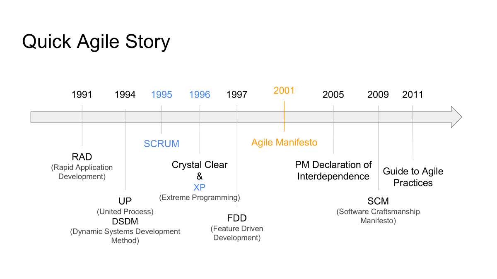
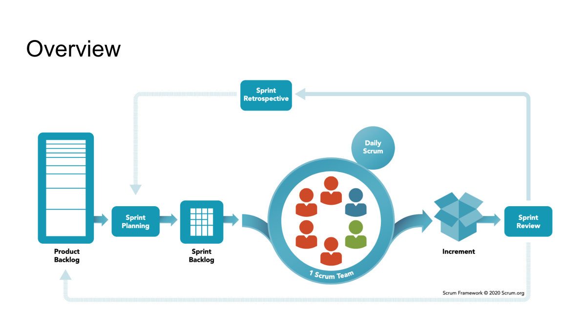

# Agile Scrum

Ludovic

## Quick Agile History

### Waterfall vs Agile

Waterfall: A linear and sequential approach where each phase must be completed before the next begins. It is often inflexible and can lead to challenges if requirements change.

Expression des besoins -> specification -> conception générale -> conception détaillée -> réalisation -> tests unitaires -> tests d'intégration -> validation/recette -> maintenance

Agile: An iterative and incremental approach that emphasizes flexibility and customer collaboration. Agile allows for changes to be made throughout the development process, accommodating evolving requirements.

## Agile Methodologies

### The Manifesto for Agile Software Development

- Individuals and interactions over processes and tools
- Working software over comprehensive documentation
- Customer collaboration over contract negotiation
- Responding to change over following a plan

### Agile Software Development Principles

1. Customer satisfaction by early and continuous delivery of valuable software.
2. Welcome changing requirements, even late in development.
3. Deliver working software frequently (weeks rather than months).
4. Close, daily cooperation between business people and developers.
5. Projects are built around motivated individuals, who should be trusted.
6. Face-to-face conversation is the best form of communication (co-location).
7. Working software is the primary measure of progress.
8. Sustainable development, able to maintain a constant pace.
9. Continuous attention to technical excellence and good design.
10. Simplicity—the art of maximizing the amount of work not done—is essential.
11. Best architectures, requirements, and designs emerge from self-organizing teams.
12. Regularly, the team reflects on how to become more effective, and adjusts accordingly.

For each Agile Principle, take some time to reflect on thme and explain its advantages:

- For the company
- For the team
- For the individual
- For the customer

1. Customer satisfaction by early and continuous delivery of valuable software.

   - Company: gives value to the company, by giving a valuable software fast, gives a good image
   - Team: their work is valuable, sentiment du travail accompli rapidement
   - Individual: lié a l'équipe, small tasks, dopamine shots
   - Customer: a un deliverable rapidement et fonctionnel

2. Welcome changing requirements, even late in development

   - Company: Adapatabilité aux demandes de client
   - Team: Simplifie l'adaptabilité et les changements
   - Individual: Hassoul le travail il a compté
   - Client: permet d'adapter ses besoins continuellement en changement

3. Deliver working software frequently (weeks rather than months).

   - Company: Reactivity de la compagnie, + profit + de contrat
   - Team: Cut down the project in pieces, less stressfull, less discouraging
   - Individual: Less probe to being late
   - Client: suivre l'avancé, a un produit rapidement, peut itérer rapidement

4. Close, daily cooperation between business people and developers.

   - Company: comprendre les besoins du client + equipe et avoir une overview
   - Team: Verifier qu'on est sur la bonne voie
   - Individual: Retour direct sur son taff
   - Client: avoir un retour direct sur sa solution, proposer des changements, s'assurer qu'on va dans la bonne voie

5. Projects are built around motivated individuals, who should be trusted.

   - Company: plus de productivité, pas besoin d'etre derriere les equipes h24, moins d'effort demandé
   - Team: cohesion d'equipe, motivation, productivité accrue, moins de retard
   - Individual: bonne ambiance, productivité accrue
   - Client: client peut faire confiance a l'équipe + companie, cette confiance se reflette sur le client

6. Face-to-face conversation is the best form of communication (co-location).

   - Company: contact direct avec les personnels, cohesion entre les manageriales et les equipes de development
   - Team: communication accrue entre les membres d'equipe, cohesion entre les membres d'equipe
   - Individual: communication accrue avec les autres, se sent plus important et ecouté
   - Client: commincation meilleure avec la compagnoe, on s'assure qu'ils ont compris nos besoins, se sent important et ecouté

7. Working software is the primary measure of progress.

   - Company: s'assure que ca fonctionne
   - Team: s'assure que ca marche
   - Individual: moins de pression
   - Client: a un produit qui marche a terme

8. Sustainable development, able to maintain a constant pace.

   - Company: maintenir et respecter les deadlines, pas de delai, confiance accrue du client, pas d'heure supp a payer, pas de perte d'argent
   - Team: eviter les crunch meetings, respecter les deadlines
   - Individual: eviter les sur-menages et un mental breakdown a terme, garder la motivation
   - Client: avoir un produit fonctionnel a temps

9. Continuous attention to technical excellence and good design.

   - Company: renommé pour avoir un produit de qualité, connu pour son savoir faire
   - Team: lien facile entre membre d'équipe
   - Individual: happy happy happy, moins de perte de temps, travail propre et bien fait 
   - Client: produit final de qualité, happy happy happy 

10. Simplicity—the art of maximizing the amount of work not done—is essential.

    - Company: moins de travail, moins de besoin humain, mois de frais + de profit
    - Team: moins de travail a faire, travail plus efficace
    - Individual: sensation d'avoir moins de charge, plus d'efficacité
    - Client: Solution simple, vie simple

11. Best architectures, requirements, and designs emerge from self-organizing teams.

    - Company: moins de sous-traitances car pas de sous-traitance
    - Team: equipe soudée, reste dans un "cercle fermé"
    - Individual: veux rester en poste et restera meme apres la fin du dev
    - Client: fini avec un produit cool :thumbs-up:, plus de trust, meilleure communication aussi

12. Regularly, the team reflects on how to become more effective, and adjusts accordingly.
    - Company: + de thune, - de temps perdu, permet de recuperer un feedback constant, et repondre aux besoins
    - Team: permet de recuperer feedback constant et repondre aux besoins
    - Individual: devenir meilleur, etre plus confiant se sentir ecouter
    - Client: aura un produit encore meilleur

### Mayden Case Study

What challenges did the company face? What impact did it have on their business?

- The company faced challenges because they had to adapt to their client needs, which were changing frequently, and they were using a waterfall envrionment, which was not flexible enough to accommodate these changes. "Our best-laid plans were continually hijacked for short-priority developments. The end result was that we reached a ppint where we had started lots of things but finished very little."

There was an illusion of progress. Projects were assigned to only one person, thus taking month to finish. There was no team environment and each individual was expert in their own field, some had large backlogs of work, while other had insuficient work. In general, teams were bored, wxith low morale and motivation, created by these individual silos.

What opportunity presented itself to the company? How was it embraced?

The company had a new project with a brand new technology. The higher ups saw this as an opportunity to try a new approach, and they decided to use Agile Scrum for this project. The company has fully commited to it, giving the team training and coaching, and allowing them to self-organize.

What was the team reaction?

Some team members already had experience with Agile and were the first to introduce it to their colleagues. They all saw the benefits of Agile and were excited to try it out.

What are the key elements to success in this transition?

1. The whole company has to commit to the change, from the top to the bottom.
2. The team has to be trained and coached in Agile.
3. Avoid falling into bad habits early on

Can you identify 3 types of companies for which Scrum wouldn't apply as easily?

1. Construction companies, they can't change the design of a building once it's been started.
2. Companies with regulated environment (Boeing, Lockheed Martin, etc.), they have to follow strict guidelines and regulations.
3. Companies with very large teams, it can be difficult to coordinate and communicate effectively.

What would be agood definition of "Waterfall" according to you ? Pick a company that you belive works in waterfall and try to outline and design their processes.

Waterfall is a linear and sequential approach to project management and software development, where each phase must be completed before the next begins. It is often inflexible and can lead to challenges if requirements change.

A company that works in waterfall is a construction company. Their process would be:

1. Expression des besoins: The client expresses their needs and requirements for the building.
2. Specification: The company creates a detailed specification of the building, including design, materials, and budget.
3. Conception générale: The company creates a general design of the building, including floor plans and elevations.
4. Conception détaillée: The company creates a detailed design of the building, including structural engineerings.
5. Réalisation: The company begins construction of the building.
6. Tests unitaires: The company tests individual components of the building, such as electrical systems and plumbing.
7. Tests d'intégration: The company tests the integration of all components of the building.
8. Validation/recette: The company conducts a final inspection of the building to ensure it meets all requirements and regulations.
9. Maintenance: The company provides maintenance and repairs for the building as needed.

## Scrum Framework

### Introduction to Scrum

Framework: set of guidelines or a structure that helps to organize and guide the work of a particular system or process.

Defined in The Scrum Guide by Ken Schwaber and Jeff Sutherland.

Better way of team collaboration for solving complex problems.

Scrum is defined by its Roles, Events and Artifacts within a bounded framework.

As well as its three pillars: Transparency, Inspection and Adaptation. and five values: Commitment, Courage, Focus, Openness and Respect.

### Scrum Roles

- Scrum Master: 
    - Facilitates the scrum process
    - Ensure that the scrum process is followed
    - Helps the team to stay focused on their goals and on track
    - Removes obstacles that may be preventing the team from making progress
    - Ensure that the team is following the scrum values and principles

- Product Owner:
    - Represents the interests of the stakeholders
    - Define the goals and priorities of the project
    - Create and maintain the product backlog
    - Communicates the vision and goals of the project to the team
    - Ensures that the team is working on the most important tasks

- Development Team:
    - Delivers working software at the end of each sprint
    - Self-organizing and self-managing
    - Made up of cross-functional members with the skills and expertise needed to complete the work
    - Responsible for completing all of the tasks required to deliver a working product

    ### Scrum Ceremonies

- Sprint Planning:
    - What will we do
- Daily Scrum:
    - What are we doing
- Sprint Review:
    - What did we do
- Sprint Retrospective: 
    - How can we improve, how did we do

### Scrum Artifacts

- Product Backlog
    - Product Goal - the target the team aims to achieve
- Sprint Backlog
    - Sprint Goal - the target for the sprint
- Increments
    - Definition of Done - the description of waht it takes for an increment to be consdidered "done"

