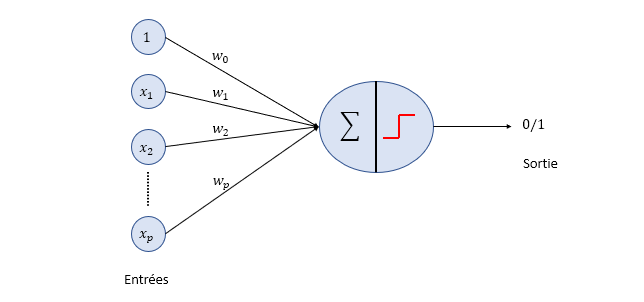
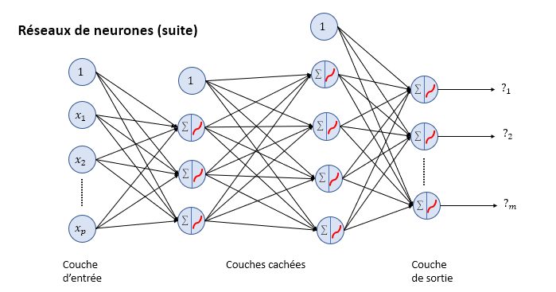
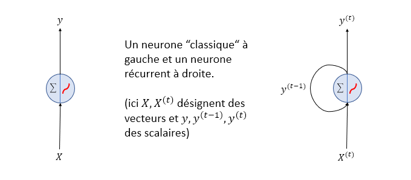

# Introduction à l'intelligence artificielle

- [Introduction à l'intelligence artificielle](#introduction-à-lintelligence-artificielle)
  - [Historique et grands domaines de l’IA](#historique-et-grands-domaines-de-lia)
    - [Tentatives de définition](#tentatives-de-définition)
      - [Plusieurs axes](#plusieurs-axes)
      - [Agir comme un humain](#agir-comme-un-humain)
      - [Penser comme un humain](#penser-comme-un-humain)
      - [Penser rationnellement](#penser-rationnellement)
      - [Agir rationnellement](#agir-rationnellement)
      - [Renoncements](#renoncements)
        - [Renoncement à la réflexion](#renoncement-à-la-réflexion)
        - [Renoncement à l'équivalence avec l'intelligence humaine](#renoncement-à-léquivalence-avec-lintelligence-humaine)
        - [Renoncement à une IA générale](#renoncement-à-une-ia-générale)
        - [Renoncement à l’indépendance à l’égard de l’intelligence humaine](#renoncement-à-lindépendance-à-légard-de-lintelligence-humaine)
    - [Premiers pas et premières idées.](#premiers-pas-et-premières-idées)
      - [Quelques premières percées](#quelques-premières-percées)
        - [Trépied d’Héphaïstos](#trépied-dhéphaïstos)
        - [Servante automatique](#servante-automatique)
        - [Remplacement des esclaves](#remplacement-des-esclaves)
        - [Ars Magna](#ars-magna)
        - [Chevalier mécanique](#chevalier-mécanique)
        - [Léviathan](#léviathan)
        - [Pascaline](#pascaline)
        - [Canard de Vaucanson](#canard-de-vaucanson)
        - [Automate Turc](#automate-turc)
        - [Métier Jacquard](#métier-jacquard)
        - [Machine analytique](#machine-analytique)
        - [Ada Lovelace](#ada-lovelace)
        - [Frankenstein](#frankenstein)
        - [Les robots](#les-robots)
        - [Tortues de Walter](#tortues-de-walter)
        - [Congrès fondateur](#congrès-fondateur)
        - [Des idées empruntées à diverses disciplines : logique mathématique](#des-idées-empruntées-à-diverses-disciplines--logique-mathématique)
        - [Des idées empruntées à diverses disciplines : probabilités et statistiques](#des-idées-empruntées-à-diverses-disciplines--probabilités-et-statistiques)
    - [IA symbolique.](#ia-symbolique)
      - [Principe fondamental](#principe-fondamental)
      - [Parcours pour aller d’un état initial à un état final](#parcours-pour-aller-dun-état-initial-à-un-état-final)
      - [Recherche de plus courts chemins](#recherche-de-plus-courts-chemins)
      - [Recherche d’une stratégie optimale dans un jeu](#recherche-dune-stratégie-optimale-dans-un-jeu)
      - [Le cas des échecs](#le-cas-des-échecs)
      - [Le cas du Go](#le-cas-du-go)
      - [Problème de satisfaction de contraintes](#problème-de-satisfaction-de-contraintes)
      - [Systèmes experts](#systèmes-experts)
    - [IA connexionniste.](#ia-connexionniste)
      - [Un point de vue radicalement différent](#un-point-de-vue-radicalement-différent)
      - [Fonctionnement simplifié d’un neurone biologique](#fonctionnement-simplifié-dun-neurone-biologique)
      - [Fonctionnement simplifié du cerveau](#fonctionnement-simplifié-du-cerveau)
      - [Neurone artificiel](#neurone-artificiel)
      - [Réseaux de neurones](#réseaux-de-neurones)
      - [Apprentissage automatique (Deep Learning)](#apprentissage-automatique-deep-learning)
        - [Limites de l’IA symbolique](#limites-de-lia-symbolique)
        - [Apprentissage automatique](#apprentissage-automatique)
      - [Les principaux types d’apprentissage](#les-principaux-types-dapprentissage)
        - [Apprentissage supervisé](#apprentissage-supervisé)
        - [Apprentissage non supervisé](#apprentissage-non-supervisé)
        - [Apprentissage semi-supervisé](#apprentissage-semi-supervisé)
        - [Apprentissage par renforcement](#apprentissage-par-renforcement)
          - [Exemples de cas pratiques](#exemples-de-cas-pratiques)
          - [Remarque](#remarque)
        - [Quelques algorithmes non connexionnistes de l’apprentissage automatique](#quelques-algorithmes-non-connexionnistes-de-lapprentissage-automatique)
        - [Quelques algorithmes non connexionnistes de l’apprentissage automatique](#quelques-algorithmes-non-connexionnistes-de-lapprentissage-automatique-1)
      - [Réseaux de neurones convolutifs](#réseaux-de-neurones-convolutifs)
      - [Réseaux de neurones récurrents](#réseaux-de-neurones-récurrents)
      - [Mécanismes d’attention](#mécanismes-dattention)
      - [Transformer](#transformer)
      - [IA génératives de textes](#ia-génératives-de-textes)
      - [IA génératives d’images](#ia-génératives-dimages)
      - [Apprentissage par renforcement](#apprentissage-par-renforcement-1)

## Historique et grands domaines de l’IA

### Tentatives de définition

Première tentative: 
    - C'est une disicpline visant à rendre des machines "intelligentes"
    - Le terme intelligence désigne la capacité qui permet à une entité d'agir pertinemment et avec discernement vis-à-vis de son environment
    - L'environment pour un robot d'échecs est le plateau, les pieces, etc..

Seconde tentative: 
    - Discipline visant à doter des machines d'une intelligence semblable à celle des humains.
    - Contrairement à la précédente, cette définition fait directement référence à l’humanité comme source d’inspiration.
    
Citations fondatrices 

- John McCarthy 
  - « C'est la science et l'ingénierie de la fabrication de machines intelligentes, en particulier de programmes informatiques intelligents »
  
- Marvin Minsky (1927-2016) : 
  - «  La science de faire faire aux machines des choses qui nécessiteraient de l'intelligence si elles étaient faites par des hommes. »
  
Exemples d'aptitudes humaines intelligentes 

- Raisonnements philosophiques abstraits
- Planification et réalisation de projets complexes
- Conception puis maitrise de plusieurs langues 
- Étude des mathématiques.
- Pratique de jeux logiques.
- Domaines artistiques.
- Capacité d’imagination.
- Sens de la caricature.
- Association d’idées.
- Compréhension profonde de son environnement.

#### Plusieurs axes 

Au travers des citations on voit clairement deux approches distinctes, celle où l’on cherche à agir “rationnellement“ et l’autre où l’on souhaite imiter l’intelligence humaine.

Ici “rationnellement“ signifie “de façon optimale“. Ce que ne fait pas toujours un humain, qui peut se laisser perturber par d’autres facteurs.
On reprend ici une partie de la présentation de l’excellent livre « Artificial Intelligence: A Modern Approach », 4th US ed.,de Stuart Russell et Peter Norvig.

Cette même intelligence pouvant être vue soit de façon interne en analysant la pensée, soit de façon plus comportementale en se consacrant sur les réalisations induites.

En combinant les approches et visions distinctes de l’intelligence, on arrive à quatre grands axes qui vont se compléter :
- Agir comme un humain.
- Penser comme un humain.
- Penser rationnellement.
- Agir rationnellement.

#### Agir comme un humain 

- Pour déterminer si une machine peut se comporter comme un humain, Alan Turing (1912-1954) a conçu un test.

- Dans celui-ci, un humain dialoguant par écrit avec un ordinateur et un autre humain cherche à savoir lequel de ses interlocuteurs est la machine.

- S’il n’y arrive pas, l’ordinateur en question passe avec succès le test de Turing.

Les aptitudes pour passer le test de Turing sont à la base de nombreux champs de recherches en IA :
- Traitement du langage (pour la communication). (Natural Language Processing - NLP)
- Représentation des connaissances (pour la mémorisation de la conversation). 
- Raisonnement (pour répondre aux questions et tirer des conclusions).
- Apprentissage automatique (pour s’adapter aux nouvelles situations).

#### Penser comme un humain 

On cherche dans ce cas à développer des machines qui non seulement répondront à un problème donné, mais qui pour ce faire suivront les mêmes étapes qu’un humain.
Cela requiert une étude approfondie des sciences cognitives. 
Vu sous cette angle, l'IA devient la science des modèles de l'intelligence humaine. 

#### Penser rationnellement 

Cette approche va reposer sur la logique mathématique des propositions, on batit alors des raisonnements structurés où des prémisses conduisent à des conclusions.  On peut ajouter une part d'incertitude en évaluant des probabilités. 

#### Agir rationnellement 

L'idée est d'utiliser des agents qui vont agir rationnellement dans le but d'obtenir le meilleur résultat possible. On se concentre ici uniquement sur le but à atteindre plus que sur le processur de décisions. 

Cette approche conduire entre autres à l'apprentissage par renforcement. 

#### Renoncements 

Ces développements majeurs n’ont pu se faire qu’au prix de plusieurs renoncements par rapport aux rêves initiaux.
On peut en citer au moins quatre : 

- Renoncement à la réflexion.
- Renoncement à l’équivalence avec l’intelligence humaine.
- Renoncement à une IA générale.
- Renoncement à l’indépendance à l’égard de l’intelligence humaine

##### Renoncement à la réflexion 

Les systèmes d’IA résolvent des problèmes mais sans les comprendre réellement.
De plus, ils ne sont pas capables de penser et conceptualiser les objets sur lesquels ils s’appliquent.
On parle d’IA faible et de “cécité sémantique“.

Voir l’expérience (contestée) de la chambre chinoise : https://fr.wikipedia.org/wiki/Chambre_chinoise

##### Renoncement à l'équivalence avec l'intelligence humaine 

Le “penser comme un humain“ où un système d’IA se doit de suivre pas à pas le raisonnement humain a séduit les premières générations de chercheurs.

Cette “équivalence forte“ a cependant été très vite remise en question, les contraintes engendrées ralentissaient les progrès de la discipline.

Elle a laissé place à une “équivalence faible“ où l’on cherche un résultat semblable à celui qu’obtiendrait un humain, sans se focaliser sur la démarche

##### Renoncement à une IA générale

Dans la majorité des définitions la notion d’intelligence a une portée générale, ce qui a voulu être transporté aux systèmes artificiels.

Ce rêve a très vite été abandonné au profit de développements de logiciels ultra spécialisés, chacun ayant son domaine d’application précis : NLP, vision, planification, jeux, etc.

##### Renoncement à l’indépendance à l’égard de l’intelligence humaine

Le développement des systèmes d’IA a toujours été fait en ayant comme objectif que ceux-ci acquièrent une certaine autonomie.

Or ceux-ci reposent intégralement sur l’intelligence de leurs concepteurs, qui les nourrissent de leur savoir et leurs raisonnements

La capacité d’adaptation des systèmes d’IA à des situations réellement inédites est ainsi très faible.

### Premiers pas et premières idées.

#### Quelques premières percées

Les exemples qui suivent sont issus soit de l’imaginaire d’artistes soit du travail de scientifiques et parfois des deux.

En aucun il ne s’agit d’une liste exhaustive de réalisations et idées précurseurs de l’intelligence artificielle.

L’étudiant intéressé par ce vaste sujet pourra consulter les ressources suivantes qui ont été compulsées lors de la rédaction de cette partie :
- « The quest for artificial intelligence », Nils J. Nilsson, Cambridge University Press.
- « Deis ex Machinis », Jean-Arcady Meyer, Les éditions du Net.

##### Trépied d’Héphaïstos

Selon Homère dans l’Iliade (8ème siècle avant J.C), Héphaïstos possédait plusieurs trépieds qui lui obéissaient.

Ils étaient constitués entre autres de trois roues en or permettant des déplacements dans toutes les directions.

##### Servante automatique

Philon de Byzance (3ème siècle avant J.C.) était un ingénieur grec.
Son automate permettait de remplir un verre d’un mélange d’eau et de vin.

##### Remplacement des esclaves

Le philosophe Aristote (4ème siècle avant J.C.) s’enthousiasme à propos des automates et de leurs possibilités.

Il imagine un monde où ouvriers et esclaves seraient remplacés par des machines mais conclu de lui-même à son impossibilité : 

« Si chaque instrument, en effet, pouvait, sur un ordre reçu, ou même deviné, travailler de lui-même, comme les statues de Dédale, ou les trépieds de Vulcain, « qui se rendaient seuls, dit le poète, aux réunions des dieux » ; si les navettes tissaient toutes seules ; si l’archet jouait tout seul de la cithare, les entrepreneurs se passeraient d’ouvriers, et les maîtres, d’esclaves.. »

##### Ars Magna

Le philosophe espagnol Raymond Lulle (1232-1315) inventa un système “logique“ constitué de disques.

Son but étant de démontrer la véracité et la supériorité de la foi chrétienne.

Sur chaque disque sont mentionnés diverses caractéristiques et vertus imputables à sa religion.

Les combiner est sensé apporter une réponse à certaines questions théologiques.

##### Chevalier mécanique

Léonard de Vinci (1452-1519) a conçu les plans d’un automate aux traits humains.

Il était sensé pouvoir exécuter des mouvements de base et même émettre des sons. 

De Vinci aurait peut-être construit ce robot vers 1495.

##### Léviathan

Thomas Hobbes (1588-1679) dans son livre « Le Léviathan » compare le corps humain à un engin mécanique :

« La Nature (l’art par lequel Dieu a fait le monde et le gouverne) est si bien imitée par l’art de l’homme (…) que [celui-ci] peut fabriquer un animal artificiel. Car, étant donné que la vie n’est rien d’autre qu’un mouvement de membres, qui trouve son origine en quelque partie principale située au-dedans, pourquoi ne pourrions-nous pas dire que tous les automates (des engins qui se meuvent eux-mêmes, par des ressorts et des roues, comme une montre) ont une vie artificielle ? »

Hobbes évoque ainsi la possibilité de construire un animal artificiel.

Pour cela il sera parfois qualifié d’ancêtre de l’intelligence artificielle.

##### Pascaline 

Le mathématicien Blaise Pascal (1623-1662) conçut la première machine à calculer pouvant réaliser les quatre opérations de base.

Elle fut à l’origine de tout le cheminement qui conduira aux ordinateurs contemporains.

##### Canard de Vaucanson 

Le mécanicien Français Jacques de Vaucanson (1709-1782) conçu un canard mécanique sensé pouvoir digérer des aliments.

En réalité le processus de digestion était simulé, un réservoir contenant par avance ce que l’automate aurait du produire. 

##### Automate Turc 

L’inventeur Hongrois Johann Wolfgang von Kempelen (1734-1804) fabriqua le Turc mécanique, un automate sensé jouer aux échecs.

Il s’agissait en fait d’un mannequin manipulé par un humain, caché dans un compartiment secret.

##### Métier Jacquard 

L’inventeur français Joseph-Marie Jacquard (1752-1834) conçu une machine programmable avec des cartes perforées.

Il s’agit d’un métier à tisser qui eut des impacts sociaux considérables.

##### Machine analytique 

Le mathématicien Charles Babbage (1791-1871) définit les principes de la future informatique et tente de construire sa machine dite analytique.

Des difficultés techniques empêcheront sa finalisation et sa production.

##### Ada Lovelace 

La mathématicienne Ada Lovelace (1815-1852) conçut en collaboration avec Babbage un programme informatique destiné à la machine analytique.

Elle fut la première à avoir l’intuition que des machines pourraient non seulement réaliser des calculs numériques mais également manipuler des expressions algébriques.

##### Frankenstein 

L’auteure Mary Shelley (1797-1851) a imaginé une histoire où un savant donne vie à une créature composée de morceaux de différents corps.

Ce savant, Victor Frankenstein, a su (dans le roman) percer le secret de la vie.

##### Les robots

L’auteur américain de science-fiction Isaac Asimov (1920-1992) a écrit une série de livres à propos des interactions entre humains et robots.

Plus généralement il fut prophétique sur beaucoup de questions, en particulier relatives à l’intelligence artificielle.

##### Tortues de Walter

Le neurophysiologiste américain William Grey Walter (1910-1977) conçut deux robots autonomes.

Ceux-ci se dirigeaient vers la lumière pour recharger leurs batteries quand cela était nécessaire et sinon s’en protégeait.

Ils apprenaient également à associer des sons à des luminosités.

##### Congrès fondateur

En 1956, quatre chercheurs Claude Shannon (1916-2001), John McCarthy (1927-2011), Nathaniel Rochester (1919-2001) et Marvin Minsky (1927-2016) organisèrent un colloque à Dartmouth.

C’est à cette occasion que fut entériné le choix de l’appellation « intelligence artificielle » et que la discipline en elle-même fut créée.

##### Des idées empruntées à diverses disciplines : logique mathématique

Aristote (384-322 avant J.C.) fut le premier fur le premier à formaliser le concept de syllogisme dont l’exemple le plus célèbre est :

«  Tous les hommes sont mortels, or Socrate est un homme, donc Socrate est mortel »

Ce raisonnement est bien sûr générique et peut s’appliquer à de nombreuses situations, si les deux prémisses sont vraies alors la conclusion l’est également.

Le domaine de la logique évolua très peu jusqu’à sa formalisation quasi-définitive par George Boole (1815-1864) vers 1850.

Il proposa un cadre algébrique aux notions classiques de la logique :

- Les valeurs "V" et "F" sont représentées par 1 et 0
- L’opérateur de conjonction "ET" par un .
- L’opérateur de disjonction "OU" par un +
- L’opérateur de négation "NON" par 𝑎↦𝑎 ̅ qui inverse les valeurs entre 0 et 1

On peut alors utiliser des arguments algébriques pour démontrer des résultats portant initialement sur des propositions logiques.

Le formalisme de Boole ne permet de traiter que des propositions atomiques, il fut complété par la logique des prédicats qui permit d’analyser la structure interne des propositions.

Les avancées dans ce domaine furent en partie dues au mathématicien allemand Friedrich Ludwig Gottlob Frege (1848-1925).

On a pu alors formaliser le syllogisme d’Aristote :

- Soient 𝑚(.) le prédicat “être mortel“ et ℎ(.) le prédicat “être un homme“. 
- ∀𝑥, ℎ(𝑥)⇒𝑚(𝑥).
- On a ℎ(𝑆𝑜𝑐𝑟𝑎𝑡𝑒) donc 𝑚(𝑆𝑜𝑐𝑟𝑎𝑡𝑒).

##### Des idées empruntées à diverses disciplines : probabilités et statistiques 

Beaucoup de raisonnements humains doivent composer avec une incertitude : expériences non déterministes, jeux comportant une part aléatoire, information incomplète, hypothèses sur le futur, etc.

Certains théorèmes de probabilités permettent de formaliser une régularité observée quand on répète un grand nombre de fois un phénomène aléatoire.

La loi des grands nombres, dont la première formulation est due à Jacob Bernoulli (1654-1705), stipule que la moyenne empirique d’une suite de variables aléatoires de même loi converge vers l’espérance de cette loi.

Le théorème limite central précise cette convergence en indiquant que la distribution de cette moyenne empirique est approximativement une loi de Gauss. Sa première version fut formulée par le français Abraham de Moivre (1667-1754).

Un résultat majeur utilisé en apprentissage automatique est celui attribué à Thomas Bayes (1702-1761) :

- ℙ(𝐴|𝐵)=ℙ(𝐵|𝐴)ℙ(𝐴)/ℙ(𝐵) 

Cette formule dite “de Bayes“ permet d’exprimer la probabilité d’une cause sachant une conséquence en fonction de celle beaucoup plus intuitive de la probabilité de la conséquence sachant la cause.

### IA symbolique.

#### Principe fondamental

L’IA symbolique part du principe que l’intelligence consiste en la capacité de manipuler des symboles.

Ceux-ci seront des éléments de “haut niveau“ censés représenter les connaissances, raisonnements, objets, concepts, etc.

L’idée étant d’imiter le raisonnement humain, celui-ci procédant ainsi pour appréhender son environnement.

Ces “symboles“ pourront être selon les cas :

- Des propositions et connecteurs logiques.
- Des structures de données (graphes, arbres, réseaux, etc.).
- Des notations, calculs et équations algébriques.
- Des mots.
- Etc.

Cette “importation“ de l’intelligence humaine passe par une phase délicate de modélisation et d’implémentation.

Cette difficulté sera paradoxalement un des atouts de l’IA symbolique, car par construction celle-ci sera compréhensible et interprétable par un humain.

#### Parcours pour aller d’un état initial à un état final

Beaucoup de problèmes se résolvent par une recherche de chemins dans une structure arborescente, le but étant de passer d’un état initial (quelconque ou prédéfini) à un état final visé.

Explorer toutes les branches dans un ordre quelconque conduit la plupart du temps à une complexité exponentielle voire factorielle.

L’intelligence va consister alors à rationnaliser ce parcours afin d’atteindre l’état final rapidement.

#### Recherche de plus courts chemins

L’algorithme fondamental date de 1959 et est dû à Edgar Dijkstra (1930-2002).

Il détermine les plus courts chemins dans un graphe à valuations positives en effectuant un parcours (plus ou moins) en largeur des sommets.

Pour des graphes à valuations quelconques, Richard Bellman (1920-1984) et Lester Randolph Ford junior (1927-2017) ont développé une solution en 1956-1958, mettant au point au passage la technique dite de programmation dynamique.

L’algorithme de Dijkstra a été considérablement accéléré en 1968 par Peter Elliot Hart (1941-), Nils John Nilsson (1933-2019) et Bertram Raphael (-1936) qui mirent au point l’algorithme A*.

Via l’utilisation d’une heuristique, cette technique permet de transformer le parcours en largeur utilisé par Dijkstra en un parcours en profondeur et ainsi gagner en rapidité.

#### Recherche d’une stratégie optimale dans un jeu

La recherche d’une stratégie optimale dans certains jeux (dames, échecs, othello, etc.) peut également être vue comme une recherche de chemins.

Il ne s’agit plus cette fois de déterminer un plus court chemin, mais plus simplement une succession de coups conduisant à une position victorieuse depuis une position courante.

Les premières idées sont dues à Ernst Zermelo (1871-1953) en 1912 ainsi qu’à John von Neumann (1903-1957) en 1928 avec son théorème du minimax.

L’article formalisant tout cela et permettant les avancées futures est celui de Claude Shannon’s (1916-2001) en 1950 : « Programming a Computer for Playing Chess ».

L’algorithme présenté, celui dit MinMax, fut ensuite complété en 1956 par John McCarthy (1927-2011) par une technique d’élagage dite d’élagage alpha / bêta.

#### Le cas des échecs

Un des premiers logiciels jouant aux échecs fut développé par une équipe de chercheurs atomiques en 1956.

Il utilisait un algorithme MinMax et devant les contraintes matérielles de l’époque des règles simplifiées furent adoptées (échiquier 6x6 sans fous).

Chaque coup prenait environ 20’

Le sujet a passionné les chercheurs pendant des décennies, jusqu’à la mise au point de Deep Blue en 1996.

Cette combinaison d’un ordinateur spécifique et d’une implémentation efficace en C de l’algorithme MinMax avec élagage alpha / bêta a alors battu le champion du monde, le Russe Garry Kasparov.

Dans les années 90 puis au début des années 2000, de nombreux chercheurs ont développé des algorithmes reposant sur la méthode de Monte Carlo.

Initialement celle-ci permettait de calculer des valeurs numériques déterministes en effectuant un grand nombre de simulations aléatoires. Elle fut formalisée lors du développement de la bombe atomique par John von Neumann (1903-1957) et Stanislas Ulam (1909-1984). 

Appliquée aux jeux, la méthode de Monte Carlo cherche à évaluer la qualité d’une position en simulant aléatoirement de nombreuses parties depuis cette position.

On choisit alors à chaque étape de jouer le coup conduisant à la position la plus favorable.

#### Le cas du Go

La méthode de Monte Carlo a permis les premières avancées notables au jeu de Go : 

2005-2014, le logiciel Crazy Stone commence à battre de très bons joueurs, d’abord sur des plateaux réduits puis sur le plateau classique 19×19. Il fut développé par le Français Rémi Coulom (1974-).

2006-2008, le logiciel MoGo développé également par des Français (INRIA et Polytechnique) obtint des résultats équivalents.

#### Problème de satisfaction de contraintes

Les problèmes les plus connus de ce type sont :

- Le problème des 𝑁 reines.
- La coloration des cartes de géographie.
- Le jeu Sudoku.
- La résolution automatique des grilles de mots croisés.

La méthode classique de résolution par retour en arrière est due (entre autres) à R. J. Walker dans les années 50.

Celle-ci fut ensuite considérablement améliorée avec des techniques de réductions des domaines et de propagation des contraintes dans les décennies suivantes.

#### Systèmes experts

Un autre grand domaine de l’IA symbolique est celui des systèmes experts.

Leur but est de simuler le raisonnement (humain) d’un spécialiste dans un domaine précis.

C’est un outil d’aide à la décision, qui via une interface de dialogue permet de répondre à une question posée par un interlocuteur.

Un système expert est constitué :
- D’une base de connaissances provenant de l’expertise d’un humain dans un domaine spécifique et qui comporte :
  - une base de faits.
  - une base de règles.
- D’un moteur d’inférence.

Les faits sont des assertions rédigées de façon affirmative et supposées vraies. 

Ils peuvent être :
- connus initialement.
- entrés par l’utilisateur en réponse à des questions du programme.
- déduits d’autres faits.

Les règles sont déductives et sont généralement formalisées avec la symbolique de la logique des propositions, i.e. avec les connecteurs logiques SI, ALORS, SINON, NON, ET, OU.

Elles sont génériques et portent sur des variables, dont la valeur est précisée lors de l’inférence.

La base de règles est non ordonnée mais on doit s’assurer de la cohérence des règles entre elles.

Le moteur d’inférence fait le lien entre les faits et les règles. 

Il tente de reproduire la logique humaine qui à partir de faits connus tire des conclusions, c’est la méthode de chaînage avant.

Il peut également fonctionner par chaînage arrière, c’est-à-dire en partant d’un résultat que l’on souhaite supposé et en vérifiant que celui-ci est cohérent avec les faits.

Différents langages furent utilisés pour implémenter des systèmes experts.

On peut citer en particulier :

Le LISP, créé en 1958 par John McCarthy (1927-2011).

Le PROLOG, créé en 1972 par les Français Alain Colmerauer (1941-2017) et Philippe Roussel (1945-).

### IA connexionniste.

#### Un point de vue radicalement différent

Parallèlement au développement de l’IA symbolique, un autre courant a vu le jour, l’IA connexionniste.

Celui-ci a pour fondement l’imitation du fonctionnement du cerveau humain et cherche à implémenter des neurones artificiels.

Les deux courants se sont développés simultanément, depuis la seconde moitié du 20ème siècle. Depuis une vingtaine d’années l’IA connexionniste a pris le dessus.

#### Fonctionnement simplifié d’un neurone biologique

Un neurone manipule des données binaires qui prennent la forme d’impulsions électriques.

Les entrées se font via les dentrites et les sorties via les synapses.

Les entrées sont pondérées et dès qu’un certain seuil est dépassé un signal est émis et arrive aux synapses par l’axone.

#### Fonctionnement simplifié du cerveau

Les différents neurones sont ensuite connectés en réseau. 

L’information sortant par les synapses d’un neurone est communiquée aux neurones avoisinants par leurs dentrites.

L’ensemble formant finalement plus ou moins le cerveau humain.

#### Neurone artificiel

Le premier neurone artificiel a été créé par Warren McCulloch (1898-1969) et Walter Pitts (1923-1969) en 1943.

Il possède plusieurs entrées numériques et une sortie binaire.

Des poids sont appliqués aux différentes entrées puis une fonction de seuil permet de calculer la sortie.

Ce neurone permet d’effectuer une classification binaire : si la valeur en sortie est égale à 0 cela signifie que l’observation en entrée, constituée de 𝑝 valeurs numériques, appartient à une première classe et si elle vaut 1 l’observation appartient à une seconde classe.

Dans le modèle de McCulloch et Pitts les poids du neurone étaient fixés manuellement.

Frank Rosenblatt (1928-1971) a ensuite proposé en 1958 un algorithme d’apprentissage permettant au neurone de déterminer lui-même les poids appliqués à ses entrées.

L’entraînement se faisant sur un jeu de données pour lesquelles on connaît l’appartenance à l’une ou l’autre classe.

#### Réseaux de neurones 

L’idée de connecter plusieurs neurones artificiels entre eux date des années 60.

Rosenblatt proposa par exemple en 1962 un modèle constitué de quatre couches, chacune d’elles comportant plusieurs neurones.

Les sorties des neurones d’une couche sont alors reliées aux entrées des neurones de la couche suivante.

Chaque arc du réseau est bien sûr muni d’un poids. La description précédente est celle d’un réseau « à propagation avant », d’autres structures existent comme les réseaux récurrents.
Tout cela sera présenté de façon très complète dans l’excellent cours 5DEEP de l’expertise IA.

Les implémentations techniques de ces modèles se sont progressivement améliorées au cours des décennies suivantes. En particulier pour la phase d’entraînement.

On peut citer deux avancées majeures :

- Algorithme de descente de gradient stochastique afin de minimiser l’erreur en sortie du réseau (1967).
- Technique de rétropropagation de l’erreur afin d’optimiser la mise à jour des poids des neurones (1986 pour la version quasi définitive).

#### Apprentissage automatique (Deep Learning)

Les réseaux de neurones font partie d’un ensemble beaucoup plus vaste de modèles, ceux de l’apprentissage automatique.

En voici la définition classique, faite en 1959 par le mathématicien Arthur Samuel (1901-1990) :

« L’apprentissage automatique est la discipline donnant aux ordinateurs la capacité d’apprendre, sans qu’ils soient explicitement programmés. »  

Cet apprentissage se faisant à partir de données.

##### Limites de l’IA symbolique

Dans le cadre classique de l’IA symbolique, c’est au concepteur d’un modèle d’établir explicitement les règles de son fonctionnement.

Par exemple dans le développement d’un filtre anti-spam, on va explicitement préciser des mots clés (“argent“, “fortune“, “bonheur“, “amour“, etc.) qui vont impliquer le classement d’un mail en spam.

- Élaboration de nombreuses règles complexes.
- Maintenance difficile.
- Mise à jour délicate, en cas de données d’une forme inconnue il faut écrire de nouvelles règles. 
- Par exemple dans le cas du filtre anti-spam, identifier de nouveaux mots-clés.

##### Apprentissage automatique

En apprentissage automatique c’est le modèle qui va déterminer ses propres règles et se paramétrer en analysant des données qui lui sont transmises.

Pour l’exemple du filtre anti-spam, on va ainsi “nourrir“ le modèle avec des mails dont on connait la catégorie, spam ou non-spam, et il va apprendre de lui-même quels sont les mots clés qui provoquent le classement.

- Codes relativement légers.
- Maintenance simplifiée.
- En cas de données de type inconnu, il suffit de réentraîner l’algorithme pour que le modèle s’adapte.
- Notre filtre anti-spam va par exemple détecter de lui-même les nouveaux mots clés problématiques.

Cette vision s’oppose ainsi à l’IA symbolique qui privilégiait le raisonnement par règles rationnelles, établies en amont.

Dans l’apprentissage automatique, on suppose que l’intelligence humaine provient également de l’expérience via l’acquisition progressive de connaissances (données) ou par essais/erreurs.

#### Les principaux types d’apprentissage

1. Apprentissage supervisé.
2. Apprentissage non supervisé.
3. Apprentissage semi-supervisé
4. Apprentissage par renforcement

##### Apprentissage supervisé

Les données comportent une variable dite “cible“.

Elle peut être Numérique (taille, prix, température, etc.) ou modéliser l’appartenance à une classe (malade/sain, favorable/neutre/défavorable, etc.).

Pour les données d’entraînement la valeur de cette variable est connue.

Le but est de prédire sa valeur pour de nouvelles observations.

##### Apprentissage non supervisé

Les données ne comportent pas de variable cible.

On va chercher à déterminer des similitudes et/ou des relations entre les observations ou entre les variables.

##### Apprentissage semi-supervisé

Sorte d’intermédiaire entre les apprentissages supervisés et non-supervisés.

Les données comportent une variable cible mais la valeur de celle-ci n’est connue que pour une (petite) partie des données d’entraînement.

Le but est là aussi de déterminer la valeur de la variable cible pour de nouvelles observations.

##### Apprentissage par renforcement

Catégorie radicalement différente des précédentes.

Dans un certain environnement, un agent peut accomplir des actions qui lui rapportent des bénéfices ou des pénalités.

L’agent va alors apprendre par lui-même à élaborer une stratégie optimale, i.e. une stratégie qui maximise ses bénéfices.

###### Exemples de cas pratiques

Déplacement de robots autonomes, et plus précisément de voitures, drones, hélicoptères, etc.

Intelligences artificielles pour des jeux de stratégie, e.g. Alpha Go pour le jeu de Go, jeux d’échec, de Backgammon, etc.

###### Remarque

L’IA connexionniste, celle des réseaux de neurones, appartient donc à la famille de l’apprentissage automatique.

Mais beaucoup d’autres techniques existent, issues de l’algèbre linéaire et/ou des probabilités et statistiques.

Elles proviennent de résultats mathématiques très anciens ou ont été développées lorsque l’on manquait encore de puissance de calculs pour exploiter le potentiel des réseaux de neurones.

##### Quelques algorithmes non connexionnistes de l’apprentissage automatique

Régression linéaire avec la méthode des moindres carrés, circa 1800, Adrien-Marie Legendre (1752-1833) - Carl Friedrich Gauss (1777-1855).

Analyse discriminante linéaire, LDA, 1936, Ronald Aylmer Fisher (mathématicien et statisticien britannique, 1890-1962).

Algorithme des 𝑘 plus proches voisins, années 50/60.

##### Quelques algorithmes non connexionnistes de l’apprentissage automatique

Arbre de décision CHAID, Chi-square Automatic Interaction Detection, 1979, Gordon V. Kass.

Arbre de décision CART, Classification And Regression Tree, 1984, Leo Breiman (statisticien américain, 1928-2005).

Machine à vecteurs supports, SVM, algorithme de classification très utilisé après sa mise au point définitive dans les années 90 par, entre autres, Vladimir Vapnik (mathématicien américain, 1936-).

ACP, Analyse en Composantes Principales, 1901, Karl Pearson (mathématicien britannique 1857-1936), puis années 30, Harold Hotelling (1895-1973).

Partitionnement en 𝑘 moyennes, 1957, Stuart P. Lloyd.

Partitionnement hiérarchique, 1963, Joe H. Ward Jr.

#### Réseaux de neurones convolutifs

Une avancée majeure et encore très utilisée dans la reconnaissance d’images, puis la génération, fut la mise au point des réseaux de neurones convolutifs.

L’idée étant d’utiliser des filtres pour balayer les images afin de détecter les formes recherchées.

Les premières ébauches datent de 1980 avec les travaux de Kunihiko Fukushima (informaticien Japonais, 1936-).

Les restrictions techniques, ces modèles étant très gourmands en ressources matérielles, furent progressivement levées dans les années 2000, avec l’utilisation de processeurs GPU.

La reconnaissance d’images a pu alors s’appliquer non seulement à des photos mais aussi à des vidéos.

#### Réseaux de neurones récurrents

Pour traiter des données séquentielles (séries chronologiques, textes, musiques, etc.) on utilise des réseaux dits récurrents.

On ajoute aux entrées d’un neurone à une étape 𝑡 la sortie de ce même neurone à l’étape 𝑡−1.

Cela permet aux neurones de garder en mémoire les informations apprises par le passé.

Cette idée assez ancienne, années 60/70, a été ensuite reprise et améliorée avec le développement des cellules LSTM, Long Short Term Memory, en 1997 puis GRU, Gated Recurrent Unit, en 2014.

S’en est suivi des progrès considérables dans le domaine du NLP, Natural Language Processing : traduction, reconnaissance vocale, analyse de textes, etc.

#### Mécanismes d’attention

Malgré leurs qualités, les réseaux récurrents munis de cellules LSTM ou GRU ont encore des faiblesses, en particulier une certaine forme d’oubli est encore présente et lorsqu’ils traitent des textes ils ont tendance à accorder la même importance à chacun des mots.

Une percée majeure fut l’introduction des mécanismes d’attention en 2017 par une équipe de Google.
Ces mécanismes permettent de déterminer l’importance de chacun des mots vis-à-vis des autres au sein d’une phrase.

Pour cela, ils calculent pour chaque mot un score relativement à chacun des autres mots.

#### Transformer 

Un réseau de type transformer va être constitué de plusieurs blocs comportant des mécanismes d’attention.

Selon les usages on gardera :

- La partie encodeur et la partie décodeur pour de la traduction.
- Seulement la partie encodeur pour de l’analyse de sentiments.
- Seulement la partie décodeur pour de la génération de textes.

#### IA génératives de textes

Un réseau de type GPT, Generative Pre-trained Transformer, est composé d’un décodeur préalablement entraîné sur un très gros corpus de textes.

Tous les LLM, Large Language Model, les plus connus utilisent cette structure : ChatGPT (2022-), Claude (2023-), Gemini (2023-), DeepSeek (2023-), etc.

#### IA génératives d’images

Les premiers modèles très satisfaisants reposent une architecture de type GAN, Generative Adversarial Networks (2014-).

Ce type de modèles comporte deux réseaux, un générateur et un discriminateur.

Le générateur crée des images à partir de pixels aléatoires et le discriminateur doit reconnaître quelles images proviennent du générateur et quelles images proviennent du jeu d’entraînement.

Les deux réseaux sont entraînés de façon antagoniste : pour tromper le discriminateur, le générateur tentera de produire de fausses images les plus vraies possible.

Des améliorations ont ensuite été apportées, avec en 2018 le ProGAN, Progressive GAN, et en 2019 le Style GAN.

Les résultats de ce dernier modèle sont assez bluffant : Style Gan

Des résultats encore meilleurs ont été obtenus par des modèles de diffusion (2015-).

Ceux-ci comportent un processus de diffusion “vers l’avant“ qui consiste à bruiter des images

Un réseau de neurones est alors entraîné à reconstituer les images originales.

Une fois l’entraînement terminé, on utilise ce réseau pour générer de nouvelles images à partir d’images complètement aléatoires.

Les principaux logiciels de génération d’images utilisent cette technique : DALL-E (2021-), Midjourney (2022-), Stable Diffusion (2022-).

#### Apprentissage par renforcement

L’idée même d’accorder des récompenses ou pénalités selon le résultat d’une action provient sans doute de la domestication du chien il y a environ 15 000 ans.

Alan Turing en 1948 et 1950 fut l’un des premiers à envisager cette technique en intelligence artificielle.

Le cadre théorique, celui des processus de Markov décisionnels, fut apporté en 1977.

Les travaux de Richard Sutton (1958-) et Andrew Barto (1948-) ont conduit au concept d’apprentissage par différence temporelle.

Ces idées furent reprises dans deux algorithmes majeurs, Apprentissage Q (1989) et Apprentissage SARSA (1994).

Une avancée fondamentale fut l’utilisation de réseaux de neurones pour modéliser la table 𝑞 ce qui a conduit au développement de l’apprentissage Q profond.

La théorie des jeux a de tout temps été un excellent cadre d’application de l’apprentissage par renforcement.

Gerald Tesauro développa dans les années 90 plusieurs versions de TD-Gammon, un logiciel utilisant les techniques d’apprentissage par différence temporelle et d’apprentissage Q profond. Celui-ci rivalisa avec les meilleurs joueurs mondiaux.

Apprentissage par renforcement (suite)

La société DeepMind a proposé successivement plusieurs logiciels jouant au Go :

- AlphaGo en 2015 qui utilise à la fois l’algorithme de Monte Carlo et de l’apprentissage par renforcement. Le meilleur joueur mondial fut battu en 2017.

- AlphaGoZero en 2017 basé uniquement sur l’apprentissage Q profond qui surpassa AlphaGo très rapidement.

- AlphaZero en 2018 qui reprend le modèle précédent mais ne joue plus spécifiquement au Go, s’ouvrant aux échecs ou au shogi.
