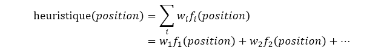
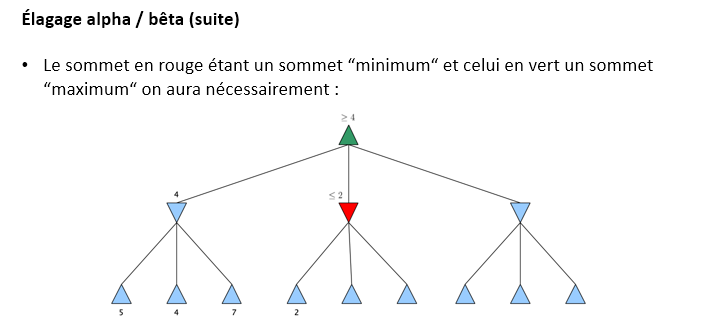

# Algorithmes MinMax et MCTS

- [Algorithmes MinMax et MCTS](#algorithmes-minmax-et-mcts)
  - [Contexte](#contexte)
    - [Éléments communs à la plupart des jeux (mathématiques)](#éléments-communs-à-la-plupart-des-jeux-mathématiques)
    - [Objectif](#objectif)
    - [Jeux déterministes](#jeux-déterministes)
    - [Jeux à coups alternés](#jeux-à-coups-alternés)
    - [Jeux à information complète](#jeux-à-information-complète)
    - [Jeux à somme nulle](#jeux-à-somme-nulle)
    - [Graphe associé à un jeu](#graphe-associé-à-un-jeu)
      - [Remarques](#remarques)
    - [Arborescence associée à un jeu](#arborescence-associée-à-un-jeu)
    - [Approche](#approche)
    - [Remarques](#remarques-1)
  - [Algorithme MinMax.](#algorithme-minmax)
    - [Idée de base](#idée-de-base)
    - [Cas simple : principe](#cas-simple--principe)
      - [Remarques sur le pseudo-code](#remarques-sur-le-pseudo-code)
      - [Limites du cas simple](#limites-du-cas-simple)
    - [Cas général : principe](#cas-général--principe)
      - [Cas général : heuristique d’évaluation](#cas-général--heuristique-dévaluation)
    - [Élagage alpha / bêta](#élagage-alpha--bêta)
    - [Expectimax : principe général](#expectimax--principe-général)
  - [Monte Carlo Tree Search.](#monte-carlo-tree-search)
    - [Origine de la terminologie Monte Carlo](#origine-de-la-terminologie-monte-carlo)
    - [Limites de l’algorithme MinMax](#limites-de-lalgorithme-minmax)
    - [Idée de base](#idée-de-base-1)
    - [MCTS : principe général](#mcts--principe-général)
    - [MCTS : arbre de recherche](#mcts--arbre-de-recherche)
    - [MCTS : description d’une itération](#mcts--description-dune-itération)
      - [MCTS: sélection](#mcts-sélection)
      - [MCTS: expansion](#mcts-expansion)
      - [MCTS: simulation](#mcts-simulation)
      - [MCTS : rétropropagation](#mcts--rétropropagation)
    - [MCTS : remarque](#mcts--remarque)
    - [Statistiques des sommets](#statistiques-des-sommets)
      - [Retropropagation : exemple](#retropropagation--exemple)
      - [Statistiques des sommets : remarque](#statistiques-des-sommets--remarque)
    - [Politique de sélection : UCT](#politique-de-sélection--uct)
      - [Politique de sélection : exemple](#politique-de-sélection--exemple)
      - [Politique de sélection : remarque sur l’exemple et la valeur de 𝑪](#politique-de-sélection--remarque-sur-lexemple-et-la-valeur-de-𝑪)
      - [Politique de sélection : remarque sur les premières itérations](#politique-de-sélection--remarque-sur-les-premières-itérations)
    - [Politique de jeu](#politique-de-jeu)
    - [Meilleur coup](#meilleur-coup)
    - [MCTS : pseudo-code](#mcts--pseudo-code)
    - [Considérations de complexité](#considérations-de-complexité)

## Contexte 

### Éléments communs à la plupart des jeux (mathématiques)

- Un ensemble de positions (états) possibles, généralement fini.

- Un ensemble de joueurs, la plupart du temps deux.

- Les joueurs choisissent leurs coups (actions) en fonction de la position courante, ce qui modifie cette dernière.

- Des gains sont attribués aux joueurs, soit tout au long de la partie, soit uniquement à la fin.
 
### Objectif
 
Proposer une stratégie optimale pour des jeux :
 
Déterministes (pas de hasard)
À deux joueurs
À coups alternés
À information complète
À somme nulle
 
Cette stratégie optimale sera mise au point en se plaçant du point de vue du premier joueur.
 
### Jeux déterministes

Ce sont des jeux dans lesquels le hasard n’intervient pas, que ça soit dans le choix des coups, dans leurs résultats, dans les changements de positions ou même dans le comportement de l’adversaire.

Par opposition aux jeux stochastiques qui contiennent une part d’aléatoire, comme le poker, le backgammon, le Monopoly, 2048, etc.

### Jeux à coups alternés

Ce sont des jeux lors desquels les joueurs jouent chacun leur tour.

Par opposition aux jeux où les joueurs jouent simultanément, comme pierre-feuille-ciseaux, le dilemme du prisonnier ou certains jeux vidéo.

### Jeux à information complète

Ce sont des jeux pour lesquels chaque joueur possède toutes les informations nécessaires à sa prise de décision lorsque c’est à lui de jouer :

- Ses coups possibles.
- Les coups possibles de son adversaire en réponse à son propre coup.
- Les gains induits par les coups.
- L’historique des coups joués par les joueurs jusqu’à présent.

Si l’un des éléments précédents est inconnu, on dit que le jeu est à information incomplète. C’est le cas par exemple du Poker ou du Scrabble.

### Jeux à somme nulle

Ce sont des jeux pour lesquels les gains d’un joueur sont opposés à ceux de l’autre joueur.

Les deux joueurs ont donc des objectifs contraires et les seules issues d’une partie sont victoire, défaite ou match nul.

Les jeux à somme non nulle sont par exemple les jeux coopératifs ou le dilemme du prisonnier.

### Graphe associé à un jeu

On peut construire un graphe orienté afin de modéliser un jeu :

- Sommets : les différentes positions du jeu.
- Arcs : les différents coups possibles, un sommet 𝑌 étant un successeur d’un sommet 𝑋 si l’on peut passer de 𝑋 à 𝑌 en un seul coup.

#### Remarques

Selon les règles du jeu un sommet du graphe pourra appartenir à plusieurs chemins.

Il pourra également comporter des circuits, i.e. une succession d’arcs se “refermant“, si une même position peut se répéter (e.g. jeu d’échecs).

### Arborescence associée à un jeu

On peut également construire une arborescence afin de représenter l’ensemble des parties existantes :

- Racine : la position initiale.
- Feuilles : les positions finales, i.e. les fins de partie possibles.
- Autres sommets : les différentes positions du jeu atteignables à partir de la configuration initiale et donc situées “entre“ la racine et les feuilles.

Un sommet 𝑋 sera le père d’un sommet 𝑌 si l’on peut passer de l’état 𝑋 du jeu à l’état 𝑌 en un seul coup.

Même s’il s’agit clairement d’une arborescence, i.e. d’un arbre orienté muni d’une racine, on omettra la plupart du temps la représentation de cette orientation en considérant qu’elle est implicite.

### Approche 

Les algorithmes des deux parties suivantes vont reposer sur des parcours en profondeur de cette arborescence.

Ces parcours, avec leurs enchaînements de coups, correspondront à des parties.

En identifiant des parcours optimaux en un certain sens, on pourra alors mettre au point des stratégies de jeu.

### Remarques

Le graphe d’un jeu représente les positions existantes et les coups possibles entre elles tandis que l’arborescence décrit la succession des coups lors des différentes parties.

À noter que l’on ne construira pas l’arborescence entièrement préalablement à son parcours, on génèrera ses différents sommets progressivement, “à la volée“.

## Algorithme MinMax.

### Idée de base

Pour décider d’un coup on envisage les répliques possibles de l’adversaire.

On suppose que celui-ci fait de même et analyse également nos propres potentielles répliques.

On répète ensuite ce processus d’alternance de coups afin d’avoir une vision à long terme sur le résultat de la partie.

Deux cas de figure :

- Cas simple : on poursuit l’enchaînement des coups jusqu’à arriver à une fin de partie, i.e. à une feuille de l’arborescence.
- Cas général : on se limite à un nombre de coups fixé à l’avance.

Dans les deux cas on fera ensuite remonter l’information jusqu’au coup à jouer présentement.

### Cas simple : principe

On va attribuer une valeur dite d’utilité à chacune des feuilles de l’arborescence.

Cela permettra d’évaluer l’intérêt et la qualité de la succession des coups conduisant à une position finale depuis la situation initiale.

On fait cela en se plaçant du point de vue du premier joueur, c’est-à-dire de celui pour lequel on veut élaborer une stratégie optimale.

Cette fonction d’utilité doit bien sûr mesurer le gain du premier joueur.

Dans le cas classique d’un jeu dont les seules issues sont la victoire, la défaite et un match nul, on pourra attribuer aux feuilles correspondantes les valeurs de +1, −1, 0.

Si des scores sont attribués selon les positions finales, ce sont ces scores que l’on utilisera.

Une fois les feuilles évaluées on va propager cette information en la faisant remonter le long des branches de l’arborescence.

On va supposer que tout au long de la partie les deux joueurs vont choisir leurs coups de façon optimale, le meilleur coup pour l’un étant bien sûr le pire pour l’autre.

Quand on est sur un sommet correspondant au premier joueur, puisque la stratégie est conçue pour lui, on va choisir le coup correspondant au maximum des utilités des positions suivantes et l’on va affecter cette valeur au sommet en question 

Inversement, quand on est sur un sommet correspondant au second joueur, on va choisir le coup correspondant au minimum des utilités des positions suivantes et l’on va affecter cette valeur au sommet en question 

Pour le second joueur on choisit le minimum car les utilités sont calculées du point de vue du premier joueur et que le jeu est à somme nulle.

Les valeurs d’utilité des feuilles vont ainsi remonter d’un niveau de profondeur au précédent en alternant les sommets où l’on calcule un maximum avec ceux où l’on calcule un minimum. 

Une fois la propagation des valeurs d’utilité terminée, le premier joueur n’a plus qu’à choisir le coup correspondant à la valeur maximale.

Dans l’exemple précédent il s’agissait du coup conduisant à la valeur 5, c’est-à-dire du coup “de gauche“.

#### Remarques sur le pseudo-code

L’objectif de cette fonction est de déterminer le coup optimal pour le premier joueur mais pas d’effectuer concrètement un enchaînement de coups.

Les appels récursifs ne devront donc pas modifier la position courante du jeu.

C’est pour cela que la fonction « "joueCoup"(𝑗𝑒𝑢, 𝑝𝑜𝑠𝑖𝑡𝑖𝑜𝑛, 𝑗𝑜𝑢𝑒𝑢𝑟, 𝑐𝑜𝑢𝑝) » devra retourner la nouvelle position sans altérer celle passée en paramètre.

Alternativement, on pourra réellement effectuer le coup et restaurer la position courante juste après l’appel récursif.

Selon les implémentations, 𝑗𝑒𝑢,𝑝𝑜𝑠𝑖𝑡𝑖𝑜𝑛,𝑗𝑜𝑢𝑒𝑢𝑟,𝑐𝑜𝑢𝑝 pourront être regroupés au sein d’une même classe, dédiée au fonctionnement logique du jeu.

Une autre classe s’occupera alors de la recherche des coups optimaux.

#### Limites du cas simple

Parcourir l’arborescence de jeu jusqu’aux feuilles ne peut se faire que pour des jeux simples, où le nombre de sommets reste limité.

C’est par exemple faisable pour le Tic-tac-toe où le nombre de positions différentes est de 5478.

Pour les échecs c’est beaucoup plus compliqué, car on estime qu’il y a environ 10^120 parties différentes ce qui fait beaucoup plus que d’atomes dans l’univers.

Quand au jeu de Go une estimation du nombre de parties différentes est 10^600.

Pour ces jeux il est donc impossible de parcourir les arborescences de jeu dans leur totalité.

### Cas général : principe

L’idée de base est la même que pour le cas simple, à savoir envisager successivement plusieurs coups des deux joueurs et estimer la situation en résultant.

Mais au lieu d’arrêter uniquement le parcours de l’arborescence aux feuilles, on se fixera un niveau de profondeur, i.e. un nombre de coups successifs maximum que l’on prendra en compte.

On aura donc deux éventualités pour arrêter les parcours : 

Arriver sur une feuille avant la profondeur maximale : dans cette situation on retournera l’utilité de la feuille en question comme dans le cas simple.

Atteindre la profondeur maximale sans rencontrer de feuille : il faudra alors estimer la qualité du sommet en question et la retourner.

La remontée des informations se fera ensuite comme dans le cas simple, avec une alternance de sommets “maximum“ et de sommets “minimum“.

L’efficacité de l’algorithme dépendra très fortement de la fonction d’évaluation des sommets qui ne sont pas des feuilles.

Il s’agira d’une heuristique.

Le terme heuristique est un peu fourre-tout et désigne moralement une technique ou une fonction permettant de résoudre rapidement un problème au détriment parfois de l’optimalité. La mise au point d’une heuristique repose à la fois sur l’expérience, la connaissance du domaine et l’intuition.

#### Cas général : heuristique d’évaluation

Son but est donc d’estimer la qualité des sommets non finaux, i.e. qui ne sont pas des feuilles de l’arborescence.

Ses qualités requises devront être :

- La rapidité : on cherche en effet à déterminer un coup optimal dans un délai raisonnable.
- La pertinence : la valeur calculée devra être fortement corrélée aux chances finales de victoire.

Mettre au point une bonne heuristique est une question difficile et dépend bien évidemment des règles du jeu.

Elle sera en général positive pour les situations favorables au premier joueur et négative pour celles favorables au second joueur.

Pour prendre le dessus sur l’heuristique, les utilités des feuilles dans un jeu dont les issues sont victoire, défaite ou match nul seront +∞,−∞,0.

Aux échecs on pourra par exemple attribuer un poids 𝑤_𝑖 pour chaque type de pièce (e.g. 20 pour une reine, 15 pour un cavalier, 10 pour une tour ou un fou, etc.), et définir 𝑓_𝑖 (𝑝𝑜𝑠𝑖𝑡𝑖𝑜𝑛) comme étant la différence du nombre de pièces du type 𝑖 entre le premier joueur et le second dans 𝑝𝑜𝑠𝑖𝑡𝑖𝑜𝑛.

L’heuristique d’une 𝑝𝑜𝑠𝑖𝑡𝑖𝑜𝑛 sera alors de la forme 



Dans des jeux d’alignement du style Puissance 4 ou Gomoku, on pourra de la même façon calculer une somme pondérée mais au lieu de prendre en compte des types de pièces on considèrera des alignements partiels ouverts de 2,3 (ou plus selon le jeu) pions.

La formule sera alors de la même forme, en définissant 𝑓_𝑖 (𝑝𝑜𝑠𝑖𝑡𝑖𝑜𝑛) comme étant la différence du nombre d’alignements partiels de 𝑖 pions entre les deux joueurs.

Dans un jeu comme Othello on pourra s’intéresser à simple différence du nombre de pions entre les deux joueurs.

On pourra là aussi apporter une pondération, en donnant de l’importance aux pions situés dans des angles ou sur les bords.

Les valeurs précises de l’heuristique n’ont pas une grande importance, ce qui compte c’est que celle-ci soit monotone, i.e. qu’à une situation moins avantageuse qu’une autre soit attribuée une valeur plus petite.

### Élagage alpha / bêta

Le but ici est de procéder à un élagage de l’arborescence afin de ne pas examiner toutes les branches et de gagner en vitesse d’exécution.

Il ne s’agira pas d’une heuristique d’élagage, en ce sens que l’on ne perdra pas d’information.

L’idée va être de se servir des parcours des premières branches pour éventuellement restreindre la suite des explorations.



Puisque l’élagage se base sur les valeurs déjà retournées par les premiers parcours, il est évident que l’ordre d’examen des branches influe sur son efficacité.

On pourra développer dans un premier temps les branches que l’on pense les plus “favorables“ afin d’élaguer les autres par la suite.

Pour des niveaux de profondeur assez grands, le gain apporté par cette méthode peut être conséquent. 

Pour implémenter cet élagage, on va rajouter deux paramètres 𝑎𝑙𝑝ℎ𝑎 et 𝑏ê𝑡𝑎 à la fonction "minMax".

Ces paramètres seront mis à jour continuellement lors des appels récursifs.

Le paramètre 𝑎𝑙𝑝ℎ𝑎 va être la meilleure valeur (la plus grande) calculée jusqu’à présent sur les sommets “maximum“.

Le paramètre 𝑏ê𝑡𝑎 va être la meilleure valeur (la plus petite) calculée jusqu’à présent sur les sommets “minimum“.

```
FONCTION "minMax"(𝑗𝑒𝑢, 𝑝𝑜𝑠𝑖𝑡𝑖𝑜𝑛, 𝑗𝑜𝑢𝑒𝑢𝑟,𝑝𝑟𝑜𝑓𝑜𝑛𝑑𝑒𝑢𝑟,𝑎𝑙𝑝ℎ𝑎,𝑏ê𝑡𝑎)
  SI 𝑝𝑜𝑠𝑖𝑡𝑖𝑜𝑛 est finale ALORS
    RETOURNER "utilité"(𝑗𝑒𝑢, 𝑝𝑜𝑠𝑖𝑡𝑖𝑜𝑛, 𝑗𝑜𝑢𝑒𝑢𝑟), "None"
  SINON SI 𝑝𝑟𝑜𝑓𝑜𝑛𝑑𝑒𝑢𝑟==0 ALORS
    RETOURNER heuristique(𝑗𝑒𝑢, 𝑝𝑜𝑠𝑖𝑡𝑖𝑜𝑛, 𝑗𝑜𝑢𝑒𝑢𝑟)
```

```
SINON SI 𝑗𝑜𝑢𝑒𝑢𝑟==1 ALORS
  𝑣𝑎𝑙𝑒𝑢𝑟𝑀𝑎𝑥𝑖←−∞ 
  𝑐𝑜𝑢𝑝𝑀𝑎𝑥𝑖←"None" 
  POUR TOUT 𝑐𝑜𝑢𝑝 possible par 𝑗𝑜𝑢𝑒𝑢𝑟 depuis 𝑝𝑜𝑠𝑖𝑡𝑖𝑜𝑛 FAIRE
    𝑝𝑜𝑠𝑖𝑡𝑖𝑜𝑛𝑁𝑜𝑢𝑣𝑒𝑙𝑙𝑒←"joueCoup"(𝑗𝑒𝑢, 𝑝𝑜𝑠𝑖𝑡𝑖𝑜𝑛, 𝑗𝑜𝑢𝑒𝑢𝑟, 𝑐𝑜𝑢𝑝)
    𝑣𝑎𝑙𝑒𝑢𝑟, 𝑐𝑜𝑢𝑝←"minMax"(𝑗𝑒𝑢, 𝑝𝑜𝑠𝑖𝑡𝑖𝑜𝑛𝑁𝑜𝑢𝑣𝑒𝑙𝑙𝑒, 𝑎𝑑𝑣𝑒𝑟𝑠𝑎𝑖𝑟𝑒,𝑝𝑟𝑜𝑓𝑜𝑛𝑑𝑒𝑢𝑟−1 𝑎𝑙𝑝ℎ𝑎,𝑏ê𝑡𝑎)
    SI 𝑣𝑎𝑙𝑒𝑢𝑟>𝑣𝑎𝑙𝑒𝑢𝑟𝑀𝑎𝑥𝑖 ALORS
      𝑣𝑎𝑙𝑒𝑢𝑟𝑀𝑎𝑥𝑖←𝑣𝑎𝑙𝑒𝑢𝑟
      𝑐𝑜𝑢𝑝𝑀𝑎𝑥𝑖←𝑐𝑜𝑢𝑝
      𝑎𝑙𝑝ℎ𝑎←max⁡(𝑎𝑙𝑝ℎ𝑎,𝑣𝑎𝑙𝑒𝑢𝑟)
    SI 𝑣𝑎𝑙𝑒𝑢𝑟≥𝑏ê𝑡𝑎 ALORS
      RETOURNER 𝑣𝑎𝑙𝑒𝑢𝑟𝑀𝑎𝑥𝑖, 𝑐𝑜𝑢𝑝𝑀𝑎𝑥𝑖
  RETOURNER 𝑣𝑎𝑙𝑒𝑢𝑟𝑀𝑎𝑥𝑖, 𝑐𝑜𝑢𝑝𝑀𝑎𝑥𝑖
```
```
SINON SI 𝑗𝑜𝑢𝑒𝑢𝑟==2
  𝑣𝑎𝑙𝑒𝑢𝑟𝑀𝑖𝑛𝑖←+∞ 
  𝑐𝑜𝑢𝑝𝑀𝑖𝑛𝑖←"None" 
  POUR TOUT 𝑐𝑜𝑢𝑝 possible par 𝑗𝑜𝑢𝑒𝑢𝑟 depuis 𝑝𝑜𝑠𝑖𝑡𝑖𝑜𝑛 FAIRE
    𝑝𝑜𝑠𝑖𝑡𝑖𝑜𝑛𝑁𝑜𝑢𝑣𝑒𝑙𝑙𝑒←"joueCoup"(𝑗𝑒𝑢, 𝑝𝑜𝑠𝑖𝑡𝑖𝑜𝑛, 𝑗𝑜𝑢𝑒𝑢𝑟, 𝑐𝑜𝑢𝑝)
    𝑣𝑎𝑙𝑒𝑢𝑟, 𝑐𝑜𝑢𝑝←"minMax"(𝑗𝑒𝑢, 𝑝𝑜𝑠𝑖𝑡𝑖𝑜𝑛𝑁𝑜𝑢𝑣𝑒𝑙𝑙𝑒, 𝑎𝑑𝑣𝑒𝑟𝑠𝑎𝑖𝑟𝑒,𝑝𝑟𝑜𝑓𝑜𝑛𝑑𝑒𝑢𝑟−1
𝑎𝑙𝑝ℎ𝑎,𝑏ê𝑡𝑎)
    SI 𝑣𝑎𝑙𝑒𝑢𝑟<𝑣𝑎𝑙𝑒𝑢𝑟𝑀𝑖𝑛𝑖 ALORS
      𝑣𝑎𝑙𝑒𝑢𝑟𝑀𝑖𝑛𝑖←𝑣𝑎𝑙𝑒𝑢𝑟
      𝑐𝑜𝑢𝑝𝑀𝑖𝑛𝑖←𝑐𝑜𝑢𝑝
      𝑏ê𝑡𝑎←min⁡(𝑏ê𝑡𝑎,𝑣𝑎𝑙𝑒𝑢𝑟)
    SI 𝑣𝑎𝑙𝑒𝑢𝑟≤𝑎𝑙𝑝ℎ𝑎 ALORS
       RETOURNER 𝑣𝑎𝑙𝑒𝑢𝑟𝑀𝑖𝑛𝑖, 𝑐𝑜𝑢𝑝𝑀𝑖𝑛𝑖
  RETOURNER 𝑣𝑎𝑙𝑒𝑢𝑟𝑀𝑖𝑛𝑖, 𝑐𝑜𝑢𝑝𝑀𝑖𝑛𝑖
```

Pour un sommet donné, le premier appel de la fonction récursive minMax se fera en passant en paramètre la profondeur maximale souhaitée et en initialisant 𝑎𝑙𝑝ℎ𝑎 et 𝑏ê𝑡𝑎 à respectivement −∞ et +∞ :


"minMax"(𝑗𝑒𝑢, 𝑝𝑜𝑠𝑖𝑡𝑖𝑜𝑛, 𝑗𝑜𝑢𝑒𝑢𝑟,𝑝𝑟𝑜𝑓𝑜𝑛𝑑𝑒𝑢𝑟𝑀𝑎𝑥𝑖𝑚𝑎𝑙𝑒,−∞,+∞)

### Expectimax : principe général

On peut facilement étendre l’algorithme MinMax aux jeux où un adversaire joue seul mais avec une intervention du hasard entre chacun de ses coups. Par exemple les jeux 2048 ou Just Get Ten :

À noter que cela n’a plus de sens maintenant de retourner un coup optimal puisque l’on calcule une moyenne sur plusieurs coups.

C’est uniquement à l’issue des parcours que l’on déterminera le coup à effectuer par le premier joueur en choisissant celui correspondant à la valeur maximale.

L’élagage alpha / bêta sera plus difficile à mettre en place car le successeur d’un sommet “moyenne“ pourra tout à fait avoir une valeur sortant de la plage définie par 𝛼 et 𝛽 alors que la moyenne pondérée restera dans cette plage.

## Monte Carlo Tree Search.

### Origine de la terminologie Monte Carlo

On qualifie du nom de Monte Carlo des algorithmes évaluant une valeur par des simulations aléatoires. Il s’agit d’une référence au casino du même nom situé à Monaco.

Exemple basique : calcul approché de la valeur de 𝜋

### Limites de l’algorithme MinMax

Le facteur de branchement de certains jeux, i.e. le nombre d’enfants d’un sommet, est trop important et limite la profondeur maximale jusqu’à laquelle on peut explorer l’arborescence.

Ce facteur est par exemple égal en moyenne à 250 pour le jeu de Go ce qui restreint la profondeur à une dizaine de coups par joueur.

D’autre part établir une “bonne“ heuristique est très délicat.

En particulier pour des jeux où est des renversements de situations sont rapides, c’est-à-dire des jeux où un simple coup peut transformer une situation favorable en une situation défavorable. 

### Idée de base

L’idée d’utiliser le hasard pour élaborer une tactique de jeu est naturelle pour des jeux stochastiques.

Par exemple si l’on joue à pile ou face, simuler de nombreux lancers permettra d’avoir des informations sur l’équilibrage de la pièce et d’ajuster ses paris en conséquence.
Pour les jeux étudiés dans ce cours cela peut aussi avoir du sens de recourir au hasard pour évaluer une position.

Si depuis celle-ci de nombreuses simulations aléatoires de parties conduisent par exemple à un fort pourcentage de victoires, on pourra estimer que cette position est favorable.

### MCTS : principe général

Au lieu de d’étudier toutes les branches récursivement comme dans l’algorithme MinMax, on va en sélectionner certaines.

En revanche, on ne se limitera plus à un certain niveau de profondeur, on explorera ces branches jusqu’à atteindre une position finale.

Il ne sera donc plus nécessaire de mettre au point une bonne heuristique.

Après avoir simulé un certain nombre de parties entières depuis la position courante, on retiendra le coup conduisant au plus grand pourcentage de victoires.

C’est dans le choix des branches à explorer, i.e. dans la simulation de certaines parties, que le hasard interviendra.

Le nombre de branches à explorer sera soit explicitement défini soit limité par une contrainte de temps (par exemple 𝑥 secondes maximum par coup). 

Les simulations ne vont pas commencer directement à partir du sommet courant mais à partir de certains de ses descendants.

Ceux-ci seront sélectionnés en fonctions des informations déjà apprises en maintenant un équilibre entre exploitation et exploration.

L’exploration consistera à considérer des sommets peu ou pas encore évaluées et permettra ainsi de découvrir éventuellement de nouveaux coups avantageux.

L’exploitation concernera des sommets déjà évalués favorablement, son but étant d’améliorer la pertinence de ces évaluations. 

Ce choix entre exploration et exploitation se fera en suivant une politique de sélection.

Une fois un sommet sélectionné, on débute la simulation d’une partie.

Pour réaliser l’enchaînement des coups jusqu’à une position finale on suivra une politique de jeu.

Dans les versions basiques celle-ci sera purement aléatoire mais on peut bien évidemment adopter des stratégies plus élaborées.

Dès qu’une simulation se termine on enregistre le résultat de la partie.

Maintenir à jour des statistiques sur l’ensemble des simulations permettra in fine de choisir le coup à jouer.

### MCTS : arbre de recherche

À chaque nouveau coup on va construire un arbre de recherche à partir d’une racine correspondant à la position courante.

Initialement cet arbre ne comporte donc qu’un seul sommet (la position courante en question).

Cet arbre va croître progressivement, un nouveau sommet sera ajouté à chaque itération.

Un sommet de cet arbre sera dit traité s’il a déjà été évalué, i.e. si au moins une simulation a commencé à partir de ce sommet.

Un sommet sera dit complètement déployé si tous ses enfants ont été traités.

À chaque itération, c’est à un sommet non complètement déployé que l’on ajoutera un enfant.

### MCTS : description d’une itération

Chaque itération, i.e. chaque examen d’une nouvelle branche, comportera quatre étapes : 

1. Sélection.
2. Expansion.
3. Simulation.
4. Rétropropagation.

#### MCTS: sélection 

À partir du sommet courant, on parcourt l’arbre en suivant la politique de sélection jusqu’à atteindre un sommet non complètement déployé.

Par définition ce sommet aura au moins un enfant non traité.

#### MCTS: expansion

On peut donc ajouter un enfant (pas encore traité par nature) au sommet précédemment sélectionné.

Le choix est arbitraire si on a plusieurs possibilités.

#### MCTS: simulation 

À partir du sommet précédemment ajouté, on lance une simulation de partie.

Pour cela on suite la politique de jeu.

On constate alors le résultat de la partie.

#### MCTS : rétropropagation

Une fois la simulation terminée, on va faire remonter l’information, i.e. le résultat de la partie.

À partir du sommet récemment ajouté on va ainsi parcourir la branche de l’arbre de recherche jusqu’à la racine.

### MCTS : remarque

On va supposer dans la suite que les seules issues d’une partie sont victoire, défaite ou match nul.

L’étape de rétropropagation sera alors très simple car elle consistera à partir du résultat de la simulation à mettre à jour les ratios victoires / parties jouées pour chacun des sommets de l’arbre de recherche appartenant à la branche déterminée lors de l’étape de sélection.

### Statistiques des sommets

On va donc définir deux paramètres statistiques pour chacun des sommets 𝑥 de l’arbre de recherche :

- 𝑁(𝑥) : nombre de fois où le sommet 𝑥 a été visité, i.e. nombre de fois où 𝑥 s’est retrouvé sur un chemin lors de l’étape de sélection.

- 𝑈(𝑥) : nombre de fois où la simulation a conduit à une victoire pour le joueur courant à la suite d'une visite du sommet 𝑥.

#### Retropropagation : exemple

Considérons la situation suivante où de niveau en niveau sont représentés les ratios 𝑈(𝑥)/𝑁(𝑥)  pour le joueur venant de jouer.

Les couleurs ne sont là que pour se repérer :

En gris les sommets après un coup de l’adversaire.
En blanc les sommets après un coup de l’IA.

Imaginons que la politique de sélection nous ait amené à choisir le sommet dont les statistiques actuelles sont 27/35.

On a ensuite ajouté un enfant à ce sommet et lancé une simulation qui a conduit à la défaite de l’adversaire et donc à la victoire de l’IA.

Les statistiques des sommets 𝑥 correspondant à l’adversaire voient leurs nombres de visites 𝑁(𝑥) incrémentées de 1 mais leurs nombres de victoires 𝑈(𝑥) inchangées car l’adversaire a perdu la partie.

En revanche, les statistiques des sommets 𝑥 correspondant à l’IA voient à la fois leurs valeurs 𝑁(𝑥) et 𝑈(𝑥) incrémentées de 1 car l’IA a gagné la partie.

#### Statistiques des sommets : remarque

Les valeurs 𝑈(𝑥) et donc les ratios 𝑈(𝑥)/𝑁(𝑥)  sont calculés du point de vue du joueur correspondant au sommet courant, c’est pourquoi ils « s’inversent » d’un niveau de profondeur à un autre.

Cela va permettre que chaque joueur, l’IA et son adversaire, optimise ses chances lors de l’étape de sélection.

### Politique de sélection : UCT

Cet acronyme signifie Upper Confidence bounds applied to Trees. Il s’agit de la politique de sélection la plus utilisée.

Elle utilise la formule UCB1, Upper Confidence Bounds 1, définie pour tout sommet 𝑥 par

𝑈𝐶𝐵1(𝑥)=𝑈(𝑥)/𝑁(𝑥) +𝐶×√(log⁡(𝑁(𝑃𝑎𝑟𝑒𝑛𝑡(𝑥)))/𝑁(𝑥) )

où 𝐶 est une constante strictement positive.

Partant de la racine, i.e. de la position pour laquelle on veut déterminer le prochain coup, on va parcourir l’arbre en suivant cette règle :

Si un sommet est complètement déployé, on sélectionne son enfant ayant la plus forte valeur de 𝑈𝐶𝐵1 (en cas d’égalité on tire un sommet au hasard parmi ceux ayant la valeur maximale). Cet enfant devient le nouveau sommet courant et l’on poursuit le parcours.

Sinon, on choisit aléatoirement un de ses enfants non traités, on l’ajoute à l’arbre et on arrête le parcours.

La fraction 𝑈(𝑥)/𝑁(𝑥)  est une évaluation de la qualité du sommet 𝑥 puisqu’elle représente le pourcentage de victoires lors des simulations faisant suite aux visites de 𝑥. Il s’agit donc d’un terme d’exploitation.

L’expression √(log⁡(𝑁(𝑃𝑎𝑟𝑒𝑛𝑡(𝑥)))/𝑁(𝑥) ) sera grande si 𝑁(𝑥) est petit, i.e. si le sommet 𝑥 a été peu visité. Il s’agit donc d’un terme d’exploration.

La constante 𝐶 est un paramètre dit de température, son rôle va être de conjuguer exploitation et exploration.

Empiriquement on constate que 𝐶=√2 est une “bonne“ valeur.

Plus un sommet 𝑥 sera visité, plus 𝑁(𝑥) sera grand et donc plus le terme d’exploration sera petit.

Cela signifie qu’à terme un sommet ne sera sélectionné que s’il est de qualité, l’exploitation prenant ainsi le dessus.

#### Politique de sélection : exemple

Reprenons cette situation et calculons les valeurs de 𝑈𝐶𝐵1 pour les trois enfants de la racine en prenant 𝐶=√2 :

60/79 +√2 √(ln⁡(100)/79)≈1,101

1/10 +√2 √(ln⁡(100)/10)≈1,060

2/11 +√2 √(ln⁡(100)/11)≈1,097

Calculons maintenant les valeurs de 𝑈𝐶𝐵1 pour les deux enfants du sommet précédent :

3/26+√2 √(ln⁡(79)/26)≈0,695

16/53+√2 √(ln⁡(79)/53)≈0,708

Calculons maintenant les valeurs de 𝑈𝐶𝐵1 pour les deux enfants du sommet précédent :

27/35+√2 √(ln⁡(53)/35)≈1,248

10/18+√2 √(ln⁡(53)/18)≈1,220

In fine, on sélectionne donc le sommet dont l’évaluation actuelle est 27/35.

#### Politique de sélection : remarque sur l’exemple et la valeur de 𝑪

Lors du premier choix on a opté pour le sommet 60/79 qui a un pourcentage de victoires supérieur aux deux autres mais choisir le sommet 2/11 aurait également eu du sens afin de l’explorer un peu plus et d’affiner son évaluation.

D’ailleurs avec une constante 𝐶=1,5 c’est ce sommet que l’on aurait choisi :

60/79+1,5√(ln⁡(100)/79)≈1,122

1/10+1,5√(ln⁡(100)/10)≈1,118

2/11+√2 √(ln⁡(100)/11)≈1,152

#### Politique de sélection : remarque sur les premières itérations

Initialement l’arbre de recherche ne comporte que la racine qui n’est bien sûr pas complètement déployée.

Les premières itérations vont donc consister à ajouter un par un les enfants de la racine à l’arbre de recherche : 

Ce fait de déployer tous les enfants d’un sommet (à la manière d’un parcours en largeur) n’est valable que pour la racine et lors des 
premières itérations.

### Politique de jeu

Dans la version la plus élémentaire de l’algorithme, la politique de jeu consiste à choisir aléatoirement selon une loi uniforme un coup parmi ceux disponibles depuis l’état courant et à recommencer jusqu’à atteindre une position finale.

Cela peut suffire pour des jeux aux règles simples mais pour d’autres plus élaborés il conviendra d’établir une vraie politique de jeu afin d’orienter le déroulement des parties.

On pourra par exemple utiliser des heuristiques de jeu, comme privilégier les angles à Othello ou viser des prises aux échecs.

On peut également concevoir des réseaux de neurones, entraînés à jouer contre eux-mêmes

### Meilleur coup

Rappelons que l’on stoppe les itérations, chacune d’elles étant constituée des quatre étapes précédentes, quand une limite de temps est dépassée ou quand un nombre maximal d’itérations est atteint.

Il faut alors retourner le “meilleur“ coup à jouer pour l’IA. Celui-ci correspondra à l’un des enfants 𝑥 de la racine de l’arbre de recherche.

On pourra alors opter pour :

- Le coup correspondant à l’enfant 𝑥 ayant le pourcentage de victoire le plus important, i.e. celui avec le ratio 𝑈(𝑥)/𝑁(𝑥)  le plus grand.

- Le coup correspondant à l’enfant 𝑥 ayant été le plus visité, i.e. celui dont la valeur de 𝑁(𝑥) est la plus élevée.

Dans de nombreux cas les deux choix coïncident car la politique de sélection tend au fur et à mesure des itérations à privilégier le terme d’exploitation par rapport à celui d’exploration.

Les sommets les plus visités seront donc généralement ceux qui ont aussi le meilleur ratio.

Cela dit on choisira en général l’enfant de la racine ayant été le plus visité, pour par exemple sélectionner un sommet ayant un ratio de 65/100 par rapport à un autre de ratio 2/3.

On peut en effet penser que même si le ratio du second est plus élevé, la fiabilité de l’évaluation du premier est supérieure.

### MCTS : pseudo-code

```
FONCTION 𝑚𝑜𝑛𝑡𝑒𝐶𝑎𝑟𝑙𝑜𝑇𝑟𝑒𝑒𝑆𝑒𝑎𝑟𝑐ℎ(𝑝𝑜𝑠𝑖𝑡𝑖𝑜𝑛)
  𝑎𝑟𝑏𝑟𝑒←𝑠𝑜𝑚𝑚𝑒𝑡(𝑝𝑜𝑠𝑖𝑡𝑖𝑜𝑛)
  TANT QUE (𝑡𝑒𝑚𝑝𝑠<𝑡𝑒𝑚𝑝𝑠𝑀𝑎𝑥)  "ET" (𝑖𝑡é𝑟𝑎𝑡𝑖𝑜𝑛𝑠<𝑖𝑡é𝑟𝑎𝑡𝑖𝑜𝑛𝑠𝑀𝑎𝑥) FAIRE
    𝑠𝑜𝑚𝑚𝑒𝑡𝑆é𝑙𝑒𝑐𝑡𝑖𝑜𝑛𝑛é←𝑠é𝑙𝑒𝑐𝑡𝑖𝑜𝑛𝑈𝐶𝑇(𝑎𝑟𝑏𝑟𝑒)
    𝑛𝑜𝑢𝑣𝑒𝑎𝑢𝑆𝑜𝑚𝑚𝑒𝑡←𝑒𝑥𝑝𝑎𝑛𝑠𝑖𝑜𝑛(𝑎𝑟𝑏𝑟𝑒,𝑠𝑜𝑚𝑚𝑒𝑡𝑆é𝑙𝑒𝑐𝑡𝑖𝑜𝑛𝑛é)
    𝑟é𝑠𝑢𝑙𝑡𝑎𝑡←𝑠𝑖𝑚𝑢𝑙𝑎𝑡𝑖𝑜𝑛(𝑛𝑜𝑢𝑣𝑒𝑎𝑢𝑆𝑜𝑚𝑚𝑒𝑡)
    𝑟é𝑡𝑟𝑜𝑝𝑟𝑜𝑝𝑎𝑔𝑎𝑡𝑖𝑜𝑛(𝑎𝑟𝑏𝑟𝑒,𝑠𝑜𝑚𝑚𝑒𝑡𝑆é𝑙𝑒𝑐𝑡𝑖𝑜𝑛𝑛é, 𝑟é𝑠𝑢𝑙𝑡𝑎𝑡)
  RETOURNER 𝑚𝑒𝑖𝑙𝑙𝑒𝑢𝑟𝐶𝑜𝑢𝑝(𝑎𝑟𝑏𝑟𝑒)
```

```
FONCTION 𝑠𝑜𝑚𝑚𝑒𝑡(𝑝𝑜𝑠𝑖𝑡𝑖𝑜𝑛)
  # transforme la 𝑝𝑜𝑠𝑖𝑡𝑖𝑜𝑛 de jeu en un sommet d’un arbre de recherche
  # ce sommet comportera des liens vers son parent et ses éventuels enfants
  # ainsi que les statistiques 𝑈 et 𝑁 et le 𝑗𝑜𝑢𝑒𝑢𝑟 dont c’est le tour


FONCTION 𝑚𝑒𝑖𝑙𝑙𝑒𝑢𝑟𝐶𝑜𝑢𝑝(𝑎𝑟𝑏𝑟𝑒)
  # retourne le meilleur coup issu de la racine ici on choisi le plus visité
  # la fonction arg max est ici calculée sur les sommets 𝑥 successeurs de la racine
  RETOURNER (arg max)┬𝑥⁡(𝑁(𝑥))
```

```
FONCTION 𝑠é𝑙𝑒𝑐𝑡𝑖𝑜𝑛𝑈𝐶𝑇(𝑎𝑟𝑏𝑟𝑒)
  # la fonction arg max est ici calculée sur les sommets 𝑥 successeurs du sommet courant
  𝑠𝑜𝑚𝑚𝑒𝑡𝐶𝑜𝑢𝑟𝑎𝑛𝑡←𝑟𝑎𝑐𝑖𝑛𝑒(𝑎𝑟𝑏𝑟𝑒)
  TANT QUE 𝑠𝑜𝑚𝑚𝑒𝑡𝐶𝑜𝑢𝑟𝑎𝑛𝑡 n’est pas une position finale FAIRE
    SI 𝑠𝑜𝑚𝑚𝑒𝑡𝐶𝑜𝑢𝑟𝑎𝑛𝑡 n’est pas complètement déployé ALORS
      RETOURNER 𝑠𝑜𝑚𝑚𝑒𝑡𝐶𝑜𝑢𝑟𝑎𝑛𝑡
    SINON
       𝑠𝑜𝑚𝑚𝑒𝑡𝐶𝑜𝑢𝑟𝑎𝑛𝑡←(arg max)┬𝑥⁡(𝑈(𝑥)/𝑁(𝑥) +𝐶×√(log⁡(𝑁(𝑠𝑜𝑚𝑚𝑒𝑡𝐶𝑜𝑢𝑟𝑎𝑛𝑡))/𝑁(𝑥) ))
  RETOURNER 𝑠𝑜𝑚𝑚𝑒𝑡𝐶𝑜𝑢𝑟𝑎𝑛𝑡
```
```
FONCTION 𝑒𝑥𝑝𝑎𝑛𝑠𝑖𝑜𝑛(𝑎𝑟𝑏𝑟𝑒,𝑠𝑜𝑚𝑚𝑒𝑡)
  choisir arbitrairement un enfant pas encore traité 𝑥 de 𝑠𝑜𝑚𝑚𝑒𝑡
  ajouter 𝑥 comme enfant de 𝑠𝑜𝑚𝑚𝑒𝑡 dans 𝑎𝑟𝑏𝑟𝑒
  RETOURNER 𝑥


FONCTION 𝑠𝑖𝑚𝑢𝑙𝑎𝑡𝑖𝑜𝑛(𝑠𝑜𝑚𝑚𝑒𝑡)
  TANT QUE 𝑠𝑜𝑚𝑚𝑒𝑡 n’est pas une position finale FAIRE
    choisir aléatoirement un 𝑐𝑜𝑢𝑝 parmi ceux disponibles depuis 𝑠𝑜𝑚𝑚𝑒𝑡
    𝑠𝑜𝑚𝑚𝑒𝑡←"joueCoup"(𝑠𝑜𝑚𝑚𝑒𝑡, 𝑐𝑜𝑢𝑝)
  RETOURNER résultat correspondant à 𝑠𝑜𝑚𝑚𝑒𝑡
```

```
PROCÉDURE 𝑟é𝑡𝑟𝑜𝑝𝑟𝑜𝑝𝑎𝑔𝑎𝑡𝑖𝑜𝑛(𝑎𝑟𝑏𝑟𝑒,𝑠𝑜𝑚𝑚𝑒𝑡, 𝑟é𝑠𝑢𝑙𝑡𝑎𝑡)
  𝑁(𝑠𝑜𝑚𝑚𝑒𝑡)←𝑁(𝑠𝑜𝑚𝑚𝑒𝑡)+1
  SI 𝑟é𝑠𝑢𝑙𝑡𝑎𝑡 est une victoire pour le joueur correspondant au 𝑠𝑜𝑚𝑚𝑒𝑡 ALORS
    𝑈(𝑠𝑜𝑚𝑚𝑒𝑡)←𝑈(𝑠𝑜𝑚𝑚𝑒𝑡)+1
  SI 𝑃𝑎𝑟𝑒𝑛𝑡(𝑠𝑜𝑚𝑚𝑒𝑡)  !="None" ALORS
    𝑠𝑜𝑚𝑚𝑒𝑡←𝑃𝑎𝑟𝑒𝑛𝑡(𝑠𝑜𝑚𝑚𝑒𝑡)
    𝑟é𝑡𝑟𝑜𝑝𝑟𝑜𝑝𝑎𝑔𝑎𝑡𝑖𝑜𝑛(𝑎𝑟𝑏𝑟𝑒,𝑠𝑜𝑚𝑚𝑒𝑡, 𝑟é𝑠𝑢𝑙𝑡𝑎𝑡)
```

### Considérations de complexité

L’algorithme MinMax a une complexité exponentielle de la forme 𝑂(𝑏^𝑝 ) où 𝑏 est le facteur de branchement et où 𝑝 est la profondeur maximale jusqu’à laquelle on effectue les recherches.

Une simulation de l’algorithme MCTS a une complexité linéaire de la forme 𝑂(𝑑) où la aussi 𝑑 est la profondeur totale de l’arbre. 

Cette différence provient du fait que lors d’une simulation de MCTS un seul coup est choisi à chaque position alors qu’avec MinMax ce sont tous les coups qui sont envisagés.

Il s’agit donc de l’exploration d’une branche versus celle de toutes les branches.

Ce gain de temps considérable permet à MCTS d’effectuer un grand nombre de simulations à chaque recherche d’un coup optimal.

Si par exemple 𝑏=32, une profondeur maximale 𝑝=6 pour l’algorithme MinMax conduira à l’examen de 32^6 positions, i.e. plus de 10^9.

Si pour ce même jeu une partie comporte en moyenne 100 coups, on pourra pour le même temps de calcul exécuter environ 10^7 simulations.
