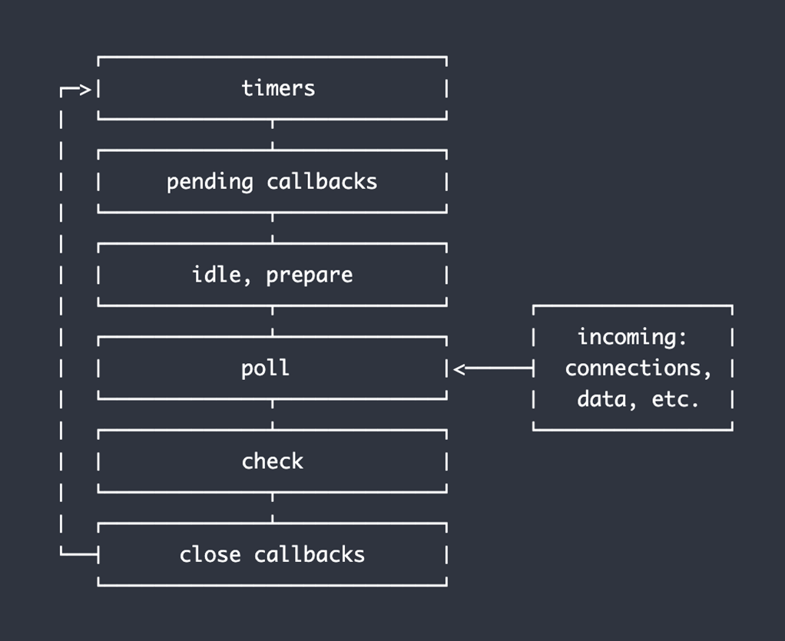

# Node.js

## Node.js concepts

Node.js was created by Ryan Dahl, a software engineer, and it was introduced to the world in 2009.

The main idea behind Node.js was to provide a runtime environment that allows developers to execute JavaScript code on the server side, extending the language's capabilities beyond the confines of the browser.

Ryan Dahl's motivation for creating Node.js stemmed from the limitations of traditional server-side technologies at the time.

Conventional server-side environments, characterized by synchronous, blocking I/O operations, faced challenges in handling a large number of concurrent connections efficiently.

Dahl envisioned a new approach, one that embraced an event-driven, non-blocking model, optimizing performance and enabling the development of scalable and real-time applications.

It allows developers to treat multiple requests at the same time, without waiting for one to finish before starting another one. It is an event-driven architecture capable of asynchronous I/O.

### Non-blocking I/O

Node.js employs an asynchronous, non-blocking I/O model, allowing it to handle multiple requests simultaneously without waiting for each operation to complete before moving on to the next.

### Event-driven architecture

Node.js follows an event-driven architecture where actions or events trigger responses.

This approach is well-suited for scenarios where responsiveness and real-time updates are critical.

### JavaScript on the server side

Node.js unifies JavaScript development by enabling the use of the same language on both the client and server sides.

This allows developers to seamlessly transition between frontend and backend development, promoting code reuse and a more cohesive development experience.

---

At its core, Node.js is not just a runtime environment; it represents a paradigm shift in how we conceive and build server-side applications.

Unlike traditional server-side technologies that follow a synchronous, blocking I/O model, Node.js adopts an event-driven, non-blocking approach.

This unique architecture allows developers to handle multiple concurrent connections efficiently, making Node.js particularly adept at building real-time applications and high-performance web servers.

Powered by the V8 JavaScript engine from Google, Node.js executes JavaScript code server-side, a departure from its conventional role confined to the browser.

This unification of JavaScript across the entire development stack, commonly referred to as "JavaScript everywhere," brings a harmonious synergy to the world of full-stack development.

Developers can seamlessly transfer their skills from frontend to backend, fostering code reusability and creating a more unified and streamlined development experience.

One of Node.js's standout features is its ability to handle asynchronous operations efficiently.

This characteristic is particularly advantageous in scenarios where real-time updates and responsiveness are paramount, such as in chat applications, online gaming platforms, and collaborative tools.

Node.js empowers developers to create applications that not only meet but exceed user expectations in terms of speed and interactivity.

## NPM

### Managing dependencies

Additionally, developers can save a package as a dependency using the --save flag to update the package.json file - or using the --save-dev flag to save a dev dependency

    > npm install react --save
    > npm install mocha --save-dev

### Executing scripts

NPM allows developers to define and run scripts in the package.json file.
This is commonly used for tasks such as running tests, building the project, or starting the application. For example, a script to start a server could be defined in the package.json file:

```json
    "scripts": {
        "start": "node server.js"
    }
```

### Global Packages

NPM allows the installation of packages globally using the -g flag.

Some packages are meant to be installed globally and used as command-line tools. The -g flag is used for global installations. For instance, to install the Node.js debugging tool, nodemon, globally:

```bash
    > npm install -g nodemon
```

This allows the nodemon command to be accessible from any terminal window.

### Publishing Packages

NPM enables developers to share their own packages with the global community. By creating a package.json file and using the npm publish command, developers can publish their packages to the NPM registry for others to use.

```bash
    > npm publish
```

### package.json

For developers engaging in project development and testing, package.json introduces the concept of devDependencies.

This section lists dependencies that are necessary during the development phase but not required for the production environment.

```json
    "devDependencies": {
        "mocha": "^9.0.0"
    }
```

This separation ensures that production environments remain lean and only include dependencies essential for runtime.

One of the notable features of package.json is the inclusion of scripts.

```json
    "scripts": {
        "test": "mocha"
    }
```

This separation ensures that production environments remain lean and only include dependencies essential for runtime.

One of the notable features of package.json is the inclusion of scripts.

The scripts section allows developers to define custom commands that can be executed via npm.

Common scripts include starting the application, running tests, or executing build processes. This capability simplifies complex workflows and standardizes project-related tasks.
For example, a script to start a server could be defined in the package.json file:

```json
    "scripts": {
        "start": "node server.js"
    }
```

Beyond technical details, package.json includes metadata about the project, such as the project's author, licensing information, and a brief description.

This metadata provides context and aids in project documentation, making it easier for developers, collaborators, and users to understand the project's purpose and attributes.

Additionally, the package.json file allows developers to specify the minimum version of Node.js and npm that the project is compatible with.

This ensures that the project is executed in environments that meet the specified criteria, promoting consistency and avoiding compatibility issues.

In summary, package.json is more than just a configuration file; it's a central hub of information that streamlines project management, fosters collaboration, and ensures a standardized and well-documented development environment in the Node.js ecosystem.

It reflects the best practices of modern software development, providing a comprehensive and structured approach to project configuration and dependency management.

In addition to the package.json file, Node.js projects often include a package-lock.json file, which serves a specific purpose in managing package dependencies.

The package-lock.json file is automatically generated and updated by npm to provide a deterministic and reproducible snapshot of the project's dependency tree.

Some specific commands that you can use from npm

- npm audit
  - Performs a security audit on your project's dependencies, identifying any known vulnerabilities.
- npm init
  - Initializes a new package.json file for your project. It prompts you to enter details such as the project name, version, entry point, test command, repository, and more.

Some specific commands that you can use from npm

- npm update
  - Updates packages to their latest versions based on the version constraints specified in the package.json file.
- npm run xyz
  - Executes a script xyz defined in the scripts section of the package.json file.

While npm remains the default choice for many Node.js developers, alternative package managers like Yarn and pnpm provide additional options, each with its unique features and advantages.

The choice of which package manager to use often depends on specific project requirements, developer preferences, and the need for specific features such as speed, disk space efficiency, or offline capabilities.

There are a few alternative package managers that offer different features and approaches.

### Yarn

Yarn is a fast, reliable, and secure package manager for JavaScript. It was developed by Facebook and is designed to be a drop-in replacement for npm.

Yarn introduced features like deterministic dependency resolution, parallel downloads, and offline capabilities, addressing some performance and reliability concerns that developers had with npm.

### pnpm

pnpm is a fast and disk-space efficient package manager for Node.js.

It is designed to share dependencies across projects, saving disk space and reducing redundancy.

pnpm uses a single content-addressable storage for all dependencies, allowing them to be linked and shared.

### Symbol before version number

- ~ : allows update to newest patch version
- ^ : allows update to newest minor version
- - : allows update to any version
- no symbol : only that exact version
- > : greater than
- > = : greater than or equal to
- < : less than
- <= : less than or equal to

### ES Modules vs CommonJS

Node.js supports two module systems: CommonJS and ES Modules (ECMAScript Modules).

- CommonJS: This is the original module system used in Node.js. It uses require() to import modules and module.exports to export them. CommonJS modules are synchronous and are loaded at runtime.

- ES Modules: This is the newer module system introduced in ECMAScript 2015 (ES6). It uses import and export statements for module management. ES Modules are asynchronous and can be statically analyzed, allowing for better optimization by bundlers and tools.

To use ES Modules in Node.js, you need to set the "type" field in your package.json file to "module". This tells Node.js to treat .js files as ES Modules.

```json
{
  "type": "module"
}
```

This allows you to use import and export statements in your JavaScript files.

For example, to export a function in ES Modules:

```javascript
export function myFunction() {
  // function code
}
```

And to import it in another file:

```javascript
import { myFunction } from "./myModule.js";
myFunction();
```

To use CommonJS, you can either set the "type" field to "commonjs" or omit it entirely, as CommonJS is the default module system in Node.js.

```json
{
  "type": "commonjs"
}
```

This allows you to use require() and module.exports in your JavaScript files.

For example, to export a function in CommonJS:

```javascript
module.exports.myFunction = function () {
  // function code
};
```

And to import it in another file:

```javascript
const { myFunction } = require("./myModule.js");
myFunction();
```

## Using Node.js

We said that Node.js is different from other languages, but what does it mean exactly? What this idea of event-driven, eventloop or asynchronous I/O can help us?

“
JavaScript has certain characteristics that make it very different than
other dynamic languages, namely that it has no concept of threads. Its
model of concurrency is completely based around events.
“
Ryan Dahl, creator of Node.js

The event loop is what allows Node.js to perform non-blocking I/O operations despite the fact that JavaScript is single-threaded by offloading operations to the system kernel whenever possible.

Node.js applications are event-driven, meaning they respond to events by executing callback functions. The event loop is responsible for managing and dispatching these events in a non-blocking manner.

The Node.js event loop is a foundational concept in the design of Node.js, playing a central role in its asynchronous, non-blocking I/O model.

At its core, the event loop is a mechanism that enables Node.js to handle multiple operations concurrently without relying on additional threads.

The asynchronous nature of Node.js applications is rooted in the event loop, which manages and dispatches events in a non-blocking manner.

Node.js follows a non-blocking I/O model, allowing the application to continue executing tasks while waiting for I/O operations to complete.

This is achieved through the use of callbacks and the event loop. When an asynchronous operation finishes, its corresponding callback is added to the event queue, and the event loop schedules its execution.

The benefits of the event loop in Node.js are significant. It contributes to the scalability of Node.js applications, enabling them to handle numerous concurrent connections without the need for threading.

The non-blocking I/O operations enhance efficiency by preventing the application from idling during I/O waits.

Moreover, the event-driven model makes Node.js highly responsive to events, making it suitable for real-time applications such as chat systems or online gaming.



The event-driven architecture in Node.js is facilitated by the event loop, which efficiently manages and dispatches events.

Core libraries in Node.js, such as those for file system operations (fs module), networking (http and net modules), and database interactions (mysql or mongodb modules), are crafted to emit events upon completion or in response to certain triggers.

Developers can register event listeners (callbacks) to respond to these events, making it an inherently non-blocking and asynchronous process.

### One key point to remember

Node.js is NOT:

- a web framework: do not compare it to Rails (Ruby) or Django (Python) but more to Python or Ruby directly
- multi threaded: you can now use WebWorker, but by default it is not a true multithreaded solution

Outside of that Node.js is pretty much compliant with the full JavaScript specification (ECMA).

As you can expect, Node.js being only server side it means that only the features that are not linked to the window, the browser or the graphical interface are availables. You cannot use

- all functions related to windows
- all features linked to navigator (like gps, camera…)
- all solutions to access user system (Node.js run on your server)

Also Node.js use historically the CommonJS specification to create a module or library

But since a couple years you can also create a module with the ESM specification - this one being also the official specification for JavaScript regarding module.

- the change between CJS (CommonJS) and ESM (EcmaScript Module) takes time
- Node.js v21 now support a flag to invert the default, from CJS to ESM

The two specifications are not fully compatible. As of right now there are still some issues if you try to use both solutions in the same project.

As time passes, more and more libraries and projects migrate to use the “new” standard with ESM. This unfortunately takes some time, especially because

- some feature available in CJS are not possible in ESM
- you need to rewrite most of your code
- libraries author need to support the two versions during the transition

CJS example:

```javascript
const math = require("./math");

module.exports = {
  add: (a, b) => a + b,
  subtract: (a, b) => a - b,
};
```

CommonJS is a module system introduced to standardize modular JavaScript code for server-side environments, notably in the Node.js ecosystem.

CommonJS modules use the require function to import modules and module.exports or exports to expose functionality.

ESM example:

```javascript
import math from "./math";

export const add = (a, b) => a + b;
export const subtract = (a, b) => a - b;
```

ESM is the native module system introduced in ECMAScript 6 (ES6) and later versions of JavaScript. It is designed to be a more standardized and versatile module system, applicable both in browsers and server-side environments.

ESM uses the import and export keywords for module importing and exporting.

One significant feature of ESM is its support for asynchronous module loading. This enables more dynamic and efficient loading of modules, particularly beneficial in scenarios where dependencies may be loaded asynchronously.

If needed, you can tell Node.js to use the ECMAScript modules loader via

- the .mjs file extension
- the package.json "type" field
- the --input-type flag.

Reminder: Node.js builds your code only once when you run your script or a command. If you update your code after running it, it won't be modified or reloaded by the runtime.

You have to relaunch the run command, each time.

You can also use a watcher to automatically reload your code. One working solution is

- to use the nodemon package
- or use the --watch flag part of Node.js since Node v20

### --watch

Since Node.js v20, you can find a feature (still experimental) that replace what nodemon is able to do.

The --watch flag allows you to say to your node processus to reload if it detects that a file in the project (or in a specific directory depending on the options) is changed, then it should automatically reload

- node --watch index.js
- node --watch --watch-preserve-output index.js
- node --watch-path=./src index.js

## Internal Libraries

Passing in arguments via the command line is an extremely basic programming task, and a necessity for anyone trying to write a simple Command-Line Interface (CLI).

In Node.js, as in C and many related environments, all command-line
arguments received by the shell are given to the process in an array called argv (short for 'argument values').

Node.js exposes this array for every running process in the form of
process.argv - let's take a look at an example.

Make a file called index.js and add this line:

> console.log(process.argv);

Execute your script from your terminal with the arguments you want.

Luckily, there are many third party modules that makes all of this trivial - one of which is yargs. It's available via npm. Use this command from your app's base path:

> npm i yargs

Or since Node.js v18, you can use the parser included inside Node.js

> const { parseArgs } = require('node:util');

Sometimes while working with Node.js you will need to interact with the system and more specifically with the file system.

You will have to read a file, write it or do others operations.

For that Node.js provides a core module fs which is built to provide all the needed functionalities

First of all you need to require (or import if you use the ESM syntax) the core module.

No need to install it as this is already bundled inside Node.js core

```js
const fs = require("fs");
const fs = require("fs/promises"); // to use the promise version of the API
```

You can now start using it !

To read the content synchronously

```js
const data = fs.readFileSync("path/to/file.txt");
console.log(data.toString());
```

To read the content asynchronously you can either way use the callback solution

```js
fs.readFile("path/to/file.txt", (err, data) => {
  if (err) throw err;
  console.log(data.toString());
});
```

Or the promisified way to to it - depending on which import you used

```js
const content = fs.readFile('path/to/file.txt');
  .then(data => {
    console.log(data.toString());
  }
);
```

Or the sugar syntax with async/await

```js
const content = await fs.readFile("path/to/file.txt");
console.log(content.toString());
```

Did you notice the toString() method?

fs reading methods returns a buffer object
toString() returns the actual content

The fs module can also

- write file: writeFile and writeFileSync
- delete file: unlink and rmdir
- rename file: rename and renameSync
- change permission: chmod and chown

## Webserver

Node.js includes a built-in http module that simplifies the creation of HTTP servers

```js
const http = require("http");
```

The createServer method takes a callback function that is invoked for each incoming HTTP request.
Inside the callback, you can handle the request (req) and send a response (res).

```js
const server = http.createServer((req, res) => {
  res.writeHead(200, { "Content-Type": "text/plain" });
  res.end("Hello, World!\n");
});
```

The listen method specifies the port on which the server should listen for incoming requests.

```js
const port = 3000;
server.listen(port, () => {
  console.log(`Server is running at http://localhost:${port}/`);
});
```

Open a web browser and navigate to http://localhost:3000/ (or the specified port).

You should see the response message.

http.ClientRequest

- Object created internally by a HTTP server
- Represent a client request
- Passed as the first argument to a request listener
- Contains several useful properties:
  - headers: HTTP headers
  - method: Method used (GET, POST, ...)
  - url: URL given

```js
http
  .createServer((req, res) => {
    console.log(req.headers);
    console.log("METHOD", req.method);
    console.log("URL", req.url);
  })
  .listen(1337);
```

The ClientRequest fires event when receiving information. Sometimes you will want to listen to them to handles specific tasks

- Allow more control request handling
- Based on the on() function
- Two most important events are data and end

For example, if you want to react to each chunk of data that are sent by the client, you can easily do that thanks to the event

```js
http.createServer(function (request, response) {
  request.on('data', function(chunk){
    // do something with the chunk of data
  }});
```

A bit more complexe, but if you want to handle a POST request with element inside the body you need to listen to each chunk of the message send (a body it not send at once when working with HTTP)

```js
http.createServer(function (request, response){
  let data = '';
  if (request.method === 'POST') {
    request.on('data', function(chunk){
      console.log('Received body data:');
      chunk = chunk.toString();
      data += chunk;
    });
    request.on('end', function(){
      console.log('Complete body: ' + data);
    });
  }
});
```

For now you are handling the request manually. It is quite tedious to do so and not really optimized.

Node.js provides a module to work with URLs namely the url module -
present as fs in Node.js core.

The url module in Node.js provides utilities for URL parsing and formatting. It allows you to work with URLs, dissect their components, and construct or modify URLs easily.

The url module in Node.js simplifies URL manipulation by providing a consistent and convenient API for working with URLs. 

Whether parsing, formatting, or resolving URLs, the url module is a valuable tool for developers working with web-related functionalities in their Node.js applications.

Some useful functions from the url module

- parse()
- search()
- new URL()
