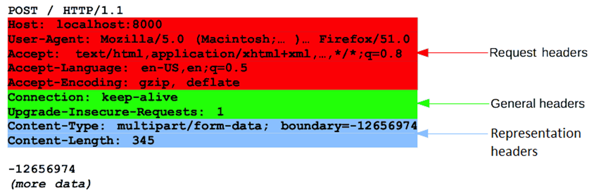

# REST

By the end of the course, students should:

- Understand what is an API
- Know about REST
- Be able to define an API using OpenAPI
- Be capable to query an API
- Design REST APIs

## HTTP

Hypertext Transfer Protocol (HTTP) stands as a foundational element of web communication, playing a pivotal role in facilitating the seamless exchange of information between clients and servers on the World Wide Web.

At its core, HTTP operates within the framework of a request-response model. Clients, typically embodied by web browsers, initiate communication by sending requests to servers, which, in turn, respond with the requested data.

One of the fundamental dynamics of HTTP lies in its adherence to a request-response paradigm.

This approach ensures a structured flow of communication, where clients articulate their needs through requests, and servers meticulously respond with the relevant information.

This standardized interaction forms the backbone of the vast and interconnected landscape of the internet.

Within the anatomy of an HTTP transaction, several integral components play distinctive roles.

The Uniform Resource Identifier (URI) acts as the identifier, guiding the nature of the transaction by pointing to the specific resource under consideration.

HTTP methods, or verbs, such as GET for retrieval, POST for submission dictate the operation to be executed.

Headers, carrying metadata, provide additional contextual information about the request or response.

Meanwhile, the body of the transaction encapsulates data, a particularly relevant element in POST requests where information is transmitted from clients to servers.

HTTP methods, each serving a specific purpose, are the language through which clients communicate with servers. GET retrieves information, POST submits data for processing...

This spectrum of methods encompasses the diverse array of operations conducted in the realm of web communication.

Status codes, serving as informative signposts, categorize responses into informational, success, redirection, client error, or server error.

These codes offer a concise way to communicate the outcome of a request, guiding both clients and servers through the intricacies of web transactions.

A distinctive characteristic of HTTP is its statelessness.

Operating as a stateless protocol means that each client-server interaction stands independently, devoid of the server retaining information about previous requests.

This design choice contributes to the simplicity and scalability of the protocol.

In the realm of security considerations, HTTPS (Hypertext Transfer Protocol Secure) emerges as a significant extension of HTTP.

HTTPS introduces an additional layer of security through SSL/TLS encryption, ensuring secure communication between clients and servers.

This encryption mitigates vulnerabilities associated with unencrypted transmissions, fostering a secure digital environment.

HTTP, evolving with the changing landscape of technology, has witnessed successive iterations, each bringing enhancements in performance, security, and efficiency.

Versions like HTTP/1.0, HTTP/1.1, HTTP/2, and HTTP/3 reflect the ongoing efforts to refine and optimize the protocol.

HTTP/2, for instance, introduced multiplexing, while HTTP/3 leverages QUIC to further enhance performance.

The request message is composed of multiples parts. You can find more on the W3C RFC

- request line
- headers
- empty line
- message body

The Request line will be composed of

- The request method used
- The resource URI
- The protocol
- The version of the protocol

HTTP defines multiples methods or verbs, currently 9 verbs.

We will mostly focus on the 5 which are the most used when building a web applications on the web but you can encounter some other depending on your use case.

HTTP methods, also known as verbs, represent the actions that can be performed on a resource identified by a Uniform Resource Identifier (URI).

Each method has a specific purpose, and they play a crucial role in defining the nature of the interaction between a client (such as a web browser) and a server. Here's an explanation of some common HTTP methods:

### GET

Used to retrieve information from the specified resource.

The GET method is idempotent, meaning multiple identical requests should have the same effect as a single request. It is also safe, indicating that it should not have a significant impact on the resource.

### POST

Used to submit data to be processed to a specified resource.
The POST method is not idempotent, meaning that multiple identical requests may have different effects. It is commonly used for creating new resources or submitting data for processing.

### PUT

Used to update a resource or create it if it does not exist.

Similar to POST, but the PUT method is idempotent, meaning repeated requests have the same effect. It is often employed when updating the content of an existing resource.

### DELETE

Used to request the removal of a resource.

The DELETE method is idempotent, meaning repeated requests have the same effect. It is employed when a client wants to delete a specified resource on the server.

### PATCH

Used to apply partial modifications to a resource.

The PATCH method is not idempotent, meaning multiple identical requests may have different effects. It is employed when the client wants to apply partial modifications to a resource.

### OPTIONS

Used to describe the communication options for the target resource.

The OPTIONS method is often used to request information about the communication options available on the target resource, such as which methods are supported.

### HTTP status codes

HTTP status codes are three-digit numbers returned by a server in response to a client's request made to the server.

They provide information about the status of the request and the outcome of the server's attempt to process it.

Status codes are divided into different classes, each indicating a specific category of response.

### 1xx (Informational):

These are informational status codes indicating that the request was received, continuing process, or waiting for further action.

Example:

- 100 Continue: The server has received the initial part of the request, and the client can continue with the rest.

### 2xx (Successful):

These indicate that the request was successfully received, understood, and accepted.

Examples:

- 200 OK: The request was successful, and the server has returned the requested data.
- 201 Created: The request was successful, and a new resource was created as a result.
- 204 No Content: The server successfully processed the request but is not returning any content.

### 3xx (Redirection):

These indicate that further action is needed to complete the request. The client might need to redirect to a different location or use a different method.

Examples:

- 301 Moved Permanently: The requested resource has been permanently moved to a different location.
- 302 Found (or 307 Temporary Redirect): The requested resource has been temporarily moved to a different location.

### 4xx (Client Error):

These indicate that the client seems to have made an error or the request cannot be fulfilled by the server.

Examples:

- 400 Bad Request: The server could not understand the request due to malformed syntax or invalid request message framing.
- 401 Unauthorized: The client must authenticate itself to get the requested response.
- 403 Forbidden: The client does not have permission to access the requested resource.
- 404 Not Found: The server cannot find the requested resource.

### 5xx (Server Error):

These indicate that the server failed to fulfill a valid request.

Examples:

- 500 Internal Server Error: A generic error message indicating an unexpected condition encountered by the server.
- 502 Bad Gateway: The server, while acting as a gateway or proxy, received an invalid response from an upstream server.
- 503 Service Unavailable: The server is not ready to handle the request. Common causes include temporary overloading or maintenance.

### Lab: Starting with REST

1. HTTP

Searching using Google, can you find some funny HTTP status code ? Is there one that looks like “strange”?

418 - I'm a teapot - an april's fool created in 1998, the Hyper Text Coffee Pot Control Protocol, used in an humorous way to indicate that the server is a teapot and cannot brew coffee.

527 - Railgun Error

We have seen some of the methods or verbs HTTP, can you find the other one and explain their use case ?

- There are 9 methods in total:
  - GET
  - POST
  - PUT
  - DELETE
  - PATCH
  - HEAD: Similar to GET but it does not return the body of the response, only the headers. It is used to check if a resource exists or to get metadata about it.
  - OPTIONS: Used to describe the communication options for the target resource. It is often used in CORS (Cross-Origin Resource Sharing) preflight requests.
  - TRACE: Used to perform a message loop-back test along the path to the target resource. It is mainly used for diagnostic purposes.
  - CONNECT: Used to establish a tunnel to the server identified by the target resource. It is often used for secure connections (HTTPS) through a proxy.

Is there some verbs that can only be used via specific hardware ?

- Yes, the CONNECT method is typically used with proxies to establish a tunnel for secure connections (HTTPS). It is not commonly used in regular client-server interactions.

What would be the status code if:

- Request timeout: 408 Request Timeout
- Bad input: 400 Bad Request
- Unauthorized access: 401 Unauthorized
- User doesnt have the right to access a resource: 403 Forbidden
- Changing website from one URL to another: 301 Moved Permanently or 302 Found (Temporary Redirect)

## REST

REST, or Representational State Transfer, is an architectural style for designing networked applications.

It was introduced by Roy Fielding in his doctoral dissertation titled "Architectural Styles and the Design of Network-based Software Architectures" which he presented in 2000.

Fielding's dissertation played a significant role in shaping the foundation of RESTful architecture.

The dissertation outlined the principles and constraints of RESTful architecture.

Fielding's work was based on his experiences with designing and implementing the HTTP/1.1 and URI standards.

REST has since become a widely adopted architectural style for designing scalable and interoperable web services.

Its principles have influenced the development of web APIs and have become a cornerstone in building distributed systems that prioritize simplicity, scalability, and flexibility.

The REST architectural style defines six guiding constraints.

When these constraints are applied to the system architecture, it gains
desirable non-functional properties, such as performance, scalability, simplicity, modifiability, visibility, portability, and reliability.

A system that complies with some or all of these constraints is loosely referred to as RESTful.

### Client-Server Architecture

The client and server are separate entities that communicate over a network.

The client is responsible for the user interface and user experience, while the server manages resources, processes requests, and contains the business logic.

This separation allows for independent evolution of both client and server components.

### Statelessness

Each request from a client to a server must contain all the information needed to understand and fulfill the request.

The server does not store any client state between requests. This constraint enhances scalability and simplifies the client-server interaction.

### Cacheability

Responses from the server can be explicitly marked as cacheable or non-cacheable.

Cacheable responses improve efficiency by allowing clients to reuse previously fetched representations, reducing the need for repeated requests to the server.

### Uniform Interface

The uniform interface is a central constraint in REST and is further divided into four sub constraints:

- Resource Identification: Resources are identified by URIs (Uniform Resource Identifiers).
- Resource Manipulation through Representations: Resources can be manipulated using standard, stateless operations, and the representation of a resource is separate from the resource itself.
- Self-Descriptive Messages: Each message between client and server contains enough information for the recipient to understand and process the message.
- Hypermedia as the Engine of Application State (HATEOAS): Clients interact with the application entirely through hypermedia provided dynamically by application servers.

### Layered System

A RESTful architecture can be composed of multiple layers, where each layer has a specific set of functionality. 

Each layer is unaware of the layers above and below it, promoting flexibility and simplifying the architecture.

### Code on Demand (optional)

This constraint is optional, and it allows the client to download and execute code, such as JavaScript, from the server. 

While not a mandatory constraint, it can enhance the functionality and flexibility of the client, especially in web applications.

### SOAP 

SOAP (Simple Object Access Protocol) and REST (Representational State Transfer) are distinct approaches to web service design. 

SOAP is a protocol with standardized specifications, using XML as its message format, making it suitable for enterprise-level applications that demand a formal contract between client and server. 

In contrast, REST is an architectural style, often chosen for its flexibility and simplicity, using various formats like JSON or XML. 

RESTful services are inherently stateless, making them lightweight and scalable, ideal for web and mobile applications. 

While SOAP follows a request-response communication style and supports both stateful and stateless interactions, REST adopts a resource-oriented communication style, emphasizing standard HTTP methods for CRUD operations and finding popularity in scenarios prioritizing simplicity and quick development cycles.

The three levels of a REST API, often categorized based on their adherence to REST principles, are described as follows:

- RESTful
- REST
- HATEOAS

### RESTful

APIs at this level are based on URLs and typically utilize the HTTP methods GET and POST. 

This level represents a basic adoption of REST principles, with resources identified by URIs and actions performed through simple HTTP operations.

APIs classified as REST adhere to the full set of rules for all HTTP methods, including GET, POST, PUT, and DELETE. 

This level emphasizes the comprehensive application of REST principles, ensuring uniformity in the design of resources and interactions, such as the proper use of HTTP status codes and adherence to statelessness.

### HATEOAS (Hypermedia As The Engine Of Application State)

At this advanced level, APIs not only follow REST principles but also fully respect the REST architectural style, especially the Uniform Interface Constraint (UIC) with the auto-discoverable aspect. 

HATEOAS allows clients to interact with the application entirely through dynamically provided hypermedia, enabling navigation based on the available actions in the current state.

These levels represent a progression in the extent to which APIs adhere to REST principles, starting from basic adoption (RESTful) to full adherence (REST) and culminating in advanced implementation (HATEOAS) with a focus on hypermedia-driven navigation.

## OPENAPI

OpenAPI, formerly known as Swagger, is an open standard for defining and documenting APIs. 

It provides a standardized way to describe RESTful APIs, allowing both humans and computers to understand the capabilities of a service without access to its source code. 

OpenAPI specifications are written in JSON or YAML and serve as a contract that outlines the structure of requests and responses, available endpoints, and other essential information.

At the heart of OpenAPI lies its Specification (OAS), serving as a comprehensive definition of the API's architecture. 

Developers leverage the Swagger Editor for real-time validation and to create and modify OpenAPI specifications. 

This editor is instrumental in generating the API documentation, which becomes interactive and easily accessible through tools like Swagger UI.

A notable feature of OpenAPI is its support for automatic code generation. 

Developers can employ the specifications to automatically generate client libraries, server stubs, and API documentation, fostering consistency throughout the development lifecycle. 

The interoperability fostered by OpenAPI ensures that APIs adhering to its specifications can seamlessly integrate with diverse tools and platforms.

One of the significant advantages of OpenAPI is its inherent ability to streamline documentation. 

The self-contained nature of the specifications enables API consumers to navigate and comprehend the API's intricacies without having to consult separate documentation. 

Additionally, OpenAPI boasts a vibrant ecosystem of tools supporting various facets of API development, testing, and documentation, enhancing overall productivity.

In essence, OpenAPI emerges as a fundamental element in contemporary API development, providing a standardized, machine-readable format. 

It not only simplifies the design and documentation of APIs but also promotes collaboration and interoperability across a diverse range of tools and platforms, making it a cornerstone in modern API development practices.
