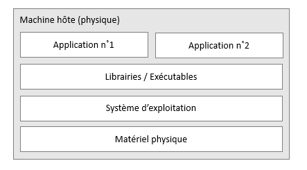
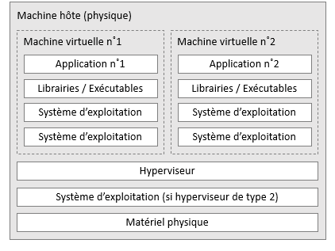
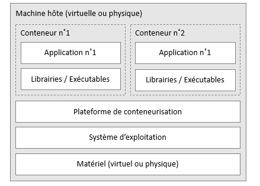
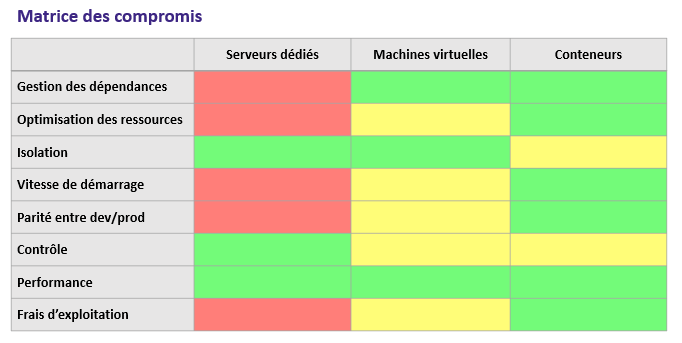
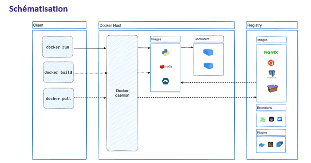

# Docker

## Evolution of application deployment

### Dedicated Servers

- Applications (typically back end or front end) are ubstakked and executed directly on the host machine.
- This is the most natural approach as it is the same as the development environment.
- Direct access to the hardware resources.



#### Advantages

- Isolation: no ressources sharing with other services.
- Control: fiull control ovet the OS, updates, preinstalled application, specific configurations.
- Performance: best performance with direct acces to the hardware, no overhead from virtualization or containerization layers.

#### Disadvantages

- Inneficient: deducated servers are often underutilized, leading to wasted resources and higher costs.
- Complexity: managing multiple dedicated servers can be complex and time-consuming, especially when scaling applications.
- Maintenance: if a dedicated server fails, it can lead to significant downtime for the applications running on it. You have to set up a new server, migrate the applications, and reconfigure everything.

### Virtual Machines (VMs)

- applications are installed and executed inside virtual machines that run on a hypervisor.
- Permit to run multiple OS instances on a single physical server.
- A hypervisor allows creation and management of VMs by abstracting the underlying hardware.
- It can be installed directly on host machine (Type 1 hypervisor) or on top of an existing OS (Type 2 hypervisor).



#### Advantages

- Reproductibility: we can clone or go back to a previous state of a VM easily.
- Dependance management: no conflicts between dependacies
- Efficiency : better resource utilization by running multiple VMs on a single physical server.
- Impact: reduced range of impact if a VM fails
- Fast startup time compared to dedicated servers.

#### Disadvantages

- Overhead: each VM has to execute a full OS, leading to significant resource overhead.
- Redudancy: each VM includes a full OS, leading to redundancy and increased storage requirements.
- Management: a lot of VM are hard to manage and monitor, to update and to secure.

### Containers

- Lightweight software unit that packages an application and its dependencies together.
- Lightweight because containers share the same os kernel.
- They are processus isolated from the host system and other containers.
- Work on a linux kernel



#### Advantages

- Dependance management: no conflicts between dependacies it embarks all the necessary libraries and dependencies.
- Efficiency: the container consumes less resources, real consumption is close to the application alone.
- Startup time: containers start almost instantly compared to VMs.
- replaceability: low startup time, means that if a container fails it can be replaced quickly with minimal downtime.
- Scalability: easy to scale applications by deploying multiple container instances.

#### Disadvantages

- Control: less configuration controle of the host system. (+ requires a linux kernel)
- Isolation: containers share the same OS kernel, which can lead to security concerns if one container is compromised.



## Docker

- Platform centered around containerization.
- Appeared in 2013
- Written in Go
- Open-Source
- Available on Linux, Windows, MacOS

### Docker Containers

- Docker didnt invent containers but made them popular.
- It changed the way we think and deliver applications.
- A deliverable isn't an artefact anymore, but an autonomous and complete environment.

### Docker Container

- Java Ecosystem
- Node.js Ecosystem

### Docker Images

- To define a container, docker usage images.
- An image is executed to create a container.
- A container is a running instance of an image.

We can execute an image multiple times to create multiple containers simultaneously.

This is employed in high-availability and load-balancing scenarios.

### Docker Hub

- Docker Hub is a cloud-based registry service for sharing Docker images.
- Docker is popular because there are a lot of prebuilt images available on Docker Hub. There are more than 100 000 images available.
- This collection is what we call a Docker Registry.

https://hub.docker.com/

- Each container share the same Linux Kernel
- They are not totaly isolated
- Some linux Docker images are available on Docker Hub

- Some Linux distributions images are not strictly equal to the original distribution because of the kernel sharing.
- We find the package manager, applications and tools
- But do not include a full Linux kernel (ex: pilots)
- These images are specifically configured to run in a Docker container environment.

### Docker Architecture

- Docker is based on a client-server architecture.
- The docker client communicates with the docker daemon, which is responsible for building, running, and managing Docker containers.
- This decoupling allows the extern Docker Daemon to run on a remote host, while the Docker client can be used locally.
- The client and the daemon communicate using a REST API over a network socket or a Unix socket.



#### Daemon Docker

- The daemon Docker (dockerd) is the core component of Docker.
- It manages Docker objects such as images, containers, networks, and volumes.
- It listens for Docker API requests and performs the requested actions.

#### Docker Client

- The Docker client (docker) is the primary user interface for Docker.
- docker in terminal
- Running commands like docker run, the client sends these commands to the Docker daemon, which executes them. via dockerd
- The docker client can communicate with multiple Docker daemons.

#### Docker Desktop

- Docker Desktop is a computer based application that provides an easy-to-use interface for managing Docker containers and images on Windows and MacOS.
- It includes the daemon Docker, Docker CLI client, Docker Compose, Kubernetes, and other tools, a GUI.

### Dockerfile

- Dockerfiles are key success elements of Docker
- They define the steps to build a Docker image.
- A docker file is a definition of an image.

### Nomenclature Structure

- The starting image to create a new one
- The containerized application
- App dependencies
- Other files
- Port
- Commands to run

```Dockerfile

FROM node

COPY . .
RUN npm install
EXPOSE 3000
CMD ["node", "app.js"]

```

## DockerFile Instructions

| Instruction |                                                Purpose | Example                                  |
| ----------- | -----------------------------------------------------: | ---------------------------------------- |
| FROM        |                               Base image for the build | FROM node:18-alpine                      |
| RUN         |      Execute a command at build time (non-interactive) | RUN npm ci --production                  |
| CMD         |              Default runtime command for the container | CMD ["node","app.js"]                    |
| ENTRYPOINT  |   Configure a container that will run as an executable | ENTRYPOINT ["docker-entrypoint.sh"]      |
| COPY        |               Copy files from build context into image | COPY . /usr/src/app                      |
| ADD         |              Like COPY, but supports URLs and archives | ADD https://example.com/app.tar.gz /opt/ |
| WORKDIR     |      Set working directory for subsequent instructions | WORKDIR /usr/src/app                     |
| EXPOSE      |            Document the ports the container listens on | EXPOSE 3000                              |
| ENV         |                 Set environment variables in the image | ENV NODE_ENV=production                  |
| USER        |       Set user for subsequent instructions and runtime | USER node                                |
| LABEL       |                                  Add metadata to image | LABEL maintainer="Alice <a@example.com>" |
| ARG         |                                    Build-time variable | ARG VERSION=1.0                          |
| ONBUILD     | Instruction executed when this image is used as a base | ONBUILD RUN npm install                  |
| STOPSIGNAL  |                           Signal to stop the container | STOPSIGNAL SIGTERM                       |
| MAINTAINER  |   (Deprecated) Author of the image — use LABEL instead | MAINTAINER John Doe <john@example.com>   |

### Layers

- In a dockerfile, each instruction creates a new layer in the image.
- Layers are instantenious in a certain point of time and helps the caching mechanism as well as data sharing between images.

## Best Practices

- Chose the correct base image: reduce the image size, the attack surface and improve performance.

```dockerfile

FROM node:20.8-alpine
COPY . .
RUN npm install
CMD ["node", "index.js"]
```

## Docker Compose

### Docker Compose Introduction 

- Docker compose is a tool for defining and executing multi-container Docker applications.
- We use a YAML file to configure the application services.
- With a single command, we can create and start all the services from the configuration.

### Functionalities

- Start, stop, and rebuild services
- View the status of running services
- Stream the log output of services
- Command execution ad-hoc commands in running services

### Usage Steps

1. Define the application environment with a Dockerfile
2. Define the services that compose the application in a YAML file (docker-compose.yml)
3. Execute docker compose up to start and execute the defined services

### Usage Cases

- Application development
- Automated Integration testing
- Demo environments
- Production deployments 

### Environment Isolation

- Compose uses a project name to isolate environments from each other.
- This can be useful to create containers group that communicate together without interfering with other containers.
- The project name is by default the name of the directory where the docker-compose.yml file is located.
- We can override the project name using the -p option when running docker compose commands or with the COMPOSE_PROJECT_NAME environment variable.

### Docker Compose File Structure

```yaml
services:
    web:
        image: my-web-app:latest
        ports:
            - "80:80"
        environment:
            - ENV=production
    db:
        image: postgres:latest
        ports:
            - "5432:5432"
```

```
$ docker run --name web -p 5000:5000 -e ENV=production my-web-app:latest
```
```
$ docker run --name db -p 5432:5432 postgres:latest
```

Each service corresponds to a container that will be deployed when docker compose is executed.

Each service has its own life cycle, environment variables, ports, and volumes and can communicate with other services defined in the same docker-compose.yml file.

```yaml

services:
    web:
    db:
```

- This file declares two services: web and db.
- These services corresponds to two containers that will be created when we run docker compose up.

### Web service

```yaml
    web: 
        image: my-web-app:latest
        ports:
            - "80:80"
        environment:
            - ENV=production
```

- This web service uses the my-web-app:latest image.
- It maps port 80 of the host to port 80 of the container.
- It sets an environment variable ENV with the value production inside the container.

### DB service

```yaml
    db:
        image: postgres:latest
        ports:
            - "5432:5432"
```

- This db service uses the official Postgres image from Docker Hub.
- It maps port 5432 of the host to port 5432 of the container.

### Create and Start containers

To start the defined services, we use the following command:

```
$ docker compose up
```

### Logs

```
$ docker compose logs
$ docker compose logs web
$ docker compose logs -f
$ docker compose logs -n 10 web
```

- f, --folow: Follow log output
- n, --tail: Number of lines to show from the end of the logs for each


### Stop containers

```
$ docker compose down
```

## Practical Guides

### Dependencies between services

- With the depends_on option, we can define dependencies between services.
- Docker compose will start the dependent services before starting the service that depends on them.

```yaml
services:
    web:
        image: my-web-app:latest
        depends_on:
            - db
    db:
        image: postgres:latest
```
- In this example, the web service depends on the db service.
- Docker compose will start the db service before starting the web service.

### Network and communication between services

- You can define custom networks in Docker Compose to control how services communicate with each other.
- Here web and db belong to the same backend network and can communicate using their service names as hostnames.

```yaml
services:
    web:
        image: my-web-app:latest
        networks:
            - backend
    db:
        image: postgres:latest
        networks:
            - backend
networks:
    backend:
```

### Volume usage

- Volumes are used to persist data generated by and used by Docker containers.
- Here db_data is a volume mounted in the db container /var/lib/postgresql/data to persist database data.

```yaml
services:
    db:
        image: postgres:latest
        volumes:
            - db_data:/var/lib/postgresql/data
volumes:
    db_data:
```

### Environment variables and .env file

- You can define environment variables for services in the docker-compose.yml file or use a .env file to set them.

```yaml
services:
    web:
        image: my-web-app:latest
        environment:
            - DATABASE_URL=postgres://user:password@db:5432/mydb
```

- In this example, the web service has an environment variable DATABASE_URL that points to the db service.
- You can also create a .env file in the same directory as the docker-compose.yml file to define environment variables.

### Configuration CPU Memory

- With the deploy option, we can specify limits for CPU resource usage and memory for each service.

```yaml
services:
    web:
        image: my-web-app:latest
        deploy:
            resources:
                limits:
                    cpus: '0.5'
                    memory: 50M
```

- In this example, the web service is limited to using 0.5 CPU and 50MB of memory.

### Configuration files import

- You can use the extends option to import configuration from another docker-compose.yml file.

```yaml
services: 
    web:
        image: my-web-app:latest
    configs:
        - source: app_config
          target: /etc/app/config.json
configs:
    app_config:
        file: ./config.json
```

### Overwriting default 

- Docker compose allows to override default settings

```yaml
services:
    web:
        image: my-web-app:latest
        command: python manage.py runserver 0.0.0.0:8000
```

- The example overrides the default command to executre another specific command when the web conatainer starts.

### Check the "health" of a service

- You can define health checks for services to monitor their status and ensure they are running correctly.

```yaml
services:
    web:
        image: webapp:latest
        healthcheck:
            test: ["CMD", "curl", "-f", "http://localhost/health"]
            interval: 1m30s
            timeout: 10s
            retries: 3
```

- In this example, the web service has a health check that runs a curl command to check the /health endpoint every 1 minute and 30 seconds.

### Secrets

- Docker Compose supports managing sensitive data using secrets.

```yaml
services:
    db:
        image: postgres:latest
        secrets:
            - db_password
secrets:
    db_password:
        file: ./db_password.txt
```

- In this example, the db service uses a secret db_password that is stored in the db_password.txt file.

### Variables in Docker Compose files

- You can use variables in Docker Compose files to make them more flexible and reusable.

```yaml
services: 
    web:
        image: webapp:${TAG}
```

- In this example, the web service uses a variable TAG to specify the image tag.
- You can set the value of the TAG variable in a .env file or as an environment

### Extend a service

- Docker compose allows to extend an existing service to create a new one with additional or modified configurations.

```yaml
services:
    webapp:
        image: webapp:latest
        ports:
            - "80:80"
        webapp_dev:
            extends: webapp
            build:
                context: .
                dockerfile: Dockerfile.dev
            volumes:
                - .:/app
```

- Here the webapp dev shares the same configuration as webapp but adds a build context and a volume for development purposes.

### Restart automatically a container 

- You can configure services to restart automatically under certain conditions using the restart option.

```yaml
services:
    web: 
        image: my-web-app:latest
        restart: always
        command: sh -c "python manage.py runserver && nginx -g 'daemon off;'"
```

- In this example, the web service is configured to always restart if it stops or crashes.


```yaml

services: 
    web:
        image: my-web-app:latest
        ports: 
            - "8080:8080"
        deploy:
            replicas: 3
            resources:
                limits:
                    cpus: '0.5'
                    memory: 50M
        depends_on:
            - db
        command: docker compose rm -fs replica web  
    db:
        image: postgres:latest
        resources:
            limits:
                cpus: '0.75'
                memory: 100M
``` 

## Storage in Docker

- Files created in a container are stored in a writable container layer. They disappear when the container is removed.
- This modifiable layer is linked to the host machine, making it difficult to share data.
- Writing on this layer is permitted by a storage driver. Which is slow compared to direct writing on the host filesystem.

### Options To Store Data

- Docker has two options to store data outside the container's writable layer:
  - Volumes
  - Bind mounts

- Files are stocked in the volatile memory of the host machine, this mechanism varies depending on the OS:
    Linux: tmpfs
    Windows: named pipes

- Independently of the mount type, data appear the same way inside the container.
- To choose correctly between volumes, bind mounts and tmpfs mount, we must ask ourselves where the data are stored on the docker host. 

### Volumes

- They are stocked in a system zone managed by Docker (Linux: /var/lib/docker/volumes/).
- Processus other than docker are not supposed to modify these files.
- In most cases volumes are the best way to mount data in a container.

### Bind mounts

- They can be stored anywhere on the host system.
- The processus other than docker can read and write files in the bind mount.

### Tmpfs mounts

- They are stored in the host system's memory only and are never written to the host system's filesystem.


## Volumes 

### Advantages

- Volumes are easier to save, back up and migrate than bind mounts.
- They are much more efficient
- It's possible to manage volumes using docker CLI commands and the Docker API.
- Volumes work on both Linux and Windows containers.
- Volumes can be shared and reused among multiple containers.
- Drivers volume permits to store volumes on remote hosts (cloud, encryption, etc.)

### Creating a volume

```bash
$ docker volume create my_volume
my_volume
```

### Listing volumes

```bash
$ docker volume ls

DRIVER    VOLUME NAME
local     my_volume
```

### Obtain information about a volume

```bash
$ docker volume inspect my_volume

[
    {
        "CreatedAt": "2024-06-10T12:34:56Z",
        "Driver": "local",
        "Labels": {},
        "Mountpoint": "/var/lib/docker/volumes/my_volume/_data",
        "Name": "my_volume",
        "Options": {},
        "Scope": "local"
    }
]

```

### Removing a volume

```bash
$ docker volume rm my_volume
my_volume
```

### Using a volume in a container

if a container is started with a volume that doesn't already exist, Docker creates it automatically.

```bash
docker run -d \
    --name my_container \
    --mount source=my_volume,target=/app/data \
    nginx:latest
```

```bash
docker run -d \
    --name my_container \
    -v my_volume:/app/data \
    nginx:latest
```

### Verify the volume is mounted

```bash
$ docker inspect devtest
[
    {
        ...
        "Mounts": [
            {
                "Type": "volume",
                "Name": "my_volume",
                "Source": "/var/lib/docker/volumes/my_volume/_data",
                "Destination": "/app/data",
                "Driver": "local",
                "Mode": "",
                "RW": true,
                "Propagation": ""
            }
        ],
        ...
    }
]
```

### Delete the container and the volume

```bash
$ docker cointainer stop devtest
$ docker container rm devtest
$ docker volume rm my_volume
```

## Network in Docker

### Docker Networking Overview

- A container has no information on the type of network it is connected to.
- It sees only a network interface with an IP address, a subnet mask and a gateway.

### Ports

- By default the container doesnt expose any port to the host machine.

- To expose a port, we use the -p option when starting a container.

- This option creates a firewall rule on host that maps the container's port to a port on the host.

- iptables is the system default way of manipulating network tables in the Linux kernel.

### Port Security

- By default, port are not secured when you publish a port, they are acesible by the host machine and other machines on the network.

- However, if you had the ip localhost adress as an publishing address, only the host machine could access the port.

- This is a security measure to limit access to the container's services.

### Internal Container Communication

- If you want to make a container accessible to other containers, it is not necessary to publish its ports to the host machine.

- The communication is active when connecting containers to the same network, generally a bridge network.

- This approche facilitates the cloising and the security of communication between containers withouth exposing ports to the host machine.

### IP Address and DNS

- By default, a container has an IP addres for each docker networks it is connected to.
- The IP address is assigned by a subnet associated with the network.
- IP addresses and dynamic subnet management are handled by the docker daemon. Each network has a subnet mask and a gateway.
- By using docker network connect, you can specify the IP address of the cointainer in the network by using the --ip option or --ip6 option for IPv6 addresses.

- The DNS of a container in Docker is the ID of the container. You can remplace it with the --hostname option when starting the container.
- When connecting to  a network, by using network connect, you can use the --alias option to specify additional DNS names for the container in that network.

#### Example

```bash
docker network create my_network
docker network connect my_network my_container
docker network connect --ip 172.18.0.22 my_network my_container
```

### DNS

- By default, containers herit the DNS settings of the host machine. as defined in the /etc/resolv.conf file.
- THe containers that connect to a user-defined bridge network get a built-in DNS server that resolves container names to IP addresses.
- You can specify custom DNS servers for a container using the --dns option when starting the container.

The available options to configure DNS are:
- --dns: Specify custom DNS servers
- --dns-search: Specify DNS search domains
- --dns-opt: Specify DNS options

#### Example

```bash
docker run --dns 8.8.8.8 -d -p 8080:80 my-container
docker run --dns-search example.com -d -p 8080:80 my-container
docker run --dns-opt ndots:5 -d -p 8080:80 my-container
```

## Network Drivers

- The subsystem of 'mise en reseau' is modular in Docker.

- It uses drivers

- Multiple drivers exist by default and gives fonctionalities adapted to different use cases.

### Bridge Network

- The driver bridge is the default network driver.
- It is generaly used when the application runs in standalone containers that need to communicate.
- This type of network is useful to isolate applications running on the same host.

### Host Network

- The host network driver removes the network isolation between the container and the Docker host.
- It allows the container to use the host's networking directly.
- This driver is useful when the container needs to have high network performance and low latency and access resources on the host machine.

### Overlay Network

- This driver links multiple Docker daemons together and enables swarm services to communicate with each other.
- It doesnt need rooting on the host machine.
- This type of network is useful in multi host Docker Swarm setups.

### IPvlan Network

- The driver IPVlan allows user to control complety an IP address assigned to a container.
- Works for ipv4 and ipv6
- Useful when you need a full access over VLAN configurations and network segmentation.

### Macvlan Network

- The Macvlan driver allows you to assign a MAC address to a container, making it appear as a physical device on the network.
- Useful when you need to integrate containers into an existing network infrastructure that relies on MAC addresses for identification and access control.

```bash
docker network create --driver bridge my_bridge_network
docker network create --driver host my_host_network
docker network create --driver overlay my_overlay_network
docker network create --driver ipvlan my_ipvlan_network
docker network create --driver macvlan my_macvlan_network
```
## Docker Swarm 

- Docker Swarm is a native clustering and orchestration tool for Docker containers.
- It allows to manage, deploy and maintain applications composed of multiple containers across a cluster of Docker hosts.
- It facilitates scaling, load balancing and high availability of containerized applications.

### Key Features

- Declarative service model
- Wanted state reconciliation
- Scaling
- Service discovery
- Load balancing
- Rolling updates

### Docker Swarm Moded

- Docker Swarm is integrated into Docker
- Docker Swarm refers to the mode that enables swarm capabilities in Docker Engine.

- Docker swarm is in reality multiple machines connected together in a cluster.
- Each machine is a node
- The all makes a cluster
- Nodes can be managers or workers

### Manager Nodes

- Manager nodes are responsible for managing the swarm cluster.
- They tkae the important decisions, such as orchestrating load balancing, maintaining the desired state of the cluster and manage the DB
- It is also responsible for planning and scheduling services on worker nodes.
- It is recommended to have an odd number of manager nodes to ensure high availability and fault tolerance. And to avoid split-brain scenarios.

### Worker Nodes

- Worker nodes execute the tasks assigned by manager nodes.
- They have no authority when it comes to taking decisions.
- Each worker node communicates with manager nodes to receive instructions and report its status.

### Promoting a Worker to a Manager

- It is possible to promote a worker noed to a manager node and vice versa. This facilitates the redimensioning of the swarm cluster based on the needs.
- If we have to many manager nodes, it can make the cluster instable, the more managers the difficult the consensus.

### Wanted State

- Each service has a definition of service considered aas the wanted state.

Exemple: 3 web servers, 2 workers, 1 db

- Swarm will create the service and monitor it to ensure that the actual state matches the wanted state.
- If a container fails, the manager will send a task to recreate a new container to maintain the desired state.

### Types of Services

- Replicated sercices: distributes a specified number of tasks across the swarm.
- Global services: swarm executes one task on each available node in the swarm.

### Service Discovery

- The warms services can discover each other automatically
- When a service is created, Docker swarm assigns a DNS that is available to other services in the swarm.
- This allows the containers to communicate to each other by using the service name rather than IP addresses.

### Load Balancing

- Docker swarm uses load balancing by entry (ingress load balancing) to distribute incoming requests across the available service replicas.
- It can automatically attribute a published port to the servcice from 30000 to 32767.
- You can specify the port
- This fonctionnality distributes automatically request from the client to sercices that are the most appropriate to handle them.

## Docker Compose on Swarm

- You can use Docker Compose files to deploy applications on a Docker Swarm cluster.
- This means that you can define environments and deploy to scale using the same Compose file format.
- This allows a clear definition, reusable and versioned of services, falicitating the deployment and management of applications in a swarm environment.

### Deploying Key

- Use the deploy in the file to specify options specific to swarm mode.
- The deployment mode can have two values: replicated or global.

```yaml
version: '3.8'
services:
    worker:
        image: dockersamples/worker:latest
        deploy:
            mode: replicated
            replicas: 5
```

### Discovery Mode

- Docker Swarm allows a discovery mode method for external clients to connect to the cluster
- VIP: Use a virtual IP as the frontend. Requests are then redirected by Docker to a node. It is the default mode.
- DNSRR: Each service task has its own IP address. The client is responsible for load balancing between the different IP addresses.

### Deploy Constraints

- Deploy Constraints allows to control on which nodes services must work
- There are multiple types of constraints:
  - Node: Allows to target specific nodes based on ID, hostname, role, labels assigned to the node.
  - Engine: allows to target nodes based on labels assigned to the Docker Engine. For instance, you can specify the OS you want the service to run on.
  - Replicas: works only with replicated mode
  - Only need to specify the amount of replicas you want to run.

### Resources limits and allocation

- You can configure limites and reservations for CPU and memory resources for each service in the swarm.
- CPU: quota, ensemble, actionnaires
- Memory: limit, swap

### Restarting policies

- Condition: none, in case of failure, any
- Delay: time to wait before restarting a container
- Max attempts: number of attempts to restart a container before considering it as failed
- Window: time frame to evaluate the restart attempts