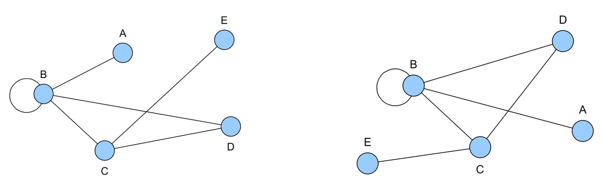
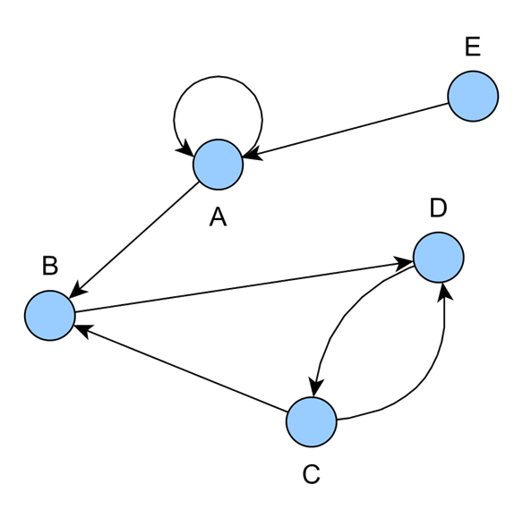
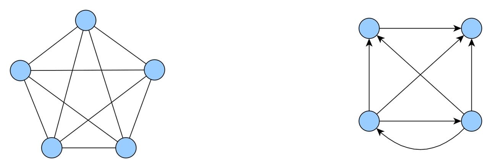
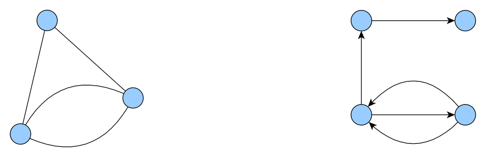
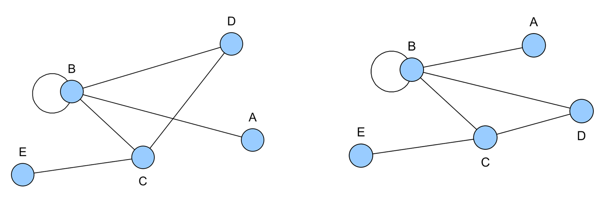

# Graphs Definition & Representation

## Definition Representation Saggitales

### Non-oriented Graph

- A non-oriented graph G=(V,E) is the data:
  - V: a set of vertices (or nodes)
  - E: a set of edges (or links) that connect pairs of vertices

#### Saggitale Representation

- A graph represented as a schematic where the vertices are modelized by disks and the edges by segments connecting these disks.
- These representations are not unique.

#### Example

To define a non oriented graph, we can use the following notations:

V = {A, B, C, D, E}

- We can then give the edges of the graph:

E = {{𝐴,𝐵},{𝐵},{𝐵,𝐶},{𝐵,𝐷},{𝐶,𝐷},{𝐸,𝐶}}

Here are two different saggital representations of the same graph:

#### Complementary Definitions

- Two vertices are said to be adjacent if they are connected by an edge.
- The order of a graph is the number of vertices it contains.
- A loop is an edge that connects a vertex to itself.
- A graph that has no loops is called a simple graph.

### Oriented Graph

- An oriented graph G=(V,E) is the data:
  - V: a set of vertices (or nodes)
  - E: a set of directed edges (or arcs) that connect ordered pairs of vertices and are couple of elements of V.

#### Saggitale Representation

- Graph represented as a schematic, modelized by disks for vertices and arrows for directed edges.
- These representations are not unique.

To define an oriented graph, we can use the following notations:

V = {A, B, C, D, E}

- We can then give the directed vertex of the graph:

𝑉={(𝐴,𝐴),(𝐴,𝐵),(𝐵,𝐷),(𝐶,𝐵),(𝐶,𝐷),(𝐷,𝐶),(𝐸,𝐴)}

#### Complementary Definitions

- We define the loop motion for simple graphs and order as for non-oriented graphs.
- The presence of arcs (D,C) we say that C is a successor of D and D is a predecessor of C.
- We say that D is the origin of the arc (D,C) and C is the end (extremity) of the arc (D,C).

- The graph G has an arc (B,D) so B is a predecessor of D and D is a successor of B.
- The edge E is the origin of the arc (E,A) and A is the end of the arc (E,A).
- The G graph isn't a simple graph because it has a loop (A,A).

### Complete Graph

- A non oriented graph is complete if it is simple and if both edges are linked by a vertice.
- An oriented graph is complete if it is simple and if all paires of edges {X,Y} are linked to one of the two arcs (X,Y) or (Y,X).

- Here are:
  - A complete non-oriented graph of order 5
  - A complete oriented graph of order 4

#### Complete Graphs: Number of vertices

- A complete non-oriented graph of order n has 𝑛(𝑛−1)/2 edges.
- The proof of result is immediate: each edge is adjacent to n-1 other vertices, which gives n(n-1) vertices.
- But each edge is counted twice, so we divide by 2 to get the final result.

### Multigraph

- Based on previous definitions, between two edges of a graph, we have at least one vertice is the case of a non-oriented graph, and at most one arc in the case of an oriented graph.
- If we authorize the fact to have multiple edges or multiple arc between two vertices, we obtain a multigraph.

#### Example

- A non-oriented multigraph with 3 vertices and 4 edges
- An oriented multigraph with 4 vertices, 3 edges and 2 arcs

### Subgraph

- G = {V,E} is an oriented graph, or not
- A G' = {V',E'} is a subgraph of G if:
  - V' ⊆ V
  - E' ⊆ E
- A subgraph covering G is a subgraph such as G' = (V,E')
- A subgraph induce from G is a subgraph such as G' = (V', E') where the edges or arcs all belong to G with their extremities in V'.

> **Note:**  
> The symbol `⊆` means "is a subset of" in set theory.  
> If `A ⊆ B`, every element of set `A` is also an element of set `B`.  
> In the context above, `V' ⊆ V` means all vertices in `V'` are also in `V`.  
> This is important for defining subgraphs, since a subgraph's vertices and edges must be subsets of the original graph's vertices and edges.

/!\ a revoir jai pas tout compris

### Planar Graph

- As G an oriented graph, or not
- G is planar if its saggital representation can be drawn with its edges or arcs not intersecting except at their extremities.

- The left graph is planar because it admits as a sagittal representation to the right. 

End: slide 25 cya tomorrow