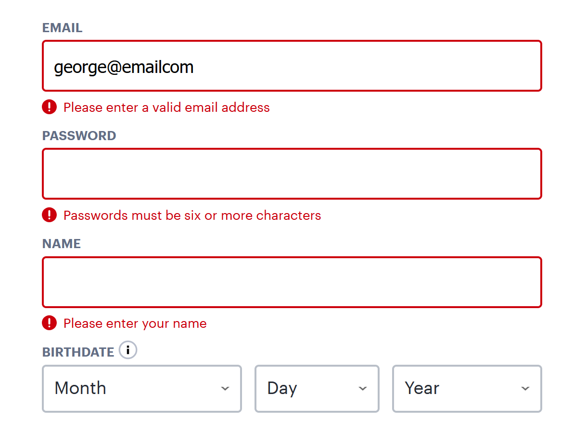
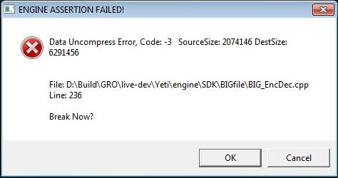
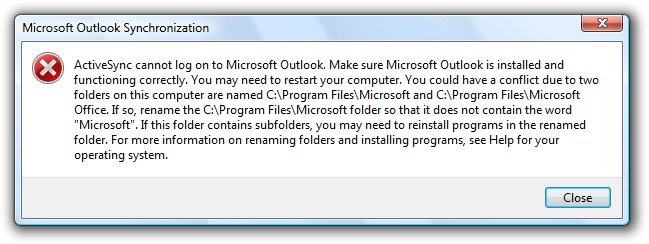
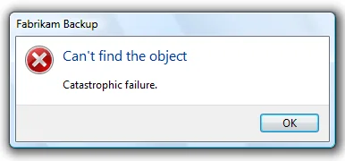
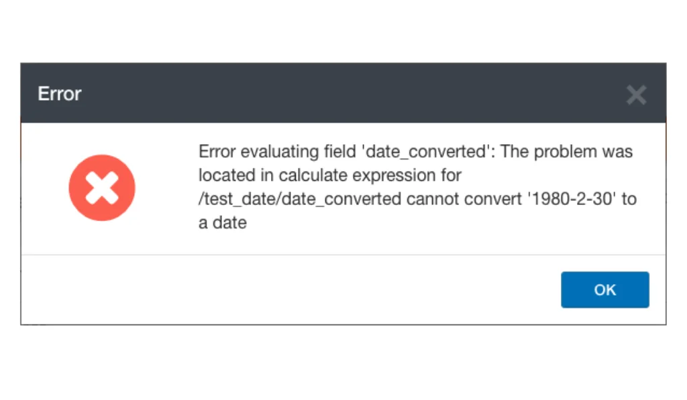
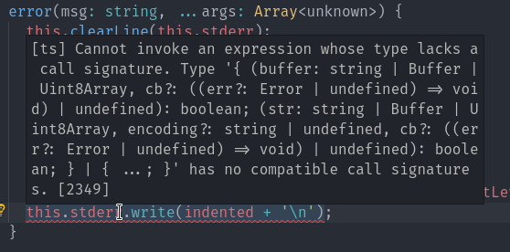

# Error Messages

## What's a good error message?

1. Describe the problem and what went wrong as precisely as you can.
2. todo

## What's a bad error message?

- generic
- not-well described
- lack of clarity
- informal
- bad grammar

### 5 Good Error Messages

### 5 Bad Error Messages

