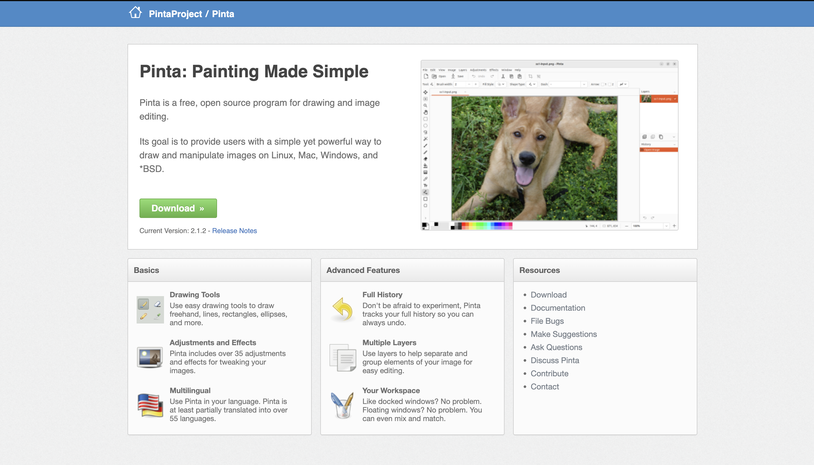
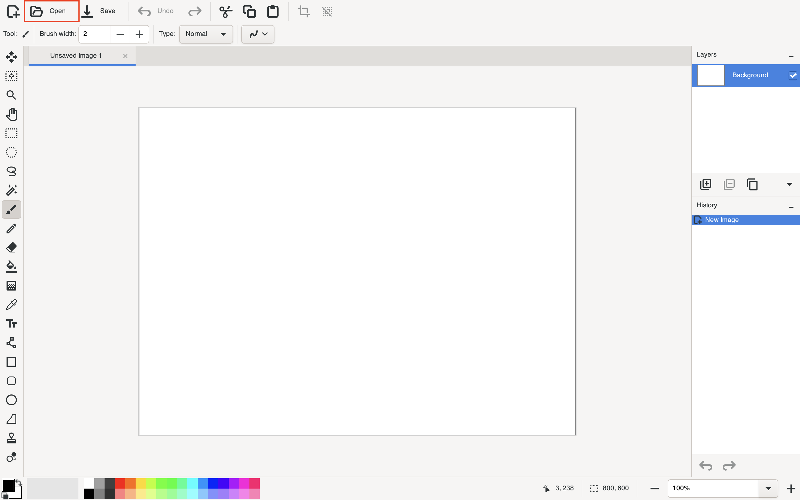
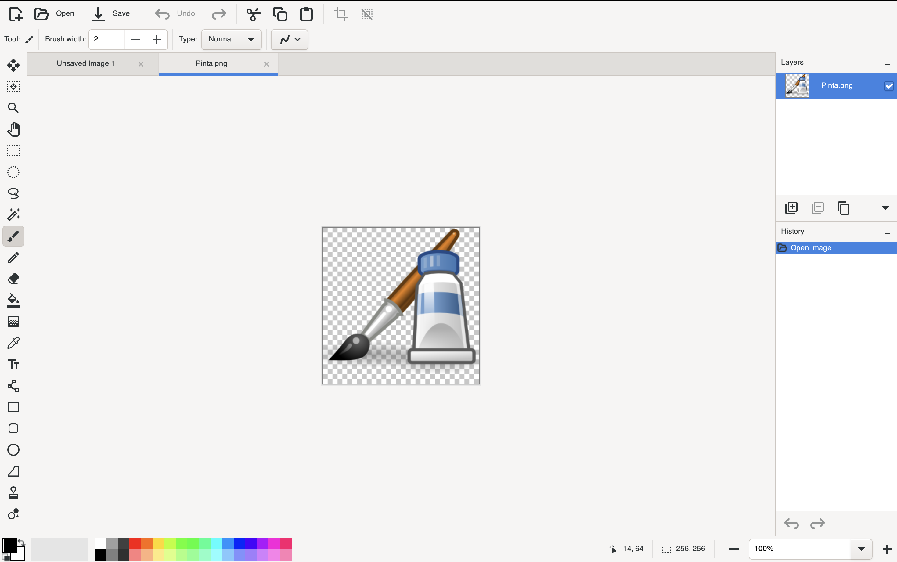
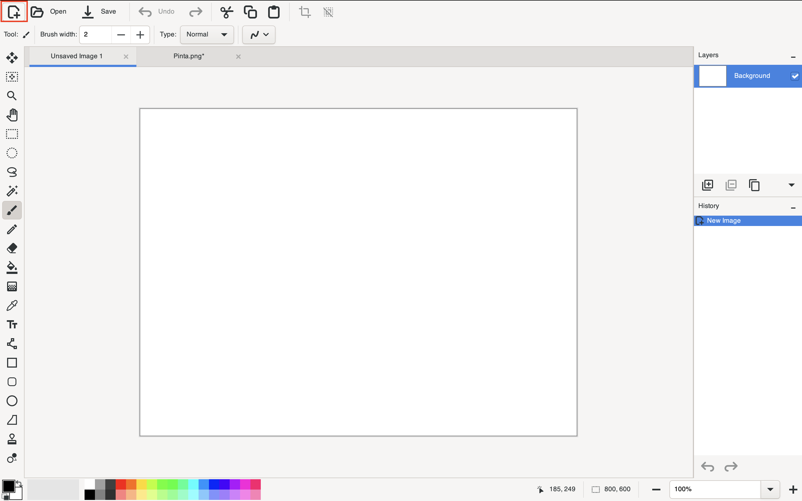
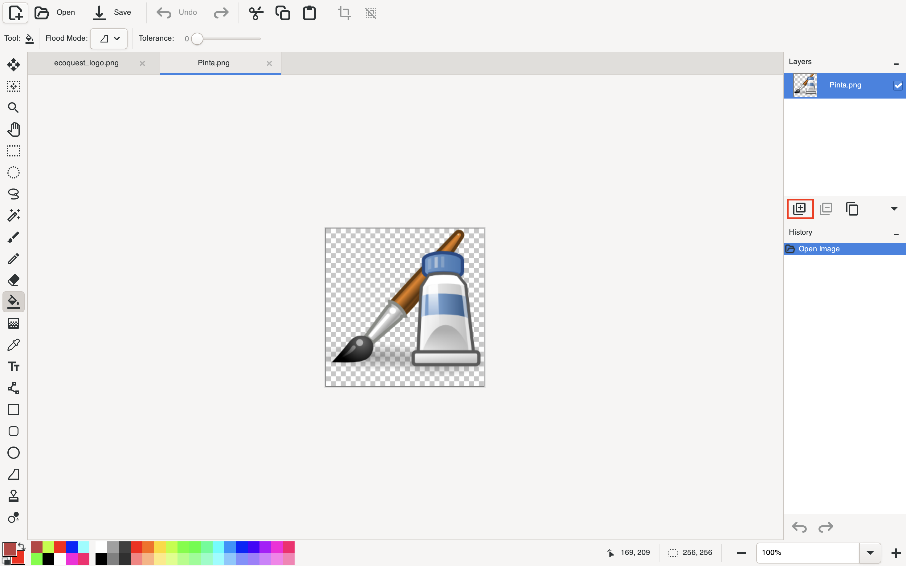
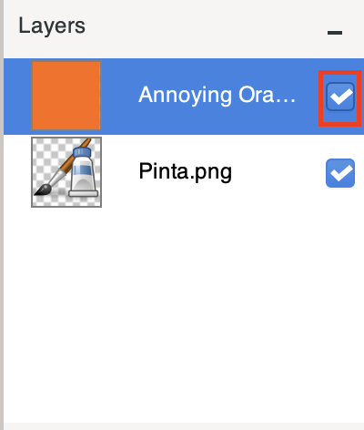

# Pinta User Manual

Table Of Content

- [Pinta User Manual](#pinta-user-manual)
  - [What is Pinta?](#what-is-pinta)
  - [Downloading Pinta](#downloading-pinta)
  - [How to Import a Picture in Pinta](#how-to-import-a-picture-in-pinta)
    - [Prerequisite](#prerequisite)
    - [Import a Picture](#import-a-picture)
  - [Creating a New Image](#creating-a-new-image)
    - [Prerequisite](#prerequisite-1)
    - [Create a New Image](#create-a-new-image)
  - [Understanding the Modifying Tools](#understanding-the-modifying-tools)
  - [Modify Tools' Color](#modify-tools-color)
    - [Prerequisite](#prerequisite-2)
    - [Changing the Color of a Tool](#changing-the-color-of-a-tool)
  - [Set a Primary / Secondary Color](#set-a-primary--secondary-color)
    - [Setting Colors](#setting-colors)
    - [Setting a Custom Color](#setting-a-custom-color)
  - [Playing with Layers](#playing-with-layers)
    - [Prerequisite](#prerequisite-3)
    - [Managing Layers](#managing-layers)
    - [Renaming a Layer](#renaming-a-layer)
    - [Reorganizing Layers](#reorganizing-layers)
    - [Layer Visibility](#layer-visibility)
  - [Saving an Image](#saving-an-image)
    - [Steps to Save Your Image](#steps-to-save-your-image)
    - [Important Notes](#important-notes)
  - [Final Words](#final-words)

## What is Pinta?

Pinta is a free, open-source program for drawing and image editing.  

Its goal is to provide users with a simple yet powerful way to draw and manipulate images on Linux, Mac, and Windows.

The software gives you access to both basic and advanced tools to modify images as desired.  

This document will help you get started with Pinta and understand its key features.

> **Note**  
> Ensure your computer is powered on and connected to the internet before proceeding.

## Downloading Pinta

If you haven't already installed Pinta, follow these steps:

1. Open your web browser.  
2. Enter the following URL in the address bar:  
   `https://www.pinta-project.com`

   You should see the following webpage:  
   

3. Click on the **Download** button.  
4. Select **Download** for your operating system.  
   

5. Run the downloaded file by double-clicking it.

> **Note**  
> If you can't locate the downloaded file, check your Downloads folder.

Upon successful installation, launching Pinta should display the following window:  

| **If Pinta** | **Do This**                                   |
|--------------|-----------------------------------------------|
| Opens        | You have successfully installed Pinta!       |
| Doesn't Open | Repeat the steps above to troubleshoot.      |

---

## How to Import a Picture in Pinta

### Prerequisite

- Ensure Pinta is downloaded and running.
- Have a picture ready for modification.

### Import a Picture

Follow these steps to import a picture into Pinta:

1. Click **Open** in the top-left corner of the screen.  
   

2. Browse and select the image file from your computer.  
   

3. Click **Open**.  

Your image will now appear in the Pinta workspace:  

---

## Creating a New Image

### Prerequisite

- Ensure Pinta is downloaded and running.

### Create a New Image

Follow these steps to create a new image in Pinta:

1. Click the **New Image** icon in the top-left corner.  
   

2. A dialog box will appear:  
   

3. Select your desired settings, such as width, height, and resolution.  
4. Click **OK**.

Your new image canvas will now be ready.

> **Note**  
> Refer to this table to understand more about the settings.

| **Setting**     | **Purpose**                                                                 |
|------------------|-----------------------------------------------------------------------------|
| **Preset**       | Clipboard: Uses dimensions of a copied image. Custom: Set your own values. |
| **Width**        | Width of the image in pixels.                                              |
| **Height**       | Height of the image in pixels.                                             |
| **Orientation**  | Choose Portrait or Landscape orientation.                                  |
| **Background**   | Set the background to white or transparent.  |

---

## Understanding the Modifying Tools

Pinta offers a range of tools located on the left-hand side of the screen.  
This section explains the purpose of each tool, its image, functionality, and associated shortcut key.

| **Tool**               | **Image**              | **Functionality**                                   | **Shortcut Key** |
|-------------------------|------------------------|---------------------------------------------------|------------------|
| **Move Selected Pixels** |  | Move, scale, and rotate the selected content.      | **M**            |
| **Zoom**               |  | Zoom in and out to adjust the view of your image. | **Z**            |
| **Rectangle Select**    |  | Select a rectangular-shaped region.               | **S**            |
| **Ellipse Select**      |  | Select an elliptical-shaped region.               | **S**            |

Experiment with these tools to familiarize yourself with their capabilities.

> **Note**  
> This table does not yet include all tools. You can hover over any tool in the software to see its description and shortcut key.

---

## Modify Tools' Color

For certain tools, such as the Pencil or Fill tool, changing the color is essential for customization.

### Prerequisite

- Ensure Pinta is downloaded and running.

### Changing the Color of a Tool

To change the color of a tool, follow these steps:

1. Select the tool you want to use (e.g., Pencil, Fill).  
2. Find the **Color Palette** at the bottom-left corner of the screen.  
     
3. Click on the color you wish to use from the palette.  

After selecting a color, your chosen color will appear in the **Recent Colors** section on the left side of the palette.  
This feature makes it easier to reuse previously selected colors.

---

## Set a Primary / Secondary Color

Setting a primary and secondary color is a useful feature, allowing you to switch quickly between two colors while working.

### Setting Colors

To assign colors, follow these instructions:
 

| **Action**      | **How to Do It**                           |
|------------------|--------------------------------------------|
| **Set Primary**  | Left-click on the desired color in the palette. |
| **Set Secondary**| Right-click on the desired color in the palette. |

Once set, the primary color will be used for tools like the Pencil or Fill by default, while the secondary color can be accessed easily for alternate actions or tools.

### Setting a Custom Color

To create and set custom colors in Pinta, follow these steps:

1. Click on the **Custom Color Icon** located next to the personal color palette.  
     

   > **Note**  
   > The left square sets a **Primary Color**, and the right square sets a **Secondary Color**.

2. A color selection dialog box will appear:  

     

3. Click on the black cross (+) to add a new custom color.  

   This will open the custom color editor:  
     

4. Use the sliders to adjust the **Hue**, **Saturation**, and **Transparency** to your desired color.  
   - You can also input a **Hexadecimal Color Code** directly for precise color selection.

5. Once satisfied with your selection, click **Select** to confirm.

Your custom color will now appear in the palette, set as either the primary or secondary color based on your initial selection.

---

## Playing with Layers

This section introduces you to working with layers in Pinta, including what layers are and how to manage them effectively. Layers allow you to stack and organize different elements of your image, making editing more flexible and non-destructive.

### Prerequisite

- Open the image you wish to modify.

### Managing Layers

The table below outlines the steps for creating, deleting, and duplicating layers:

| **Action**           | **Steps**                                                                                     | **Icon**                       |
|-----------------------|-----------------------------------------------------------------------------------------------|--------------------------------|
| **Create a New Layer** | 1. Click the **Add New Layer** button.                                                      |  |
| **Delete a Layer**    | 1. Select the layer you wish to delete.                                                      |  |
|                       | 2. Click the **Delete Layer** button.                                                        |  |
| **Duplicate a Layer** | 1. Select the layer you want to duplicate.                                                   |                                |
|                       | 2. Right-click the layer and choose **Duplicate Layer** from the context menu, or use the toolbar button if available. |  |

> **Note**  
> A selected layer is outlined in blue for easy identification.

---

### Renaming a Layer

To rename a layer, follow these steps:

1. Double-click the layer you wish to rename.  

   A popup will appear:  
     

2. Enter the new name for the layer in the **Name** field.  
3. Click **OK** to confirm.  

Your layer is now renamed and updated in the layer list.

---

### Reorganizing Layers

To change the order of layers in your image:

1. Select the layer you want to move.  
2. Use the **Move Layer** drop-down menu:  
     

   Available options are:  
   - **Move Up**: Moves the selected layer one position higher.  
   - **Move Down**: Moves the selected layer one position lower.  

     

Layers will be reorganized in the list and reflected in the image stack.

---

### Layer Visibility

You can toggle a layer's visibility on and off for practical purposes, such as focusing on specific elements during editing.

To toggle visibility, follow these steps:

1. Identify the **Layers Panel** on the right side of the screen.  
2. Click the checkbox next to the layer you want to toggle visibility for.  

   - If the checkbox is checked, the layer will be **visible**.  
   - If the checkbox is unchecked, the layer will be **hidden**.  

   

---

## Saving an Image

Saving your image ensures that your progress and modifications are not lost. Follow these instructions to save your work effectively:

### Steps to Save Your Image

1. Click on the **Save** button located at the top-left corner of the screen or simultaneously press command + S / Windows + S.  
   

   - This will overwrite your current file with the modified version.

### Important Notes

- **Overwriting Warning**:  
   Saving directly will replace the original file with your modified version. If you want to preserve the original, make a copy of the file before editing.  

- **File Location**:  
   The saved file will be stored in the same location as the original imported file, unless specified otherwise.  

By saving regularly, you can ensure your work is secure and avoid accidental data loss.

---

## Final Words

This document provides an overview of Pinta's core functionalities to help you get started effectively.

If you experience any bugs or issues while using Pinta, you can report them on our GitHub issue tracker:

<https://github.com/PintaProject/Pinta/issues>

For additional documentation and tutorials, visit our How-To Guides:

<https://www.pinta-project.com/howto/>

Our team is here to assist with troubleshooting and answer any questions you may have. Your feedback is invaluable in helping us enhance Pinta for all users.
