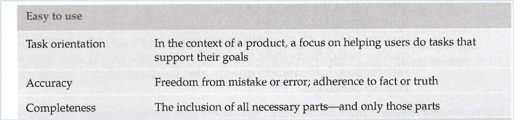
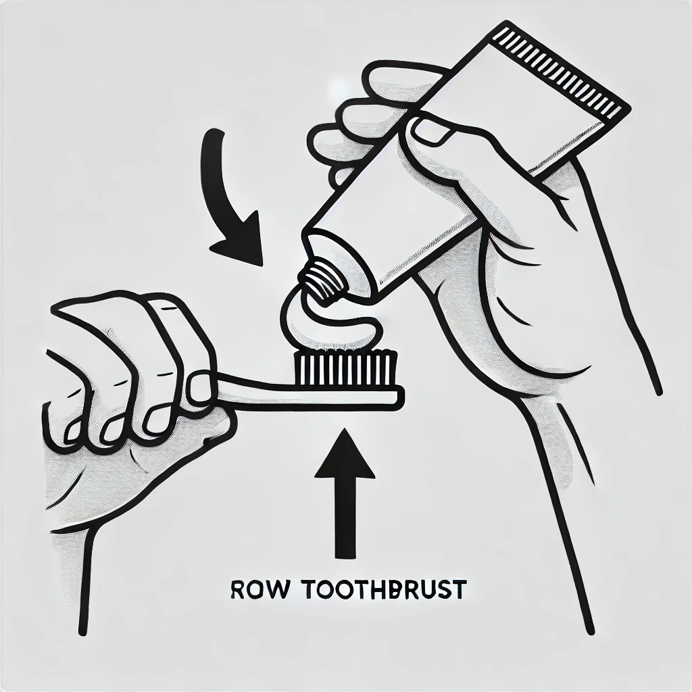

# Technical Writing

- [Technical Writing](#technical-writing)
  - [Review of previous session](#review-of-previous-session)
    - [5 C's](#5-cs)
    - [Rewrite](#rewrite)
    - [Rewritten](#rewritten)
    - [Rewriter two](#rewriter-two)
      - [How to record a conference](#how-to-record-a-conference)
  - [The technical writer's role today](#the-technical-writers-role-today)
  - [Redefining Quality Technical Information](#redefining-quality-technical-information)
  - [Task Orientation](#task-orientation)
  - [Procedures and Instructions](#procedures-and-instructions)
  - [Complex Procedures](#complex-procedures)
  - [Multiple Input Methods and Branching](#multiple-input-methods-and-branching)
  - [Lists in Technical Writing](#lists-in-technical-writing)
  - [Parallel Structure in Lists](#parallel-structure-in-lists)
  - [Starting Steps with Imperative Verbs](#starting-steps-with-imperative-verbs)
  - [Exercise](#exercise)
    - [Today's TO DO LIST](#todays-to-do-list)
      - [At Work](#at-work)
      - [After Work](#after-work)
    - [Change Carambola Setting](#change-carambola-setting)
    - [Help Jane and David](#help-jane-and-david)
    - [How to get toothpaste on a toothbrush](#how-to-get-toothpaste-on-a-toothbrush)
    - [Information](#information)
    - [How to put toothpaste on the toothbrush](#how-to-put-toothpaste-on-the-toothbrush)

## Review of previous session

Tables make complex information easier to understand and digest, without tables, data may appear cluttered or disorganized, making it more difficult to read for readers to grasp the content.

### 5 C's

Clarity
Concise
Consistent
Complete
Correct

### Rewrite

Using the infoinstaller tool

Infoinstaller is a tool that you use to install InfoProduct. Using the InfoInstaller tool to install InfoProduct takes about 20 minutes.

To use the infoinstaller tool:

1. Open the infoinstaller tool by entering infoinst at the command line
2. complete the infoinstaller window by specifying the installation parameters, when you click OK, infoinstaller installs infoproduct

### Rewritten

**InfoProduct Installation Steps**

To install InfoProduct, you have to use the InfoInstaller tool.

1. Enter the `infoinst` command in the **command line**.
2. Specify the **parameters**.
3. Click on **Apply**
4. Click on **OK**.

The installation should take about 20 minutes.

### Rewriter two

#### How to record a conference

**Note:** If you have already done this in the past, you don't have to redo it.

1. Start the online meeting
2. Turn on your computer's speakers
3. Click **Record**
4. Enter the phone conference number pass-code and the pass-code in the dialog that opens
5. Wait for a beeping sound then turn  your speakers off
6. Click **Start recording**
7. Start sharing your screen

*Note: You can assign presentation control to participants using either **Make Presenter** or **Stop Sharing**.*

To retrieve the recording once the meeting has ended:

1. Connect to the **InfoCompany portal**
2. Click **Recordings**

## The technical writer's role today

Technical writer's role is evolving as quickly as the products for which we write information.

When you develop quality technical information, you are responsible for:

- **Evolution with Agile Development**: With agile methodologies, technical writers are integrated into development processes earlier than before. Responsibilities often include collaborating on product design and user interfaces.
- **User Advocacy**: Writers act as advocates for users by creating intuitive, embedded assistance directly in user interfaces (UIs), labels, and error messages to help users accomplish their goals.
- **Ownership of Content**: Technical writers ensure clarity and usefulness in all content, from UI labels to full documentation topics.

## Redefining Quality Technical Information

Quality is ultimately determined by users. In fact, an overwhelming majority of customers report that information
quality both affects their view of the product quality and their overall product
satisfaction.

Information quality also has a significant impact on customers’
buying decisions.

Technical writers must be the users’ advocate throughout the product
development process. Ideally, writers have access to users through that process,
but user engagement alone cannot ensure information quality.

Writers must apply their own skills and expertise based on solid research and proven
methods.

- **User-Centered Quality**: Quality is defined by how well users can find answers and perform tasks. When information meets users' needs, they perceive both the documentation and product as high-quality.
- **Impact on Satisfaction and Purchases**: Quality documentation affects user satisfaction and can influence purchasing decisions, emphasizing the need for precise, accessible information.

- **Easy to Use**: Content should flow logically and be easy to navigate, helping users complete their tasks with minimal friction.
- **Easy to Understand**: Avoid technical jargon; use clear, simple language tailored to the intended audience.
- **Easy to Find**: Structure documentation so that users can easily locate information, using headings, subheadings, or a search function.

## Task Orientation

- **User Goals Focus**: Technical documentation should prioritize user tasks over product details, focusing on helping users achieve specific goals.
- **Example in UI**: Instructions should address users’ needs directly, guiding them through complex interfaces or assisting with error resolutions.

## Procedures and Instructions

- **Types of Instructions**:

  - **Illustrations/Infographic**: Visual aids like infographic or posters can simplify complex instructions.
  - **Video Tutorials**: Videos provide step-by-step visual guides that can clarify procedures.
  - **One-Sentence Instructions**: For simple tasks, a single, clear sentence may suffice.
  - **Numbered Procedures**: When steps are required, structure them in a clear, consistent sequence.
- **Tips for Numbered Steps**:
  - Use complete sentences and start each step with an imperative verb.
  - Limit steps to seven or fewer to maintain user focus and keep the steps on one screen when possible.
  - Make instructions consistent and clear, using capitalization at the start and punctuation at the end.

## Complex Procedures

- **Formatting Complex Instructions**:
  - Ensure consistency by using headings to describe tasks and starting steps with actions or commands.
  - If steps require branching or offer alternatives, these can be presented in tables or separate paragraphs for clarity.
- **Examples of Procedures**: Real-world examples demonstrate applications of consistent formatting and task orientation, like adding a OneDrive account or creating groups of tiles.

## Multiple Input Methods and Branching

- **Documenting Input Options**: When multiple methods are available (e.g., touch vs. keyboard shortcuts), present these in a table or as alternative steps to help users choose their preferred method.
- **Branching**: If a step has multiple alternatives, list each option in a bulleted list or paragraph to avoid confusion.

## Lists in Technical Writing

- **Types of Lists**:
  - **Bulleted Lists**: Best for unordered items where the sequence doesn’t matter.
  - **Numbered Lists**: Use for ordered steps where the sequence is essential.
  - **Embedded Lists**: Inline lists within sentences are less effective and should be converted into bulleted or numbered lists where possible.
- **List Consistency**:
  - Ensure lists are parallel by matching items grammatically (e.g., all items as verbs or nouns), keeping consistent capitalization and punctuation for improved readability.

## Parallel Structure in Lists

- **Creating Parallel Lists**: Lists should maintain uniformity in terms of grammatical structure, logical category, and format.
- **Exercises Provided**: Examples and exercises encourage creating parallel lists by rephrasing non-parallel lists, especially when listing steps or items in procedures.

## Starting Steps with Imperative Verbs

- **Command-Oriented Instructions**: Begin each step with an action verb to guide the user clearly and effectively. For example, instead of "You need to open the app," use "Open the app."
- **Exercise**: The document provides exercises for rewriting lists with imperative verbs to improve clarity and user focus.

## Exercise

Today at work, I have to code three unit tests, write a design document, and review Janet's latest document. After work, I have to wash my car without using any water and then dry it without using any towels.

### Today's TO DO LIST

#### At Work

- Code three unit tests
- Write a design document
- Review Janet's latest document

#### After Work

- Wash the car
  - without using water
- Dry the car
  - without using towels

Make the following list parallel. Ensure that each element in the result list begins with an imperative verb:

1.Stop Frambus
2.The key configuration file is /etc/frambus. Open this file with an ASCII text
editor.
3.In this file, you will see a parameter named Carambola, which is currently set to
the default value (32). Change this value to 64.
4.When you are finished setting this parameter, save and close the configuration
file
5.now, start Frambus again.

### Change Carambola Setting

1. Stop Frambus.
2. Open the key configuration file, /etc/frambus, with an ASCII text editor.
3. Change the Carambola parameter from its default value (32) to 64.
4. Save and close the configuration file.
5. Start Frambus again.

### Help Jane and David

Jane and David are similar to you. They are about the same age as you and
have about the same educational level and work experience as you.
However, Jane and David differ from you in one very important way:
Jane and David have never seen toothbrushes or toothpaste.
In fact, Jane and David have never seen brushes or tubes of any kind.
Write instructions telling Jane or David how to get toothpaste on a
toothbrush.
Note: Do not explain how to brush teeth.

### How to get toothpaste on a toothbrush

To brush your teeth, you’ll need to put toothpaste on a toothbrush, then use it to clean your teeth.

### Information

Find a toothbrush:

Toothbrush is a small tool of about 10 centimeters, with a handle and bristles used for cleaning teeth. It helps remove plaque, food particles, and bacteria to maintain oral hygiene.

visual representation of a toothbrush:

 

Find a toothpaste tube:

Toothpaste: Toothpaste is a gel or paste used with a toothbrush to clean teeth. It typically contains abrasives, fluoride, and other ingredients to help prevent cavities, freshen breath, and promote dental health. It is found in tubes of about 20 centimeters.

visual representation of a toothpaste tube:

### How to put toothpaste on the toothbrush

1. Pick up the toothpaste tube.

2. Unscrew the lid of the tube.

3. Position the toothbrush under the toothpaste tube as shown below:  

4. Squeeze gently the end of the tube to dispense toothpaste.

5. Apply about a pea-sized amount of toothpaste onto the bristles.

6. Lightly wet the toothbrush with water.

**Note**: Remember to unscrew or screw: Lefty loosey, righty tighty.

**Note**: Some people will wet the toothbrush before putting the toothpaste, choose whatever suits the best for you.
