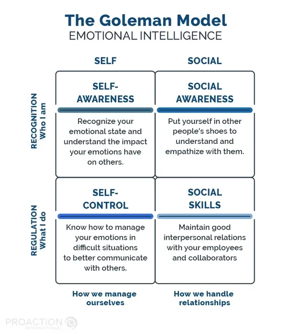
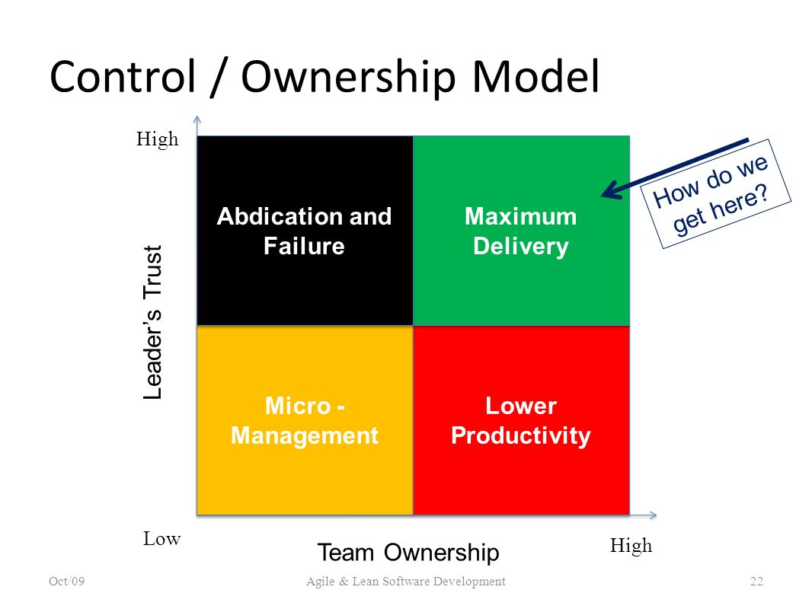
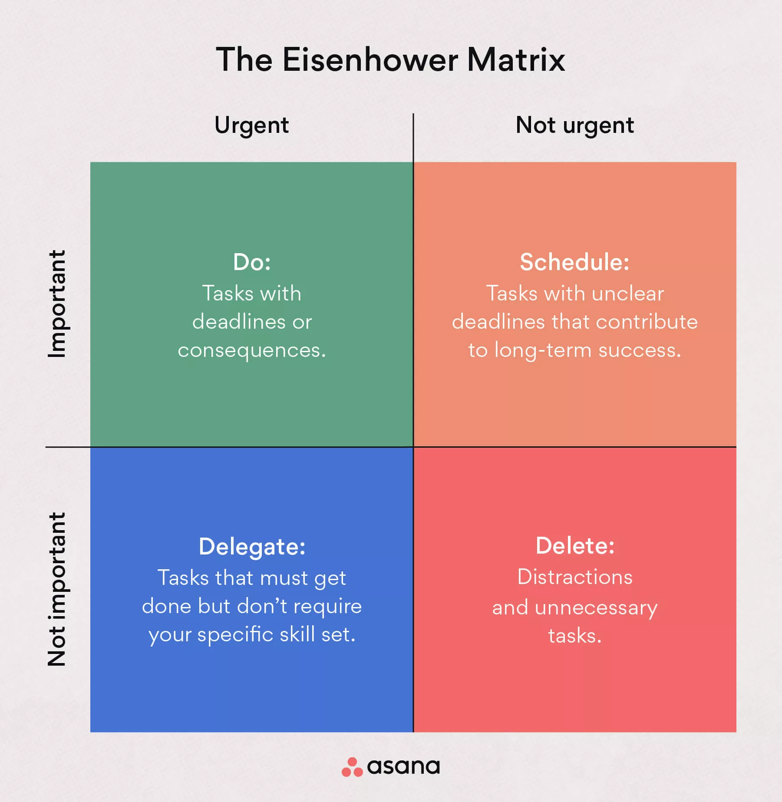

# Identifying Opportunities

## Core values and personal vision

What is important to me now?

- Get better at programming
- Work on my moonshot project for the bachelor then the master
- Get better at the guitar
- Start working at the gendarmerie

What do you think will be important to you when you finish your studies at ALGOSUP?

- Build experience over the years
- Have knowledge

What do you need to be, to do or to have in order for you to be happy?

- To be loved
- To be myself, be kind
- To do something I like, that matters to me, that can help others

### Alexis L.

Important now:

- Moonshot + Graduation (next month)
- French sign language exam (next week)
- plan holidays (vercors)

Important after ALGOSUP:

- directly find a job, don't want to spend too much time on the job market
- create a family

To be happy:

- To be proud of himself
- To do something that really help others
- Human relations (small talks, enjoying time)

## The values I value the most

- Love
- Openness
- Humor

### Positive and Negative Behaviors Driven by These Values

#### Positive

- **Love:** Caring for others, fostering healthy and non-toxic relationships, I want love to be primary (family first).
- **Openness:** Being receptive to others' opinions, beliefs, and perspectives, which helps in understanding different viewpoints.
- **Humor:** Creating a light-hearted atmosphere that brings joy, making work environments and social interactions more enjoyable and likable.

#### Negative

- **Love:** Can cause pain if feelings are one-sided or lead to being blinded by love, overlooking important issues.
- **Openness:** May result in feeling vulnerable or left out when your own feelings are not equally acknowledged.
- **Humor:** Risks not being taken seriously if humor dominates, and sometimes it can be misinterpreted or offend others.

They have to be balanced, not too much, but enough. These points are important to me, but I keep in mind that if they are unbalanced, this can lead to issue.

## Personal Vision

- A personal vision is a clear picture of your desired future.
- It should be **meaningful**, **realistic**, and **easy to understand**.
- It must also be **inspirational**—appealing to your imagination and aligning with your core motives and aspirations.

### How I want potential employers, colleagues, and partners to see me

I want to be seen as a relaxed, easygoing person—gentle, trustworthy, and someone who brings humor and a light-hearted atmosphere to the workplace.

### How I intend to make money

I plan to earn a living through multiple paths:

- Working as a full-time employee
- Serving as a reservist in the Gendarmerie
- Investing in the stock market
- Invest in my bank account (interests)

### What will make me special

I would love to be known as a skilled guitar player, but above all, I want to be recognized for my kindness and gentleness. These qualities matter to me more than any specific talent.

### What I want my family and friends to think of me

I hope my family and friends see me as someone caring, loving husband, gentle, and docile—always willing to help and there for them when they need support.

### What reputation I wish to have among people I may not know personally

I want to be known as a hardworking, trustworthy, and gentle person, even by those who may not know me well.

### Personal Vision Statement

In the future, I want to be known as a kind, gentle, trustworthy, and hardworking person—someone who brings a light-hearted, supportive presence to both personal and professional relationships. I aim to build a fulfilling life through meaningful work, service in the Gendarmerie, wise investments, and by nurturing my passion for guitar and human connection. I aspire to be a loving husband, a reliable colleague, and a person who values purpose over profit.

"Everybody thinks of changing humanity - hardly anyone thinks of changing himself." - Bayazid al-Bastami

## What attitudes and behaviors do I need to change in order to realize my personal vision?

- "I'll do it tomorrow"
- "I'll play video games for now"
- "I'm tired"
- "I've time to do it"
- I won't succeed anyway
- I'm not good enough
- I'll never know what/how to do
- I'll never reach such a level
- If I fail, I'll lose everything
- others will do it

- I'll do it now
- I can't do it, yet
- I need to persevere, ill do it one day
- I'll try my best
- I'll learn from my mistakes
- I will manage my time
- let's plan my day
- let's plan deadlines
- Let's break the tasks down
- I don't need to be perfect

### Four-Room Apartment

- Contentment:
  - Comfort zone
  - Feel confident
  - Feel Competent
- Denial:
  - I'm not the problem
  - Won't learn a thing
  - doesn't admit any weakness or fault
  - Refuse to change
  - "I'm doing all possible"
- Confusion
  - questioning
  -
- Renewal
  - growth

## Discovering Opportunities

Effectuation - [Link explanation](https://blog.hubspot.fr/sales/effectuation#:~:text=L%27effectuation%20est%20une%20logique,avec%20exactitude%20dès%20ses%20débuts.)

- Start with what's available now
- Invest want you can afford to lose

Process of exploration

- Who I am / What I know
- WHat I can do → goals
- Who I know
- stakeholders / commitment
  - no commitment → dead end (dump bad idea)
  - new means → how will I do this
  - new goals
-

A change in environment changes what you know (e.g. lessons) and loops back to the beginning

This whole loop leads to new firms, products or markets

5 principles:

1. bird in hand

- start with what you have
- asked yourself what should I know
- who I know
- use the available resources
- zero

2. Affordable loss

- make a commitment
- find what you can lose
- focus on downside
- limit risks

3. Crazy quilt

- patchwork quilt
- partnership and networks
- seek funding
- co-create new markets with interested others
- build hive with bees

4. Lemonade

- sense and seize opportunities
- don't use what if
- transform problems into chances for growth
- more lemon, more lemonade

5. Pilot in the plane

- control vs predict
- focus on activities within control
- action result in desired outcomes
- don't predict the future: make your own

- designed for older people experiencing reduced mobility
- enable coordination and mobility
- increase autonomy
- amount of obstacles they might face avoided
- reaction time
- stability regarding long distance → balance

## Today's Conclusion

- When you are given the task to task somebody, don't do it yourself.
- Sometimes they do even better than what you've imagined
- trust your colleague, you will get sometimes surprised
- even if they don't deliver as you expected them to, it opens new possibilities
- sometime the best solution is the combination of ideas
- sometimes you have to build up and not build down

## Building Relationships

"The best way to find out if you can trust somebody is to trust them" - Hemingway

Trust holds relationship together. No matter the source of the relationship (love, friendship, colleague)

Do you directly trust someone, or do you not ?

1. People are open directly, until they get hit on the head
2. People won't trust you and will test you all along

If you always search for mistakes, it communicates no trust.
Rather, search for good things and mistakes. And feedback will be more appreciated.

TRUST = (Credibility + Reliability + Intimacy) / Perceived Self Orientation

Credibility = perceived competence \
Reliability = Perceived consistency and dependability: delivering promises \
Intimacy = Perceived closeness and understanding

Perceived Self Orientation = Perceived personal gain motive

Sometimes people say the same thing as you with other words, you have to understand that they have the same pov as you. \
Things don't have to be said the way you think or say them.

### The 5 trust skills

- Listen

  - Do not argue or apply a fixed mindset
  - Empathetic, earning the right to be heard

- Partner

  - do not compete over ideas, maybe other people can add value to your idea, sometimes they are trying to improve it (keep in kind that sometimes they try to shoot you down, in that case, refuse it, but conquer your mind)
  - Give and take
  - Being in 'tune', know their needs, understand them

- Know yourself

  - You need to know yourself for others to trust you, it's at the center.

- Risk

  - Risks of trusting, the more you defend, the more people throw stones, they will stop eventually if you don't defend. WHen someone argues with you, they give you weapon to fight back with, so don't give them weapons in return.
  - Willingness to take risks because there's a solid relationship to fall back on
  - When the relationship is strong, you forgive more, so you are willing to take more risks and when it comes to conflicts, you know it can be fixed, because the relationship is strong
  - Negotiation doesn't have to take a lot of time when you trust each other

- Improvise
  - Flexibility (according to the needs of the people we are working with)
  - Thinking and responding quickly when the situation is not familiar
  - Some things you cannot control or predict will happen
  - Practice improvisation, your instinct will get better

You have to be like water, be flexible and hard to be trapped, be like bamboo, be strong and flexible at the same time. In Asia, they say that
bamboo (fiber) can be stronger than steel.

Lots of talking doesn't matter, the doing does, and the doing improves your credibility

### 4 elements of empathy

1. See their world
   1. put yourself in their shoes
2. Appreciate them as human beings
   1. don't judge them they are human after all
3. Communicate understanding
   1. verbal/non-verbal communication
   2. a smile can be enough (beware of cultural differences)
4. Understand feelings

### Trust creation process - ELFEC

1. Engage
   1. Offer something of value in an open discussion about issues important to the other: "Let's talk about..."
2. Listen
   1. Take note of what's important to the other and earn the right to offer solutions: "Tell me more..."
3. Frame
   1. State the root issue in terms of what is acceptable to both
   2. state problems and hypotheses
   3. Take personal risks to explore sensitive issue in depth "So the issue is..."
4. Envision
   1. Define an alternate reality including win-win descriptions of outcomes and results "Let's imagine..."
5. Commit
   1. Jointly articulate actionable next steps to signify commitment and movement on the part of each party "I suggest we do..."

### Emotional Intelligence

The ability, capacity, or skill to perceive, assess, and manage your emotions and those of others.

It is the core of the art of handling relationships of any kind.

1. Recognition
   1. SELF
      1. Self awareness
         1. Self-Confidence
            1. Emotional self-awareness
            2. Accurate self assessment
   2. SOCIAL
   3. Social Awareness
      1. Empathy
         1. Organizational Awareness
         2. Service Orientation
2. Regulation
   1. SELF
      1. Self management
         1. Self control
         2. Trustworthiness
         3. Conscientiousness
         4. Adaptability
         5. Achievement
         6. Drive to succeed
         7. Initiative
   2. SOCIAL
      1. Relationship Management
         1. Influence
         2. Inspirational Leadership
         3. Developing others
         4. Building Bonds
         5. Teamwork & Collaboration

### Trust-Ownership Model

## Structuring Problem-Solving

### Rational Problem-Solving

- Identify the problem
  - Define the situation
  - Analyze the situation
  - Diagnose the cause of the problem
  - Specify decision objectives
- Problem-Solving
  - Searching for alternatives
- Decision-Making
  - Evaluating alternatives
  - Selecting the best alternatives
- Implementing the decision
  - Testing
  - Monitoring
  - Reviewing

### Eisenhower Urgent-Important Matrix

Purpose: prioritize actions, tasks or projects. 

### Role Plays

Lucas: 
- Fluid
- fast at the beginning
- clean
- not all questions were asked

Camille: 
- had a great feeling about the interview

Thibaud: 
- had a great feeling as well

Would hire Camille for the junior web developer job, on a common decision, Camille wasn't expecting for the senior job, and from what he said, the interviewer was aiming for the same. 